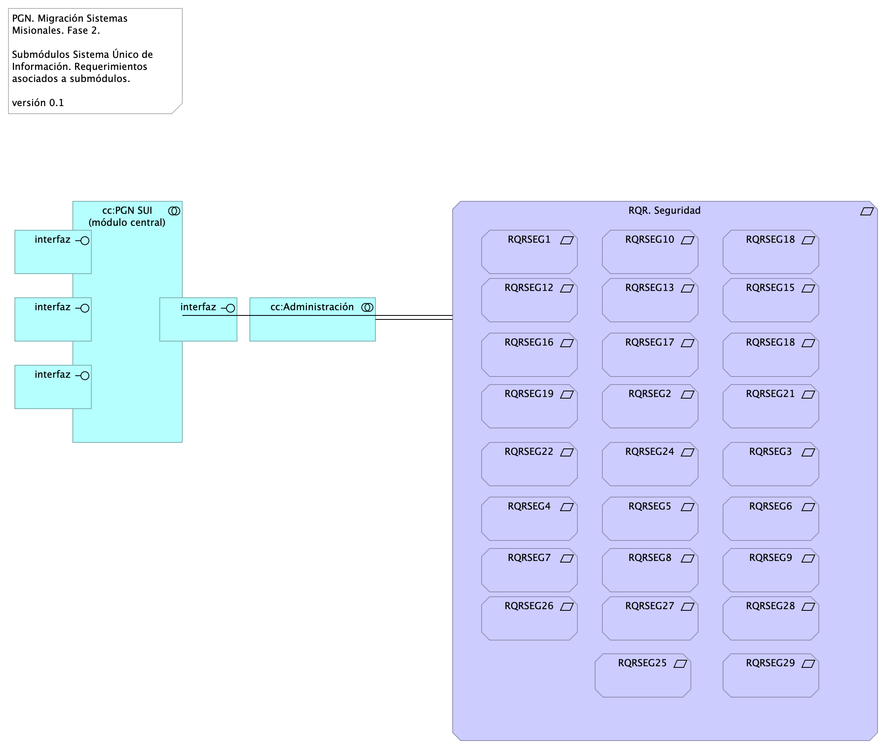
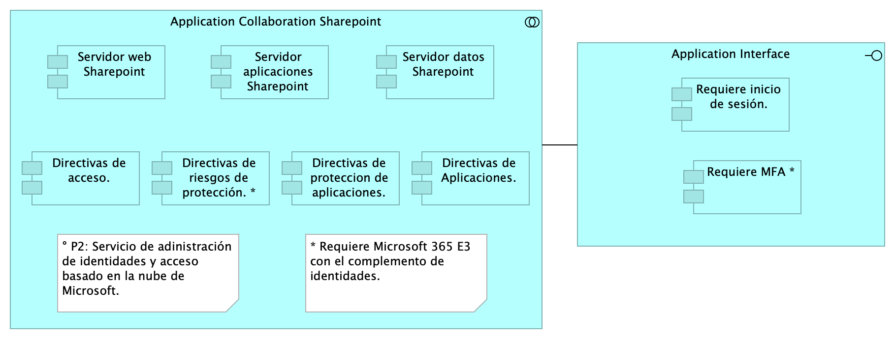

# Doc.3.Migración Funcional SUI
* [Patrón de Diseño Línea Base SUI PGN](#patrón-de-diseño-línea-base-sui-pgn)
	* [Lineabase.0.SIU applicación](#lineabase.0.siu-applicación)
	* [Lineabase.1.SIU componente](#lineabase.1.siu-componente)
	* [Lineabase.1a.SIU componentes. infraestrcutura](#lineabase.1a.siu-componentes.-infraestrcutura)
	* [Linebase.2.Portal](#linebase.2.portal)
* [Patrón de Diseño Migración SUI PGN](#patrón-de-diseño-migración-sui-pgn)
	* [Migracion.1a.SIU módulos](#migracion.1a.siu-módulos)
	* [Migracion.1b.SIU módulos componentes](#migracion.1b.siu-módulos-componentes)
	* [Migracion.1c.SIU modulos colaboración](#migracion.1c.siu-modulos-colaboración)
* [Organización cambios arquitectura](#organización-cambios-arquitectura)
	* [Organización. 1n. Mapa producto](#organización.-1n.-mapa-producto)
	* [Organización. 1n.1.b. Mapa producto PGN. Relatoría](#organización.-1n.1.b.-mapa-producto-pgn.-relatoría)
	* [Organización. 2n.1a. Mapa producto PGN. Conciliacion](#organización.-2n.1a.-mapa-producto-pgn.-conciliacion)
	* [Organización. 4n.1. Mapa producto PGN. Estratego](#organización.-4n.1.-mapa-producto-pgn.-estratego)
	* [Organización. 3n.1. Mapa producto PGN. SIAF](#organización.-3n.1.-mapa-producto-pgn.-siaf)
* [Arquitectura de Seguridad, SUI Migración](#arquitectura-de-seguridad,-sui-migración)
	* [Seguridad. 1. Requerimientos](#seguridad.-1.-requerimientos)
	* [Seguridad. Linebase.2.Portal](#seguridad.-linebase.2.portal)
* [Análisis de Productos](#análisis-de-productos)
	* [Organización. 4n.1a. Mapa producto PGN. Comparativa](#organización.-4n.1a.-mapa-producto-pgn.-comparativa)
* [Riesgos Técnicos](#riesgos-técnicos)
	* [Riesgos.1. Migración funcional](#riesgos.1.-migración-funcional)
	* [Riesgos.2. Modelo Riesgo RSG10](#riesgos.2.-modelo-riesgo-rsg10)

\newpage

# Patrón de Diseño Línea Base SUI PGN
## Lineabase.0.SIU applicación
{#fig:Lineabase.0.SIUapplicación width=}

Procuraduría General de la Nación, proyecto Migración SIU, 2023, Fase II. Línea base del sistema único de información (SUI en adelante) de la PGN. Presentación de componentes de software  originales implementados en la Fase I del presente proyecto.

## Representación Arquitectónica
Con una arquitectura orientada a servicios SUI recopila:

1. Runtime: Es el servicio que interactúa con el usuario final (GUI) elaborado en Angular 11
1. API Tx: Servicio api rest base node encargado de realizar las transacciones básicas CRUD
1. API Config / Seguridad. Servicio Web API .Net Framework encargado de gestionar características con la autenticación y configuración

 

### Catálogo de Elementos
| Name| Type| Description| Properties
|:--------|:--------|:--------|:--------|
|**Application Collaboration**|application-collaboration|||
|**Application Collaboration**|application-collaboration|||
|**App**|application-component||*plataforma:* node Js |
|**App PGN Móvil**|application-component||*plantilla:* element-md-new |
|**App PGN Web**|application-component||*plataforma:* angular 11 |
|**Config**|application-component||*plataforma:* cs |
|**Punto acceso público**|application-interface|URL tipo C HTTP||
|**Application Service (NLB)**|application-service||*plataforma:* angular 11 |
|**Interfaz de datos 1**|application-service|||
|**Interfaz de datos 2**|application-service|||

## Lineabase.1.SIU componente
{#fig:Lineabase.1.SIUcomponente width=5.89in}

Distribución de los servicios y paquetes que integran la aplicación de SUI. 

Cuatro paquetes con tecnologías respectivas

1. Angular 11 (Web)
1. API Transaccional (Node Js)
1. API Config (C#)
1. Persistencia (SQL)

Asuntos de la Migración:

* Estrategia CMS central
* Motor de búsqueda
* Estatego como BI
* Conciliación y Doku
* Gestión de sesiones / caducidad

### Catálogo de Elementos
| Name| Type| Description| Properties
|:--------|:--------|:--------|:--------|
|**Persistencia**|application-collaboration|||
|**App**|application-component||*plataforma:* node Js |
|**App PGN Móvil**|application-component||*plantilla:* element-md-new |
|**App PGN Web**|application-component||*plataforma:* angular 11 |
|**Config**|application-component||*plataforma:* cs |
|**Controlador admin**|application-component||*plataforma:* cs |
|**Controlador frontal mvl**|application-component||*plataforma:* js |
|**Controlador frontal web**|application-component||*plataforma:* js |
|**Controlador funcional**|application-component||*plataforma:* js |
|**Modelo (neg)**|application-component||*plataforma:* cs |
|**Puerto datos 1**|application-component||*plataforma:* js |
|**Puerto datos 2**|application-component||*plataforma:* cs |
|**Seguridad**|application-component||*plataforma:* sql |
|**Transacciones**|application-component||*plataforma:* sql |
|**Utilitario**|application-component||*plataforma:* no-sql |
|**Vista móvil**|application-component||*plataforma:* js |
|**Vista web**|application-component||*plataforma:* html |
|**Interfaz de aplicación (runtime)**|application-interface||*plataforma:* angular 11 |
|**API externas**|application-service|||
|**Application Service (NLB)**|application-service||*plataforma:* angular 11 |
|**Archivos Compartidos**|application-service|||
|**CDN Contenidos**|application-service|||
|**Doku (gest. doc.)**|application-service|||
|**Identidades**|application-service|||
|**Interfaz de datos 1**|application-service|||
|**Interfaz de datos 2**|application-service|||
|**Interfaz de datos 3**|application-service|||
|**ccccc Proveedores contenidos**|application-service|||
|**Mensaje: JSON**|data-object|||
|**PGN SIU**|grouping|El objetivo principal de la arquitectura del SUI de la migración es la centralización de los conceptos misionales: concentrar los conceptos misionales en componentes aislados; dejar por fuera de estos componentes misionales todo lo distintos a la misionalidad de la PGN. Los objetivos secundarios de esta arquitectura SUI de la migración son flexibilidad y extensibilidad. Dichos objetivos son independientes. Es decir, estos pueden ser maximizados sin conclifcto entre ellos. ||
|**RQR. Administrativos**|requirement|||
|**RQR. Funcionales**|requirement|||
|**RQR. Ingeniería**|requirement|||
|**RQR. Seguridad**|requirement|Requerimientos de seguridad, SUI, Migración, en aspectos de comunicación, autenticación, autorización y (manejo de) sesiones. ||

## Lineabase.1a.SIU componentes. infraestrcutura
{#fig:Lineabase.1a.SIUcomponentes.infraestrcutura width=}

Dependencias de infraestructura entre los servicios que integran el modelo de aplicación de SUI, Migración. 

* Servidor de Canales (App PGN web y móvil)
* Servidor Web App (App SUI)
* Servidor Lappiz (Config SUI)
* Servidor BDD App (Transaccional)
* Servidor BDD Config (Configuración)

### Catálogo de Elementos
| Name| Type| Description| Properties
|:--------|:--------|:--------|:--------|
|**Persistencia**|application-collaboration|||
|**App**|application-component||*plataforma:* node Js |
|**App PGN Móvil**|application-component||*plantilla:* element-md-new |
|**App PGN Web**|application-component||*plataforma:* angular 11 |
|**Config**|application-component||*plataforma:* cs |
|**Controlador admin**|application-component||*plataforma:* cs |
|**Controlador frontal mvl**|application-component||*plataforma:* js |
|**Controlador frontal web**|application-component||*plataforma:* js |
|**Controlador funcional**|application-component||*plataforma:* js |
|**Modelo (neg)**|application-component||*plataforma:* cs |
|**Puerto datos 1**|application-component||*plataforma:* js |
|**Puerto datos 2**|application-component||*plataforma:* cs |
|**Seguridad**|application-component||*plataforma:* sql |
|**Transacciones**|application-component||*plataforma:* sql |
|**Utilitario**|application-component||*plataforma:* no-sql |
|**Vista móvil**|application-component||*plataforma:* js |
|**Vista web**|application-component||*plataforma:* html |
|**Interfaz de aplicación (runtime)**|application-interface||*plataforma:* angular 11 |
|**API externas**|application-service|||
|**Application Service (NLB)**|application-service||*plataforma:* angular 11 |
|**Archivos Compartidos**|application-service|||
|**CDN Contenidos**|application-service|||
|**Doku (gest. doc.)**|application-service|||
|**Identidades**|application-service|||
|**Interfaz de datos 1**|application-service|||
|**Interfaz de datos 2**|application-service|||
|**Interfaz de datos 3**|application-service|||
|**ccccc Proveedores contenidos**|application-service|||
|**Mensaje: JSON**|data-object|||
|**Infraestructura SUI**|grouping|Soporte de infraestructura a los componentes del SUI Migración. Servidores y ambientes de cómputo para la ejecución del software base de los componentes misionales del SUI de PGN. ||
|**PGN SIU**|grouping|El objetivo principal de la arquitectura del SUI de la migración es la centralización de los conceptos misionales: concentrar los conceptos misionales en componentes aislados; dejar por fuera de estos componentes misionales todo lo distintos a la misionalidad de la PGN. Los objetivos secundarios de esta arquitectura SUI de la migración son flexibilidad y extensibilidad. Dichos objetivos son independientes. Es decir, estos pueden ser maximizados sin conclifcto entre ellos. ||
|**Servidor BDD App**|node|Sistema Operativo Windows Server 2019 Standard o Datacenter x64. RAM	8 GB. CPU 64 Bits, 4 Cores > 2 Ghz Discos	SO C: 126 GB, Backup E: 511 GB, SQL Data F: 510 GB, SQL Log   G: 510 GB, TempDB  G: 63.6 GB. ||
|**Servidor BDD Config**|node|Sistema Operativo Windows Server 2019 Standard o Datacenter x64. RAM	8 GB. CPU 64 Bits, 4 Cores > 2 Ghz Discos	SO C: 80 GB, Backup E: 250 GB, SQL Data F: 250 GB, SQL Log G: 250 GB, TempDB  G: 30 GB. ||
|**Servidor Web App**|node|Windows Server 2019 Standard o Datacenter x64. Nombre físico. IP LAN. IP Pública. Windows Server 2019 Standard or Datacenter x64. RAM	8  GB. CPU	64 Bits. 4 Cores de 2 Ghz. Discos	SO C: 126 GB. SO D: 16 GB. ||
|**Servidor Web Canales**|node|Windows Server 2019 Standard o Datacenter x64. Nombre físico. IP LAN. IP Pública. Windows Server 2019 Standard or Datacenter x64. RAM	8  GB. CPU	64 Bits. 4 Cores de 2 Ghz. Discos	SO C: 126 GB. SO D: 16 GB. ||

## Linebase.2.Portal
{#fig:Linebase.2.Portal width=}

El portal es el conjunto de los elementos físicos y lógicos necesarios para la implementación de la granja de servidores de SharePoint Server 2019 para el portal de la PROCURADURIA.

* Servidores Web Front End
* Servidores de Aplicaciones
* Servidores de SQL Server

### Catálogo de Elementos
| Name| Type| Description| Properties
|:--------|:--------|:--------|:--------|
|**Application Collaboration Sharepoint**|application-collaboration|||
|**Servidor aplicaciones Sharepoint**|application-component|||
|**Servidor datos Sharepoint**|application-component|||
|**Servidor web Sharepoint**|application-component|||
|**Application Interface**|application-interface|||

\newpage

# Patrón de Diseño Migración SUI PGN
## Migracion.1a.SIU módulos
{#fig:Migracion.1a.SIUmódulos width=}

Identificación de submódulos del Sistema Único de Información (SUI) de la PGN. 

Todos los sistemas de información del SUI deben seguir la directiva de separar a los componentes misionales de los utilitarios: el SUI de PGN estará constituidos por submódulos dispuestos en relación de utilitarios (que sirven) a los componentes misionales del SUI, ubicados en el centro en la diagrama.

Los submódulos del SUI, tal como están presentados, reúnen a las partes por el mismo rol en favor de la coherencia. Por ejemplo, los servicios de aplicación, en la imagen, contiene a todos aquellos utilitarios que prestan alguna utilidad momentánea al SUI migrado. Organizados así, estos submódulos utilitarios pueden ser intercambiados o ampliados sin perjuicio de los componentes misionales dell SUI (centro del diagrama) gracias a las _interfaces de unión_ en favor de la extensibilidad.

Las interfaces de unión indicadas arriba obligan a los submódulos a cumplir las exigencias de los componentes misionales del SUI.

Los submódulos identificados tienen los siguientes roles para el SUI migrado:

1. cc:Presentación
1. cc:Servicios de aplicación
1. cc:Portales y canales
1. cc:Administración y configuración
1. cc:Almacenamiento

### Requerimientos Asociados a los Submódulos
La disposición de los módulos y submódulos presentada, denominada SUI Migración en adelante, facilita la focalización de los requerimientos encontrados en el levantamiento realizado en el actual proyecto. Así, por ejemplo, los requerimientos funcionales se encuentran concentrados en el submódulo de presentación (ver imagen).

### Catálogo de Elementos
| Name| Type| Description| Properties
|:--------|:--------|:--------|:--------|
|**cc:Administración**|application-collaboration|||
|**cc:Almacenamiento**|application-collaboration|||
|**cc:PGN SUI (misional)**|application-collaboration|||
|**cc:Portales y canales**|application-collaboration|Submódulo de portales internos de la PGN a donde llega el SUI. Interfaz web que usa al SUI para llegar a direcciones y subdirecciones de la PGN. La plataforma principal de portales en este contexto es Sharepoint de Microsoft. ||
|**cc:Presentación**|application-collaboration|Submódulo de presentación del SUI. interfaz gráfica, interfaz web visible a los usuarios clientes y funcionarios de la PGN. ||
|**cc:Servicios de aplicación**|application-collaboration|Submódulo de servicios utilitarios que sirven al SUI. Servicios variados que cumplen roles facilitadores de las actividades misionales del SUI. Ejemplos de estos servicios son los de gestión documental, implementado por Doku en el contexto de PGN. ||
|**interfaz**|application-interface|||
|**interfaz**|application-interface|||
|**interfaz**|application-interface|||
|**interfaz**|application-interface|||
|**interfaz**|application-interface|||
|**Cliente PGN**|business-actor|||
|**Funcionario PGN**|business-actor|||
|**ARQ01. Consistencia SUI**|constraint|Unifica las entidades de negocio PGN, entre las que se incluyen a conciliaciones, publicaciones de relatoría, resoluciones, en artefactos reutilizables. Distinto de que estas entidades (y su lógica de negocio) estén dispersos entre los sistemas del SUI, estarán concentradas en un único artefacto correspondiente. Calidad sistémica: la consistencia persigue que el resultado de la lógica de negocio sea la misma entre los módulos del SUI migrado. Esto redunda a mantenibilidad y gestión: tiende a tener un solo punto de cambio y dificulta la transferencia de dependencias implícitas a otros procesos.||
|**ARQ02. Mantenibilidad SUI**|constraint|Evitar las dependencia transitivas de los módulos misionales del SUI a componentes y sistemas de terceros o submódulos no misionales.  Calidad sistémica: la mantenibilidad por control de dependencias que optimiza el diseño Migración SUI está dada por el control de cambios no programados sobre los componentes misionales del SUI (corrupción de componentes). Ver Patrón de Diseño Migración SUI, más adelante en el documento.||
|**ARQ03. Extensibilidad SUI**|constraint|Concentración de los componentes de negocio, misionales, del SUI protegidos de cambios provenientes de otros sistemas. Ver Patrón de Diseño Migración SUI, más adelante en el documento. Calidad sistémica: la extensibilidad que optimiza el diseño Migración SUI está dada por el intercambio de submódulos no misionales, como el gestor documental, sin afectación de los componentes misionales que este diseño protege.||
|**RQR. Administrativos**|requirement|||
|**RQR. Funcionales**|requirement|||
|**RQR. Ingeniería**|requirement|||
|**RQR. Misionales**|requirement|||
|**RQR. Seguridad**|requirement|Requerimientos de seguridad, SUI, Migración, en aspectos de comunicación, autenticación, autorización y (manejo de) sesiones. ||
|**RQR. Seguridad**|requirement|Requerimientos de seguridad, SUI, Migración, en aspectos de comunicación, autenticación, autorización y (manejo de) sesiones. ||

## Migracion.1b.SIU módulos componentes
{#fig:Migracion.1b.SIUmóduloscomponentes width=}

Presentación de los componentes internos de los submódulos del sistema único de información migración PGN. Organización intena de los servicios y paquetes que integran cada submódulo del SUI. Todos los sistemas de información del SUI siguen esta directiva: estarán constituídos por submódulos dispuestos en relación de utilitarios (que sirven) a los componentes misionales del SUI, ubicados en el centro en la diagrama. 

La organización de componentes de migración SUI facilita focalizar la selección de tecnologeias. Los componentes internos y tecnologías elegidas son las siguientes

1. Presentación: Angular 11 (Web)
1. PGN SUI: API Transaccional (Node Js)
1. Administración: API Config (C#)
1. Persistencia: (SQL)

Los submódulos del SUI, tal como están presentados, reúnen a las partes que tienen el mismo rol en favor de la coherencia. Así mismo, estos pueden ser intercambiados o ampliados sin perjuicio del SUI gracias a las interfaces de unión (en favor de la extensibilidad).

Las interfaces de unión indicadas arriba obligan a los submódulos a cumplir las exigencias de los componentes misionales del SUI.

### Catálogo de Elementos
| Name| Type| Description| Properties
|:--------|:--------|:--------|:--------|
|**App**|application-component||*plataforma:* node Js |
|**App PGN Móvil**|application-component||*plantilla:* element-md-new |
|**App PGN Web**|application-component||*plataforma:* angular 11 |
|**Config**|application-component||*plataforma:* cs |
|**Controlador admin**|application-component||*plataforma:* cs |
|**Controlador frontal mvl**|application-component||*plataforma:* js |
|**Controlador frontal web**|application-component||*plataforma:* js |
|**Controlador funcional**|application-component||*plataforma:* js |
|**Modelo (neg)**|application-component||*plataforma:* cs |
|**Puerto datos 1**|application-component||*plataforma:* js |
|**Puerto datos 2**|application-component||*plataforma:* cs |
|**Seguridad**|application-component||*plataforma:* sql |
|**Servidor aplicaciones Sharepoint**|application-component|||
|**Servidor datos Sharepoint**|application-component|||
|**Servidor web Sharepoint**|application-component|||
|**Transacciones**|application-component||*plataforma:* sql |
|**Utilitario**|application-component||*plataforma:* no-sql |
|**Vista móvil**|application-component||*plataforma:* js |
|**Vista web**|application-component||*plataforma:* html |
|**Application Interface**|application-interface|||
|**Interfaz de aplicación (runtime)**|application-interface||*plataforma:* angular 11 |
|**API externas**|application-service|||
|**Application Service (NLB)**|application-service||*plataforma:* angular 11 |
|**Archivos Compartidos**|application-service|||
|**CDN Contenidos**|application-service|||
|**Doku (gest. doc.)**|application-service|||
|**Identidades**|application-service|||
|**Interfaz de datos 1**|application-service|||
|**Interfaz de datos 2**|application-service|||
|**Interfaz de datos 3**|application-service|||
|**Office**|application-service|||
|**ccccc Proveedores contenidos**|application-service|||
|**Mensaje: JSON**|data-object|||
|**Administración**|grouping|||
|**Almacenamiento**|grouping|||
|**PGN SIU**|grouping|El objetivo principal de la arquitectura del SUI de la migración es la centralización de los conceptos misionales: concentrar los conceptos misionales en componentes aislados; dejar por fuera de estos componentes misionales todo lo distintos a la misionalidad de la PGN. Los objetivos secundarios de esta arquitectura SUI de la migración son flexibilidad y extensibilidad. Dichos objetivos son independientes. Es decir, estos pueden ser maximizados sin conclifcto entre ellos. ||
|**Portales**|grouping|Submódulo de portales internos de la PGN a donde llega el SUI. Interfaz web que usa al SUI para llegar a direcciones y subdirecciones de la PGN. La plataforma principal de portales en este contexto es Sharepoint de Microsoft. ||
|**Presentación**|grouping|Submódulo de presentación del SUI. interfaz gráfica, interfaz web visible a los usuarios clientes y funcionarios de la PGN. ||
|**Servicios de aplicación**|grouping|Submódulo de servicios utilitarios que sirven al SUI. Servicios variados que cumplen roles facilitadores de las actividades misionales del SUI. Ejemplos de estos servicios son los de gestión documental, implementado por Doku en el contexto de PGN. ||
|**RQR. Administrativos**|requirement|||
|**RQR. Funcionales**|requirement|||
|**RQR. Ingeniería**|requirement|||
|**RQR. Misionales**|requirement|||
|**RQR. Seguridad**|requirement|Requerimientos de seguridad, SUI, Migración, en aspectos de comunicación, autenticación, autorización y (manejo de) sesiones. ||
|**RQR. Seguridad**|requirement|Requerimientos de seguridad, SUI, Migración, en aspectos de comunicación, autenticación, autorización y (manejo de) sesiones. ||

## Migracion.1c.SIU modulos colaboración
{#fig:Migracion.1c.SIUmoduloscolaboración width=}

Patrón de Distribución y Colaboración estándar para el SUI.

La colaboración y comunicación de los componentes internos del SUI (grupo PFN SUI, en el diagrama) está mediada por interfaces. Estas son provistas por el grupo de componentes misionales, PGN SUI, hacia los submódulos externos. La intención es mantener reducido y controlado el número de interfaces.

La colaboración entre el SUI Migración con sistemas externos puede darse mediante buses de datos empresarial, sin perjuicio del patrón de comunicación estadar descrito en el diagrama.

### Catálogo de Elementos
| Name| Type| Description| Properties
|:--------|:--------|:--------|:--------|
|**cc:Almacenamiento**|application-collaboration|||
|**cc:Almacenamiento**|application-collaboration|||
|**cc:PGN SUI (misional)**|application-collaboration|||
|**cc:PGN SUI (misional)**|application-collaboration|||
|**cc:Portales y canales**|application-collaboration|Submódulo de portales internos de la PGN a donde llega el SUI. Interfaz web que usa al SUI para llegar a direcciones y subdirecciones de la PGN. La plataforma principal de portales en este contexto es Sharepoint de Microsoft. ||
|**cc:Portales y canales**|application-collaboration|Submódulo de portales internos de la PGN a donde llega el SUI. Interfaz web que usa al SUI para llegar a direcciones y subdirecciones de la PGN. La plataforma principal de portales en este contexto es Sharepoint de Microsoft. ||
|**interfaz**|application-interface|||
|**interfaz**|application-interface|||
|**interfaz**|application-interface|||
|**interfaz**|application-interface|||

\newpage

# Organización cambios arquitectura
## Organización. 1n. Mapa producto
{#fig:Organización.1n.Mapaproducto width=3.14in}

### Catálogo de Elementos
| Name| Type| Description| Properties
|:--------|:--------|:--------|:--------|
|**Épicas**|capability||*modulo:*  |
|**Deliverable: (tiempo)**|deliverable||*modulo:*  |
|**Tiempo**|gap|||
|**Características**|goal||*modulo:*  |
|**Hoja ruta del producto**|grouping||*modulo:* relatoria |
|**Hitos mercado**|value||*modulo:*  |
|**Iteración**|work-package||*modulo:*  |

## Organización. 1n.1.b. Mapa producto PGN. Relatoría
{#fig:Organización.1n.1.b.MapaproductoPGN.Relatoría width=}

### Catálogo de Elementos
| Name| Type| Description| Properties
|:--------|:--------|:--------|:--------|
|**Administración de contenidos**|capability||*modulo:* relatoria |
|**Componente de  comunicación segura SIU**|capability||*modulo:* conciliacion |
|**Componente de autenticación SIU**|capability||*modulo:* conciliacion |
|**Componente de autorización SIU**|capability||*modulo:* conciliacion |
|**Componentes de usabilidad, no. 1**|capability||*modulo:* relatoria |
|**Componentes de usabilidad, no. 2**|capability||*modulo:* relatoria |
|**Funcionalidades de búsqueda**|capability||*modulo:* relatoria |
|**Funcionalidades de descripción de contenidos**|capability||*modulo:* relatoria |
|**Integración API CMS**|capability||*modulo:* relatoria |
|**Motor de búsqueda**|capability||*modulo:* relatoria |
|**Proceso de organización de contenidos**|capability||*modulo:* relatoria |
|**Proceso de recolección de contenidos**|capability||*modulo:* relatoria |
|**Proceso de sincronización automática de contenidos**|capability||*modulo:* relatoria |
|**Épicas**|capability||*modulo:*  |
|**Deliverable: (tiempo)**|deliverable||*modulo:*  |
|**Autenticación**|goal||*modulo:* relatoria *caracteristica:* seguridad |
|**Autorización**|goal||*modulo:* relatoria *caracteristica:* seguridad |
|**Búsqueda**|goal||*modulo:* relatoria *caracteristica:* técnica, integración |
|**Características**|goal||*modulo:*  |
|**Contenidos**|goal|Se tendran que adecuar los contenidos audivisuales de los sitios web, con subtitulos o CLosed Caption y la apropiacion de lenguajes de señas. |*modulo:* relatoria *caracteristica:* técnica, integración |
|**Descripción (metatada)**|goal||*modulo:* relatoria *caracteristica:* técnica, integración |
|**Indexación**|goal||*modulo:* relatoria *caracteristica:* técnica, integración |
|**Integridad**|goal||*modulo:* relatoria *caracteristica:* seguridad |
|**Recolección**|goal||*modulo:* relatoria *caracteristica:* técnica, integración |
|**Sincronización (actualizcn)**|goal||*modulo:* relatoria *caracteristica:* técnica, integración |
|**Usabilidad web**|goal||*modulo:* relatoria *caracteristica:* seguridad |
|**Usabilidad web**|goal||*modulo:* relatoria *caracteristica:* seguridad |
|**Hoja ruta del producto**|grouping||*modulo:* relatoria |
|**Adopción, v1.2**|value||*modulo:* relatoria |
|**Búsqueda de contenidos. Relatoría v0.1**|value||*modulo:* relatoria |
|**Despliegue Relatoría v1.2**|value||*modulo:* relatoria |
|**Gestión contenidos. Rltría v1.0**|value||*modulo:* relatoria |
|**Hitos mercado**|value||*modulo:*  |
|**Organización contenidos. Rltría v0.5**|value||*modulo:* relatoria |
|**Iteración**|work-package||*modulo:*  |
|**Iteración 2**|work-package||*modulo:* relatoria |
|**Iteración 3**|work-package||*modulo:* relatoria |
|**Iteración 4**|work-package||*modulo:* relatoria |
|**Iteración 5**|work-package||*modulo:* relatoria |
|**Iteración 6**|work-package||*modulo:* relatoria |
|**Iteración 7**|work-package||*modulo:* relatoria |
|**rel.Iteración 1**|work-package||*modulo:* relatoria |

## Organización. 2n.1a. Mapa producto PGN. Conciliacion
{#fig:Organización.2n.1a.MapaproductoPGN.Conciliacion width=}

### Catálogo de Elementos
| Name| Type| Description| Properties
|:--------|:--------|:--------|:--------|
|**Componente de  comunicación segura SIU**|capability||*modulo:* conciliacion |
|**Componente de autenticación SIU**|capability||*modulo:* conciliacion |
|**Componente de autorización SIU**|capability||*modulo:* conciliacion |
|**Flujo de trabajo  Preventico**|capability||*modulo:* conciliacion |
|**Flujo de trabajo Disciplinar**|capability||*modulo:* conciliacion |
|**Flujo de trabajo Intervención**|capability||*modulo:* conciliacion |
|**Integración API Dokus**|capability||*modulo:* conciliacion |
|**Motor de flujo de trabajo**|capability||*modulo:* conciliacion |
|**Panel de control flujos**|capability||*modulo:* conciliacion |
|**Reporte flujos de trabajo**|capability||*modulo:* conciliacion |
|**Épicas**|capability||*modulo:*  |
|**Deliverable: (tiempo)**|deliverable||*modulo:*  |
|**Autenticación**|goal||*modulo:* conciliacion *caracteristica:* seguridad |
|**Autorización**|goal||*modulo:* conciliacion *caracteristica:* seguridad |
|**Características**|goal||*modulo:*  |
|**Conciliación administrativa**|goal||*modulo:* conciliacion *caracteristica:* técnica, integración |
|**Conciliación civil**|goal||*modulo:* conciliacion *caracteristica:* técnica, integración |
|**Conciliación disciplinar**|goal||*modulo:* conciliacion *caracteristica:* técnica, integración |
|**Conciliación familia**|goal||*modulo:* conciliacion *caracteristica:* técnica, integración |
|**Conciliación preventivo**|goal||*modulo:* conciliacion *caracteristica:* técnica, integración |
|**Diseño de flujos de Conciliación**|goal||*modulo:* conciliacion *caracteristica:* técnica, integración |
|**Gestión de instancias (flujos)**|goal||*modulo:* conciliacion *caracteristica:* técnica, integración |
|**Gestión documental**|goal||*modulo:* conciliacion *caracteristica:* seguridad |
|**Informes de gestión flujos**|goal||*modulo:* conciliacion *caracteristica:* técnica, integración |
|**Integridad**|goal||*modulo:* conciliacion *caracteristica:* seguridad |
|**Hoja ruta del producto**|grouping||*modulo:* relatoria |
|**Adopción, v1.2**|value||*modulo:* conciliacion |
|**Despliegue Conciliación v1.2**|value||*modulo:* conciliacion |
|**Flujo de trabajo Disciplinario. Conciliación v0.9**|value||*modulo:* conciliacion |
|**Flujo de trabajo Intervención. Conciliación v0.1 (copy)**|value||*modulo:* conciliacion |
|**Flujo de trabajo Preventivo. Conciliación v0.7**|value||*modulo:* conciliacion |
|**Gestión de flujos. Conciliación 1.0**|value||*modulo:* conciliacion |
|**Hitos mercado**|value||*modulo:*  |
|**Iteración**|work-package||*modulo:*  |
|**Iteración 1**|work-package||*modulo:* conciliacion |
|**Iteración 2**|work-package||*modulo:* conciliacion |
|**Iteración 3**|work-package||*modulo:* conciliacion |
|**Iteración 4**|work-package||*modulo:* conciliacion |
|**Iteración 5**|work-package||*modulo:* conciliacion |
|**Iteración 6**|work-package||*modulo:* conciliacion |
|**Iteración 7**|work-package||*modulo:* conciliacion |

## Organización. 4n.1. Mapa producto PGN. Estratego
{#fig:Organización.4n.1.MapaproductoPGN.Estratego width=}

### Catálogo de Elementos
| Name| Type| Description| Properties
|:--------|:--------|:--------|:--------|
|**Épicas**|capability||*modulo:*  |
|**Épicas**|capability||*modulo:* estratego |
|**Épicas**|capability||*modulo:* estratego |
|**Épicas**|capability||*modulo:* estratego |
|**Épicas**|capability||*modulo:* estratego |
|**Épicas**|capability||*modulo:* estratego |
|**Épicas**|capability||*modulo:* estratego |
|**Deliverable: (tiempo)**|deliverable||*modulo:*  |
|**Acciones correctivas**|goal|Administrar los riesgos asociados a cada uno de los indicadores o planes.|*modulo:* estratego |
|**Auditoria de mediciones**|goal|Gestionar las actividades de los usuarios, como el registro de indicadores, el tipo, etc.|*modulo:* estratego |
|**Auditorias**|goal|Gestionar el control de logs de las actividades realizadas por el usuario en sesión.|*modulo:* estratego |
|**Características**|goal||*modulo:*  |
|**Dependencias**|goal|Reportar al sistema, actividades, proyectos, indicadores.|*modulo:* estratego |
|**Grupos (Roles)**|goal|Administrar los roles y permisos dentro del sistema|*modulo:* estratego |
|**Gráficos**|goal|Generar y presentar gráficos|*modulo:* estratego |
|**Históricos**|goal|Almacenar y consultar históricos dentro del sistema|*modulo:* estratego |
|**Informes**|goal|Generar documentos con los informes correspondientes.|*modulo:* estratego |
|**Instrumento de cooperación**|goal|Administrar los proyectos de los cooperantes.|*modulo:* estratego |
|**Organizaciones**|goal|Estructura principal.|*modulo:* estratego |
|**Planes administrar**|goal|Administrar el plan estratégico institucional.|*modulo:* estratego |
|**Planes asociar**|goal|Asociar recursos, presupuesto.|*modulo:* estratego |
|**Planes generar**|goal|Generar planes estratégicos institucionales y asociar los planes de acción preventivos.|*modulo:* estratego |
|**Portafolio**|goal|Gestionar el portafolio de todos los proyectos de la entidad.|*modulo:* estratego |
|**Reportes**|goal|Generar reportes y exportarlos en diferentes tipos de archivo.|*modulo:* estratego |
|**Usuarios**|goal|Administrar los usuarios del sistema|*modulo:* estratego |
|**Hoja ruta del producto**|grouping||*modulo:* relatoria |
|**Hitos mercado**|value||*modulo:*  |
|**Hitos mercado**|value||*modulo:* estratego |
|**Hitos mercado**|value||*modulo:* estratego |
|**Hitos mercado**|value||*modulo:* estratego |
|**Hitos mercado**|value||*modulo:* estratego |
|**Iteración**|work-package||*modulo:*  |
|**Iteración**|work-package||*modulo:* estratego |
|**Iteración**|work-package||*modulo:* estratego |
|**Iteración**|work-package||*modulo:* estratego |
|**Iteración**|work-package||*modulo:* estratego |
|**Iteración 1**|work-package||*modulo:* estratego |
|**Iteración 6**|work-package||*modulo:* estratego |

## Organización. 3n.1. Mapa producto PGN. SIAF
{#fig:Organización.3n.1.MapaproductoPGN.SIAF width=}

### Catálogo de Elementos
| Name| Type| Description| Properties
|:--------|:--------|:--------|:--------|
|**Épicas**|capability||*modulo:*  |
|**Épicas**|capability||*modulo:* siaf |
|**Épicas**|capability||*modulo:* siaf |
|**Épicas**|capability||*modulo:* siaf |
|**Épicas**|capability||*modulo:* siaf |
|**Épicas**|capability||*modulo:* siaf |
|**Épicas**|capability||*modulo:* siaf |
|**Épicas**|capability||*modulo:* siaf |
|**Épicas**|capability||*modulo:* siaf |
|**Épicas (copy) (copy) (copy) (copy)**|capability||*modulo:* siaf |
|**Deliverable: (tiempo)**|deliverable||*modulo:*  |
|**Acciones de acuerdo al estado**|goal|Realización de acciones específicas según el estado de los movimientos devolutivos.|*modulo:* siaf |
|**Almacén**|goal|Administración de almacenes.|*modulo:* siaf |
|**Asientos**|goal|Registro de asientos.|*modulo:* siaf |
|**CRUD Campos**|goal|Operaciones CRUD (Crear, Leer, Actualizar, Eliminar) en campos de los asientos.|*modulo:* siaf |
|**Características**|goal||*modulo:*  |
|**Creación de movimiento**|goal|Generación de movimientos de acuerdo con los asientos abiertos.|*modulo:* siaf |
|**Cuenta de funcionario**|goal|Gestión de cuentas de funcionarios.|*modulo:* siaf |
|**Cuenta en Microsoft (Autenticación)**|goal|Autenticación mediante cuentas de Microsoft.|*modulo:* siaf |
|**Cálculo de total**|goal|Cálculo automático del total basado en la información de elementos.|*modulo:* siaf |
|**Código (autoincremental)**|goal|Generación automática de códigos que se reinician cada año.|*modulo:* siaf |
|**Dependiendo del tipo de movimiento**|goal|Gestión de movimientos según su tipo, incluyendo elementos como conceptos, beneficiarios y funcionarios (maestros).|*modulo:* siaf |
|**Elementos**|goal|Registro de elementos relacionados con los movimientos.|*modulo:* siaf |
|**Estado**|goal|Seguimiento del estado de los asientos.|*modulo:* siaf |
|**Fecha automática**|goal|Asignación automática de la fecha en los asientos.|*modulo:* siaf |
|**Filtrar por campos**|goal|Capacidad para filtrar los movimientos devolutivos según campos específicos.|*modulo:* siaf |
|**Funcionario Posesionado**|goal|Registro de información sobre funcionarios en posesión.|*modulo:* siaf |
|**Funcionarios (Nómina) vs Funcionarios (Siaf)**|goal|Comparación y actualización de información de funcionarios almacenada en Siaf con la información de nómina.|*modulo:* siaf |
|**Generar documento**|goal|Creación de documentos relacionados con los movimientos.|*modulo:* siaf |
|**Generar reportes**|goal|Creación de informes y reportes para proporcionar la información solicitada.|*modulo:* siaf |
|**Login (Doble factor)**|goal|Autenticación de usuario mediante doble factor de seguridad|*modulo:* siaf |
|**Movimiento Consumible**|goal|Registro de movimientos relacionados con elementos consumibles.|*modulo:* siaf |
|**Movimiento devolutivo**|goal|Registro de movimientos devolutivos.|*modulo:* siaf |
|**Sincronización con Homminis**|goal|Sincronización de datos con el sistema Homminis.|*modulo:* siaf |
|**Vista CRUD**|goal|Interfaz para crear, leer, actualizar y eliminar registros en el almacén.|*modulo:* siaf |
|**Vista formulario personalizada**|goal|Personalización de formularios para la creación de asientos dependiendo del almacén.|*modulo:* siaf |
|**Vista tipo formulario personalizada**|goal|Personalización de formularios para ingresar datos relacionados con los asientos.|*modulo:* siaf |
|**Vista tipo lista personalizada**|goal|Visualización personalizada en forma de lista con filtros por campos específicos.|*modulo:* siaf |
|**Hoja ruta del producto**|grouping||*modulo:* relatoria |
|**Hitos mercado**|value||*modulo:*  |
|**Hitos mercado**|value||*modulo:* siaf |
|**Hitos mercado**|value||*modulo:* siaf |
|**Hitos mercado**|value||*modulo:* siaf |
|**Hitos mercado**|value||*modulo:* siaf |
|**Iteración**|work-package||*modulo:*  |
|**Iteración 1**|work-package||*modulo:* siaf |
|**Iteración 1**|work-package||*modulo:* siaf |
|**Iteración 1**|work-package||*modulo:* siaf |
|**Iteración 1**|work-package||*modulo:* siaf |
|**Iteración 1**|work-package||*modulo:* siaf |
|**Iteración 1**|work-package||*modulo:* siaf |
|**Iteración 1**|work-package||*modulo:* siaf |
|**Iteración 1**|work-package||*modulo:* siaf |
|**Iteración 9**|work-package||*modulo:* siaf |

\newpage

# Arquitectura de Seguridad, SUI Migración
## Seguridad. 1. Requerimientos
{#fig:Seguridad.1.Requerimientos width=}

### Catálogo de Elementos
| Name| Type| Description| Properties
|:--------|:--------|:--------|:--------|
|**cc:Administración**|application-collaboration|||
|**cc:PGN SUI (misional)**|application-collaboration|||
|**interfaz**|application-interface|||
|**interfaz**|application-interface|||
|**interfaz**|application-interface|||
|**interfaz**|application-interface|||
|**RQR. Seguridad**|requirement|Requerimientos de seguridad, SUI, Migración, en aspectos de comunicación, autenticación, autorización y (manejo de) sesiones. ||
|**RQRSEG1**|requirement|1. Las soluciones deben dar cumplimiento a las políticas institucionales del sistema de gestión de seguridad de la información establecidas por la entidad que busca garantizar la confidencialidad, integridad y disponibilidad de la información que se genera, procesa, almacena y/o transmite en los sistemas de Información de la Entidad.||
|**RQRSEG10**|requirement|1. Debe incluir un mecanismo de cifrado de los datos que se transportan entre los diferentes componentes tecnológicos y los datos sensibles de la base de datos que representen un alto nivel de confidencialidad.||
|**RQRSEG12**|requirement|1. Debe contemplar el cumplimiento de la normatividad vigente en cuanto a protección de datos personales y debe permitir el manejo de excepciones.||
|**RQRSEG13**|requirement|1. Para los casos que aplique se debe permitir el manejo de certificados y/o firmas digitales en los documentos que así se definan para efectos de aprobación y digitalización.||
|**RQRSEG15**|requirement|1. Debe funcionar sobre protocolo SSL (certificados internos de la entidad cuando los sistemas de información sean internas y certificados validos públicamente cuando los sistemas de información estén expuestas a internet).||
|**RQRSEG16**|requirement|1. Debe entregar un procedimiento para el respaldo de la información de acuerdo con las necesidades de la entidad.||
|**RQRSEG17**|requirement|1. Debe incluir uso de criptografía para transacciones y/o campos sensibles según lo indiquen las normas vigentes y las necesidades específicas del negocio de acuerdo como lo determine la entidad.||
|**RQRSEG18**|requirement| "1. Debe contemplar un modelo de datos que garantice base de datos única para evitar que se pueda presentar duplicidad de información. "||
|**RQRSEG18**|requirement|1. Debe contemplar un modelo de datos que garantice base de datos única para evitar que se pueda presentar duplicidad de información.,id-d1a6b80e7a6c4538b922f333f4d7ec7a,requirement RQRSEG11,"1. A nivel de la base de datos debe poder definirse reglas de validación de integridad de datos (unicidad, referencial y negocio).||
|**RQRSEG19**|requirement|1. En la información confidencial solo puede ser consultada por los perfiles autorizados e igualmente restringir documentos de consulta según los privilegios o permisos asociados.||
|**RQRSEG2**|requirement|1. Las soluciones de automatización de procesos a implementar deben permitir la Gestión de Seguridad de Usuarios, grupos de usuarios y asignación de Roles y perfiles de usuarios, permitiendo asociar las acciones disponibles en la solución con respecto a roles de usuario, permitiendo parametrizar las funcionalidades que cada actor puede usar en la solución.||
|**RQRSEG21**|requirement|1. Debe cerrar las transacciones luego de máximo 10 minutos de inactividad. """||
|**RQRSEG22**|requirement|1. Debe incluir controles de bloqueo de cuenta después de un máximo de 5 intentos erróneos a fin de evitar ataques de fuerza bruta.||
|**RQRSEG24**|requirement|1. Debe cumplir con todos los lineamientos de desarrollo seguro establecidos en The OWASP Foundation recomendados en la “Guía de desarrollo OWASP” y “OWAS Cheat Sheet||
|**RQRSEG25**|requirement| "1. Debe incluir un mecanismo de cifrado de los datos que se transportan entre los diferentes componentes tecnológicos y los datos sensibles de la base de datos que representen un alto nivel de confidencialidad."||
|**RQRSEG26**|requirement| "1. Para los casos que aplique se debe permitir el manejo de certificados o firmas digitales en los documentos que así se definan para efectos de aprobación y digitalización. "||
|**RQRSEG27**|requirement| "1. Debe contemplar las prácticas de desarrollo seguro de aplicaciones y/o implementación segura de productos, para su naturaleza Web based. "||
|**RQRSEG28**|requirement| "1. A nivel de la base de datos debe poder definirse reglas de validación de integridad de datos (unicidad, referencial y negocio). "||
|**RQRSEG29**|requirement| "1. Debe evidenciar el resultado positivo frente apruebas de ethical hacking, análisis de vulnerabilidades, carga, estrés y desempeño antes de la puesta en operación de acuerdo con los lineamientos de la entidad. "||
|**RQRSEG3**|requirement|1. Un usuario puede estar asociado a uno o más roles, de tal manera que los menús de navegación de la solución se muestran o despliegan dependiendo de las acciones asociadas a cada rol de usuario, permitiendo así que cuando el usuario es autenticado correctamente, la solución verifica los roles que tiene activos para otorgarle únicamente las acciones autorizadas.||
|**RQRSEG4**|requirement|1. El diseño de la solución debe definir los criterios necesarios para asegurar la trazabilidad y auditoría sobre las acciones de creación, actualización, modificación o borrado de los componentes de información, de tal manera que la solución debe permitirle al administrador de la solución parametrizar las tablas y eventos que pueden auditarse.||
|**RQRSEG5**|requirement|1. Las soluciones deben tener en cuenta mecanismos que aseguren el registro histórico para poder mantener la trazabilidad de las acciones realizadas por los usuarios, contemplando el registro de auditoría que contiene información de fecha y hora, identificación del registro, tabla afectada, descripción del evento, tipo de evento, usuario que realiza la acción, identificación de sesión y dirección IP del usuario que efectuó la transacción.||
|**RQRSEG6**|requirement|1. La solución debe proveer una consulta que permita a un usuario con los privilegios asignados, consultar los registros de auditoría, aplicando criterios de filtro (usuario, maquina, rango de fechas y tipo de operación).||
|**RQRSEG7**|requirement|1. Las soluciones deben integrarse con LDAP – (Lightweight Directory Access Protocol) para los procesos de inicio de sesión y autenticación. La solución debe soportar la integración Nativa con Active Directory de Microsoft. Para usuarios externos el mecanismo de autorización, autenticación y acceso será controlado a través del modelo de seguridad de la solución (no habrá autenticación para usuarios externos).||
|**RQRSEG8**|requirement|1. Las soluciones deben cumplir con los lineamientos de seguridad relacionados a su utilización a través de redes públicas y privadas, garantizando la confidencialidad e integridad de la información y acceso a ella.||
|**RQRSEG9**|requirement|1. Debe evidenciar que, a través de pruebas de vulnerabilidad, garantiza la seguridad de la información. Estas pruebas deben suministrar evidencia de que se usaron umbrales de seguridad para establecer niveles mínimos aceptables de calidad de la seguridad y de la privacidad.||

## Seguridad. Linebase.2.Portal
{#fig:Seguridad.Linebase.2.Portal width=}

El portal es el conjunto de los elementos físicos y lógicos necesarios para la implementación de la granja de servidores de SharePoint Server 2019 para el portal de la PROCURADURIA.

* Servidores Web Front End
* Servidores de Aplicaciones
* Servidores de SQL Server

### Catálogo de Elementos
| Name| Type| Description| Properties
|:--------|:--------|:--------|:--------|
|**Application Collaboration Sharepoint**|application-collaboration|||
|**Directivas de Aplicaciones.**|application-component|||
|**Directivas de acceso.**|application-component|||
|**Directivas de proteccion de aplicaciones.**|application-component|||
|**Directivas de riesgos de protección. ***|application-component|||
|**Requiere MFA ***|application-component|||
|**Requiere inicio de sesión.**|application-component|||
|**Servidor aplicaciones Sharepoint**|application-component|||
|**Servidor datos Sharepoint**|application-component|||
|**Servidor web Sharepoint**|application-component|||
|**Application Interface**|application-interface|||

\newpage

# Análisis de Productos
## Organización. 4n.1a. Mapa producto PGN. Comparativa
{#fig:Organización.4n.1a.MapaproductoPGN.Comparativa width=}

Mapa de productos. Comparativa funcional y técnica de módulos PGN, SIAF (izq.) y Estratego (derecha).

### Volumen Funcional
El análisis funcional de ambos módulos realizado durante el levantamiento (iteración 0) del presente proyecto arroja que SIAF tiene un 40% más de volumen que Estratego. Esto es, 16 funcionalidades de Estratego, mientras que SIAF suma 26. Ver imagen comparativa.

### Viabilidad de Alcance
Tomando en cuenta el criterio de calidad de la migración, objeto del presente contrato, 078-2023, de migrar módulos completos dentro de lo posible, y contrastando este criterio con el plazo del proyecto actual, que es de 4 meses, de los cuales ya se han ejecuta aproximadamente el 20% del mismo, es más viable la estrategia de migración de estratego sobre la de SIAF de la PGN por requerir menos iteraciones de desarrollo: seis (6) iteraciones, versus, nueve (9) de SIAF.

### Impacto / Beneficio a PGN
Los hitos de mercado del presente análisis producto, imagen arriba, dan cuenta  del beneficio e impacto de ambos proyectos de migración. Haciendo la comparación de los hitos de mercado de estos productos resalta que Estratego prima sobre SIAF en tanto que el peso cualitativo de las funciones estratégicas del primero son de mayor relevancia que las funciones operativos de inventario de SIAF. Basado en esto, Estratego reporta mayor beneficio y menos impacto en esfuerzo (por la razón anterior) que SIAF.

En conclusion, por los criterios de viabilidad y tamaño funcional y por el impacto estratégico, Estratego resulta en la migración a seleccionar sobre la del modulo SIAF. Esta estrategia satisface además la restricción de migrar moóulos completos sobre migración parcial.

### Catálogo de Elementos
| Name| Type| Description| Properties
|:--------|:--------|:--------|:--------|
|**Épicas**|capability||*modulo:* estratego |
|**Épicas**|capability||*modulo:* estratego |
|**Épicas**|capability||*modulo:* estratego |
|**Épicas**|capability||*modulo:* estratego |
|**Épicas**|capability||*modulo:* estratego |
|**Épicas**|capability||*modulo:* estratego |
|**Épicas (copy)**|capability||*modulo:* siaf |
|**Épicas (copy)**|capability||*modulo:* siaf |
|**Épicas (copy)**|capability||*modulo:* siaf |
|**Épicas (copy)**|capability||*modulo:* siaf |
|**Épicas (copy)**|capability||*modulo:* siaf |
|**Épicas (copy)**|capability||*modulo:* siaf |
|**Épicas (copy)**|capability||*modulo:* siaf |
|**Épicas (copy)**|capability||*modulo:* siaf |
|**Épicas (copy) (copy) (copy) (copy) (copy)**|capability||*modulo:* siaf |
|**Acciones correctivas**|goal|Administrar los riesgos asociados a cada uno de los indicadores o planes.|*modulo:* estratego |
|**Acciones de acuerdo al estado (copy)**|goal|Realización de acciones específicas según el estado de los movimientos devolutivos.|*modulo:* siaf |
|**Almacén (copy)**|goal|Administración de almacenes.|*modulo:* siaf |
|**Asientos (copy)**|goal|Registro de asientos.|*modulo:* siaf |
|**Auditoria de mediciones**|goal|Gestionar las actividades de los usuarios, como el registro de indicadores, el tipo, etc.|*modulo:* estratego |
|**Auditorias**|goal|Gestionar el control de logs de las actividades realizadas por el usuario en sesión.|*modulo:* estratego |
|**CRUD Campos (copy)**|goal|Operaciones CRUD (Crear, Leer, Actualizar, Eliminar) en campos de los asientos.|*modulo:* siaf |
|**Creación de movimiento (copy)**|goal|Generación de movimientos de acuerdo con los asientos abiertos.|*modulo:* siaf |
|**Cuenta de funcionario (copy)**|goal|Gestión de cuentas de funcionarios.|*modulo:* siaf |
|**Cuenta en Microsoft (Autenticación) (copy)**|goal|Autenticación mediante cuentas de Microsoft.|*modulo:* siaf |
|**Cálculo de total (copy)**|goal|Cálculo automático del total basado en la información de elementos.|*modulo:* siaf |
|**Código (autoincremental) (copy)**|goal|Generación automática de códigos que se reinician cada año.|*modulo:* siaf |
|**Dependencias**|goal|Reportar al sistema, actividades, proyectos, indicadores.|*modulo:* estratego |
|**Dependiendo del tipo de movimiento (copy)**|goal|Gestión de movimientos según su tipo, incluyendo elementos como conceptos, beneficiarios y funcionarios (maestros).|*modulo:* siaf |
|**Elementos (copy)**|goal|Registro de elementos relacionados con los movimientos.|*modulo:* siaf |
|**Estado (copy)**|goal|Seguimiento del estado de los asientos.|*modulo:* siaf |
|**Fecha automática (copy)**|goal|Asignación automática de la fecha en los asientos.|*modulo:* siaf |
|**Filtrar por campos (copy)**|goal|Capacidad para filtrar los movimientos devolutivos según campos específicos.|*modulo:* siaf |
|**Funcionario Posesionado (copy)**|goal|Registro de información sobre funcionarios en posesión.|*modulo:* siaf |
|**Funcionarios (Nómina) vs Funcionarios (Siaf) (copy)**|goal|Comparación y actualización de información de funcionarios almacenada en Siaf con la información de nómina.|*modulo:* siaf |
|**Generar documento (copy)**|goal|Creación de documentos relacionados con los movimientos.|*modulo:* siaf |
|**Generar reportes (copy)**|goal|Creación de informes y reportes para proporcionar la información solicitada.|*modulo:* siaf |
|**Grupos (Roles)**|goal|Administrar los roles y permisos dentro del sistema|*modulo:* estratego |
|**Gráficos**|goal|Generar y presentar gráficos|*modulo:* estratego |
|**Históricos**|goal|Almacenar y consultar históricos dentro del sistema|*modulo:* estratego |
|**Informes**|goal|Generar documentos con los informes correspondientes.|*modulo:* estratego |
|**Instrumento de cooperación**|goal|Administrar los proyectos de los cooperantes.|*modulo:* estratego |
|**Login (Doble factor) (copy)**|goal|Autenticación de usuario mediante doble factor de seguridad|*modulo:* siaf |
|**Movimiento Consumible (copy)**|goal|Registro de movimientos relacionados con elementos consumibles.|*modulo:* siaf |
|**Movimiento devolutivo (copy)**|goal|Registro de movimientos devolutivos.|*modulo:* siaf |
|**Organizaciones**|goal|Estructura principal.|*modulo:* estratego |
|**Planes administrar**|goal|Administrar el plan estratégico institucional.|*modulo:* estratego |
|**Planes asociar**|goal|Asociar recursos, presupuesto.|*modulo:* estratego |
|**Planes generar**|goal|Generar planes estratégicos institucionales y asociar los planes de acción preventivos.|*modulo:* estratego |
|**Portafolio**|goal|Gestionar el portafolio de todos los proyectos de la entidad.|*modulo:* estratego |
|**Reportes**|goal|Generar reportes y exportarlos en diferentes tipos de archivo.|*modulo:* estratego |
|**Sincronización con Homminis (copy)**|goal|Sincronización de datos con el sistema Homminis.|*modulo:* siaf |
|**Usuarios**|goal|Administrar los usuarios del sistema|*modulo:* estratego |
|**Vista CRUD (copy)**|goal|Interfaz para crear, leer, actualizar y eliminar registros en el almacén.|*modulo:* siaf |
|**Vista formulario personalizada (copy)**|goal|Personalización de formularios para la creación de asientos dependiendo del almacén.|*modulo:* siaf |
|**Vista tipo formulario personalizada (copy)**|goal|Personalización de formularios para ingresar datos relacionados con los asientos.|*modulo:* siaf |
|**Vista tipo lista personalizada (copy)**|goal|Visualización personalizada en forma de lista con filtros por campos específicos.|*modulo:* siaf |
|**Hitos mercado**|value||*modulo:* estratego |
|**Hitos mercado**|value||*modulo:* estratego |
|**Hitos mercado**|value||*modulo:* estratego |
|**Hitos mercado**|value||*modulo:* estratego |
|**Hitos mercado**|value||*modulo:* siaf |
|**Hitos mercado**|value||*modulo:* siaf |
|**Hitos mercado**|value||*modulo:* siaf |
|**Hitos mercado**|value||*modulo:* siaf |
|**Iteración**|work-package||*modulo:* estratego |
|**Iteración**|work-package||*modulo:* estratego |
|**Iteración**|work-package||*modulo:* estratego |
|**Iteración**|work-package||*modulo:* estratego |
|**Iteración 1**|work-package||*modulo:* estratego |
|**Iteración 1 (copy)**|work-package||*modulo:* siaf |
|**Iteración 1 (copy)**|work-package||*modulo:* siaf |
|**Iteración 1 (copy)**|work-package||*modulo:* siaf |
|**Iteración 1 (copy)**|work-package||*modulo:* siaf |
|**Iteración 1 (copy)**|work-package||*modulo:* siaf |
|**Iteración 1 (copy)**|work-package||*modulo:* siaf |
|**Iteración 1 (copy)**|work-package||*modulo:* siaf |
|**Iteración 1 (copy)**|work-package||*modulo:* siaf |
|**Iteración 6**|work-package||*modulo:* estratego |
|**Iteración 9 (copy)**|work-package||*modulo:* siaf |

\newpage

# Riesgos Técnicos
## Riesgos.1. Migración funcional
{#fig:Riesgos.1.Migraciónfuncional width=}

Riesgos de la migración funcional:

* RSG1. Estrategia CMS central
* RSG2. Motor de búsqueda
* RSG3. Estatego como BI
* RSG4. Conciliación y Doku
* RSG5. Gestión de sesiones / caducidad
* RSG6. Componentes de negocio
* RSG7. Asignación de roles y permisos de Acceso 
* RSG8. Intentos de accesos no autorizados
* RSG9. Alteración de datos negocio
* RSG10. Validación decisiones de arquitectura

### Acciones de Mitigación

1. Informar a la PGN de las implicaciones junto con alternativas para la implementación de la acción de aprovechamiento: diseño del SCM central (sharepoint). La PGN debe decidir si o no a la acción propuesta.

1. Informar a la PGN de las implicaciones junto con alternativas para la implementación de la acción de aprovechamiento: diseño del motor de búsqueda compartido (sharepoint). La PGN debe decidir si o no a la acción propuesta.

1. Informar a la PGN de las implicaciones junto con alternativas para la implementación de la acción de manejo del riesgo: diseño de solución de inteligencia de negocio (Power BI). La PGN debe decidir si o no a la acción propuesta.

1. Informar a la PGN de las implicaciones junto con alternativas para la implementación de la acción de manejo del riesgo: ubicar la lógica, los flujos, y los datos misionales dentro del SIU. La PGN debe decidir si o no a la acción propuesta.

1. Informar a la PGN de las implicaciones junto con alternativas para la implementación de la acción de manejo del riesgo: facilitar la administración de seguridad en un solo lugar (distinto de localizarla en las aplicaciones web). La PGN debe decidir si o no a la acción propuesta.

### Catálogo de Elementos
| Name| Type| Description| Properties
|:--------|:--------|:--------|:--------|
|**RSG1. Estrategia CMS central**|constraint|Establecer desde el principio el gestor de contenidos compartido que los módulos del SUI migrados van a usar. ||
|**RSG10. Validación decisiones de arquitectura**|constraint|Discutir la arquitectura de referencia de SUI Migración PGN. La arquitectura de referencia SUI informa de todas las fortalezas y consideraciones estructurales y de sistema, como extensibilidad, rendimiento y seguridad, que regirán a todos los módulos del SUI migrado. ||
|**RSG2. Motor de búsqueda compartido**|constraint|Establecer desde el principio el motor de búsqueda de conteidos compartido para los módulos del SUI migrados. ||
|**RSG3. Estatego como BI**|constraint|Definir la arquitectura de Estratego migrado: puede ser una solución de BI simple, o puede ser una aplicación web tradicional. ||
|**RSG4. Conciliación y gestión documental (Doku)**|constraint|Definir la ubicación de los componentes misionales de Conciliación Administrativa (SIU). Debe estar fuera de Doku. ||
|**RSG5. Gestión de sesiones / caducidad**|constraint|Establecer desde el principio el motor de búsqueda de conteidos compartido para los módulos del SUI migrados. ||
|**RSG6. Componentes de negocio**|constraint|Incluir el esfuerzo de creación de componentes estrcturales y comunes a los módulos del SUI migrado requeridos por la arquitectura de referencia SUI.  Algunos componentes requeridos son: * Administración de autorizaciones (integrado con el directorio PGN) * Motor de flujos de trabajo para diseño y organización del trabajo (Conciliación) * Componente de ruteo de documentos (Relatoría) ||
|**RSG7. Asignación de roles y permisos de Acceso **|constraint|RSG7. Asignación de roles y permisos de Acceso Los riesgos de autenticación como el Single Sign On (SSO), permite que si las credenciales de usuario se ven comprometidas, pueden dar permiso a un atacante acceder a todos o la mayoría de recursos y aplicaciones en la red.  Se ha propuesto controlar los accesos a partir de la documentación que identifica la metodología de clasificación y gestión de usuarios roles y procesos de autenticación, a partir del control de acceso basado en roles RBAC (Identidades y autenticación), que permite tener una reacción más oportuna para controlar los accesos a diferentes módulos de los diferentes sistemas de Información.  Los inicios de sesión de los usuarios asociados a cuenta de dominio de Active Directory deben tener en cuenta la asignación de roles de ingreso al servidor o roles de ingreso al motor de bases de datos. Las cuentas de usuario no deben ser creadas de administrador local (administrador), es una puerta de entrada para los ataques de fuerza bruta. ||
|**RSG8. Intentos de accesos no autorizados**|constraint|RSG8. Intentos de accesos no autorizados Los intentos no autorizados son una de las técnicas más comunes utilizadas en la actualidad, los diferentes tipos de amenazas de intrusiones SQL Injections, Denegaciones de Servicios, riesgos de Ransomware, Ingeniería social, malware y otras amenazas, permite que se proponga implementación de soluciones de Seguridad perimetral a partir de la implementación de WAF para controlar las peticiones externas y evaluación de vulnerabilidades y escaneo para conocer puertos abiertos y establecer medidas. ||
|**RSG9. Alteración de datos negocio**|constraint|RSG9. Alteración de datos almacenados en Base de Datos. Se deberán asignar usuarios para la conexión de cada base de datos. Se debe proporcionar seguridad a nivel de filas y columnas (ofuscamiento) para proteger los datos confidenciales en el nivel de columnas y filas RLS ((seguridad de nivel de fila).  Algunos de los métodos y características que se deben tener en cuenta a implementar es a partir del Alway encrypted, para cifrar los datos que se encuentran almacenados.  ||
|**Riesgos Migración Funcional SIU**|constraint|Conjunto de riesgos técnicos y arquitectura. Proyecto Migración SUI 2023, PGN. ||

## Riesgos.2. Modelo Riesgo RSG10
{#fig:Riesgos.2.ModeloRiesgoRSG10 width=}

Para mitigar el riesgo 10, RSG10. Validación decisiones de arquitectura, que tiene como agente de riesgo a los arquitectos del contratista, Softgic, y al de la entidad, PGN, es necesario iniciar un proceso de evaluación y aprobación de la arquitectura. La frecuencia de este proceso será eventual, y como mínimo una vez cada dos semanas.

### Valoración del Riesgo

| Requisito      | Extensibilidad SUI |
|:-------------|:------------------|
| Descripción | Concentración de los componentes de negocio, misionales, del SUI protegidos de cambios provenientes de otros sistemas. Ver Patrón de Diseño Migración SUI, más adelante en el documento. |
| Calidad sistémica | La extensibilidad que optimiza el diseño Migración SUI está dada por el intercambio de submódulos no misionales, como el gestor documental, sin afectación de los componentes misionales que este diseño protege. |

Table: Valoración del riesgo RSG10. Validación decisiones de arquitectura. Migración SUI. {#tbl:requisito1-id}

### Catálogo de Elementos
| Name| Type| Description| Properties
|:--------|:--------|:--------|:--------|
|**Impacto**|assessment|||
|**Agente de riesgo PGN**|business-actor|Arquitecto PGN||
|**Agente de riesgo Softgic**|business-actor|Arquitecto Softgic||
|**Desconocimiento arq. de referencia SUI**|business-event|||
|**RSG10. Validación decisiones de arquitectura**|constraint|Discutir la arquitectura de referencia de SUI Migración PGN. La arquitectura de referencia SUI informa de todas las fortalezas y consideraciones estructurales y de sistema, como extensibilidad, rendimiento y seguridad, que regirán a todos los módulos del SUI migrado. ||
|**Evaluación  arquitectura de referencia SUI**|course-of-action|La frecuencia del proceso de evaluación de la arquitectura es eventual, mínimo una vez cada dos semanas. ||
|**Sesión semanal validación arquitectura**|requirement|||
|**Supervisor contrato 078-2023**|stakeholder|||

``Generated on: Thu Sep 28 2023 12:49:24 GMT-0500 (COT)``