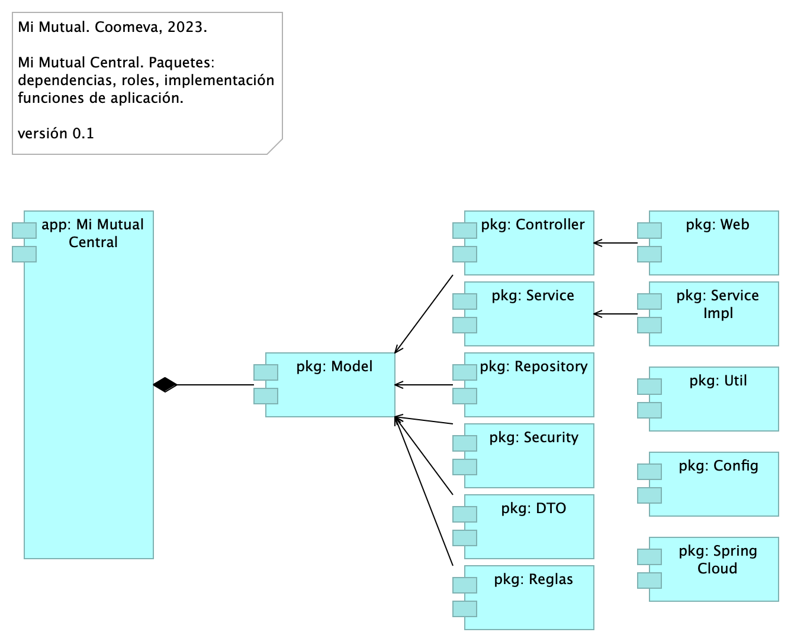
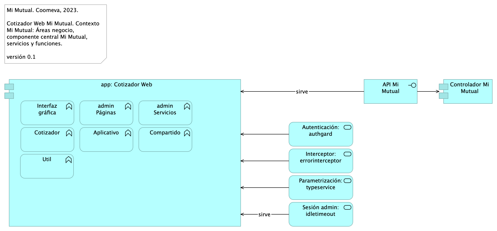

# Vistas de Arquitectura Mi Mutual
* [Mi Mutual Central](#mi-mutual-central)
	* [Arq Mi Mutual. 1. Contexto](#arq-mi-mutual.-1.-contexto)
	* [Arq Mi Mutual. 2. Contenedores](#arq-mi-mutual.-2.-contenedores)
	* [Arq Mi Mutual. 3. Dominios](#arq-mi-mutual.-3.-dominios)
	* [Arq Mi Mutual. 4. Aplicación](#arq-mi-mutual.-4.-aplicación)
	* [Arq Mi Mutual. 4a3. Dependencias](#arq-mi-mutual.-4a3.-dependencias)
	* [Arq Mi Mutual. 5. Físico (despliegue)](#arq-mi-mutual.-5.-físico-despliegue)
	* [Arq Mi Mutual. 6. Infraestructura](#arq-mi-mutual.-6.-infraestructura)
* [Cotizador Web](#cotizador-web)
	* [ArqCotizador. 1. Contexto](#arqcotizador.-1.-contexto)
	* [ArqCotizador. 4a. Dependencias](#arqcotizador.-4a.-dependencias)
	* [ArqCotizador. 5. Físico (despliegue)](#arqcotizador.-5.-físico-despliegue)
	* [ArqCotizador. 7. Datos. Negocio](#arqcotizador.-7.-datos.-negocio)

\newpage

# Mi Mutual Central
## Arq Mi Mutual. 1. Contexto
{#fig:ArqMiMutual.1.Contexto width=}

Spring Boot Security y Spring Boot Oauth2 proveen características de seguridad entre Vista (Angular 2) y Controlador. Estas son responsables de que únicamente permita el acceso si se está autenticado. Además, para realizar el proceso de autenticación se delega a la aplicación SISPRO (Coomeva) que funciona como un servidor de autenticación.

### Catálogo de Elementos
| Name| Type| Description| Properties
|:--------|:--------|:--------|:--------|
|**app: Mi Mutual Central**|application-component|Antes SIPAS, Mi Mutual es una aplicación web compuesta por distintos módulos de software con arreglo a todas las actividades necesarias que soportan la operación de los productos y servicios que ofrece la Unidad de Solidaridad y Seguros de la Cooperativa.|*modulo:* mimutual |
|**Administración facturación y recaudo**|application-function|Administración de la facturación y recaudo diario de los productos ||
|**Autorizaciones**|application-function|Autorizaciones: Administración de peticiones de autorización y sus correspondientes aprobaciones mediante el servicio del flujo de procesos||
|**Certificados**|application-function|Certificados: Permite la generación de los certificados de valores de protección y contribuciones pagadas, de retención en la fuente, de pagos de perseverancia y de cobertura de auxilio funerario. ||
|**Configuración factores cálculos, contribuciones**|application-function|1. Configuración o parametrización de factores para realizar los cálculos de las contribuciones de los asociados a la Cooperativa para cada uno de los productos adquiridos. ||
|**Gestión Beneficiarios**|application-function|Gestión de Beneficiarios: Permite administrar la información relacionada con los beneficiarios del Asociado, permitiendo ejecutar operaciones de consulta, inserción y modificación. ||
|**Gestión Reclamaciones**|application-function|Gestión de Reclamaciones (Indemnización): Permite realizar la gestión, seguimiento y pago o negación de las diferentes reclamaciones de acuerdo a las coberturas y los productos que se encuentren dentro del portafolio del Asociado. ||
|**Gestión Usuarios**|application-function|Gestión de Usuarios: Administración de la información relacionada con los usuarios del sistema. Este componente se comunica con el servicio unificado de autenticación y autorización que devuelve los permisos que un usuario posee sobre las opciones que proporciona el sistema. ||
|**Gestión fondo mutual y auxilio funerario**|application-function|Gestión de productos del fondo mutual y auxilio funerario que involucran a sus coberturas ||
|**Interoperabilidad entre sistemas Coomeva**|application-function|Integración con otros sistemas para facilitar los procesos de vinculación, retiro, reactivación o fallecimiento de asociados. ||
|**Seguridad**|application-function|||
|**Simuladores**|application-function|Simuladores: Funcionalidades que permiten generar las simulaciones de los diferentes planes o modificaciones (incrementos y disminuciones) a los productos del Asociado. ||
|**Autorizaciones**|application-service|Autorizaciones: Administración de peticiones de autorización y sus correspondientes aprobaciones usando el servicio del flujo de procesos.||
|**Certificados**|application-service|Certificados: Permite la generación de los certificados de valores de protección y contribuciones pagadas, de retención en la fuente, de pagos de perseverancia y de cobertura de auxilio funerario.||
|**Configuración**|application-service|Configuración o parametrización de factores para realizar los cálculos de las contribuciones de los asociados a la Cooperativa para cada uno de los productos adquiridos.||
|**Facturación y Recaudo**|application-service|Administración de la facturación y recaudo diario de los productos||
|**Gestión de Beneficiarios**|application-service|Gestión de Beneficiarios: Permite administrar la información relacionada con los beneficiarios del Asociado, permitiendo ejecutar operaciones de consulta, inserción y modificación ||
|**Gestión de Productos**|application-service|Gestión de productos del fondo mutual y auxilio funerario que involucran lo relacionado a las siguientes coberturas: * Fondo de Solidaridad: Incapacidades temporales, Incapacidades Permanentes (total, parcial), Perseverancia 60, 62, 65, 70 años, Perseverancias Anticipadas, Fallecimiento Asociado (Auxilio por muerte), Desempleo, Disminución de ingresos y enfermedades graves; Rentas por hospitalización, Enfermedades de Alto Costo, Pólizas de seguros personales y patrimoniales, Planes educativos, Segunda opinión médica, Asistencias. * Auxilio Funerario: Fallecimiento de familiares directos (inscritos) del Asociado.||
|**Gestión de Reclamos**|application-service|Gestión de Reclamaciones (Indemnización): Permite realizar la gestión, seguimiento y pago o negación de las diferentes reclamaciones de acuerdo a las coberturas y los productos que se encuentren dentro del portafolio del Asociado||
|**Gestión de Usuarios**|application-service|Gestión de Usuarios: Administración de la información relacionada con los usuarios del sistema. Este componente se comunica con el servicio unificado de autenticación y autorización que devuelve los permisos que un usuario posee sobre las opciones que proporciona el sistema.||
|**Simuladores**|application-service|Simuladores: Funcionalidades que permiten generar las simulaciones de los diferentes planes o modificaciones (incrementos y disminuciones) a los productos del Asociado.||
|**Unidad de Solidaridad y Seguros**|business-function|Unidad de Solidaridad y Seguros de la Cooperativa||
|**Restricciones de Arquitectura**|constraint|## Restricciones de Arquitectura (Atributos) 1. Disponibilidad. Se requiere que el sistema esté disponible 7 X 24, el servicio prestado al cliente no se limita a horarios de oficina pues las compras pueden darse en cualquier momento 1. Escalabilidad. Se requiere que el sistema pueda llegar a atender hasta 1.000 clientes, para esto se requiere que el sistema se pueda extender horizontalmente de tal manera que pueda tener instalado en varios servidores para atender esta cantidad de usuarios. Todas las aplicaciones desarrolladas podrán ser escaladas horizontalmente para atender la demanda relacionada con el crecimiento de la empresa. 1. Reutilización. Se requiere que el sistema permita reutilizar sus componentes para prestar el mismo servicio a otras aplicaciones de la compañía. Para esto se va a desarrollar la aplicación utilizando servicios, separados y con asignación de responsabilidades, propias, de tal manera de que, si se requiere exponer servicios web sobre estas funcionalidades, no requiere cambios en la aplicación. 1. Autenticación. Autenticación es el proceso para determinar que alguien o un sistema es quien dice ser. Uso de estándar Oauth2 y JSON Web Token – JWT, para gestión de autenticación de servicios de la aplicación. 1. Autorización. Autorización se refiere a la validación que realiza un sistema para determinar si un usuario puede usar cierta funcionalidad. Uso de API de seguridad de Spring (spring-security) + Oauth2 1. Interoperabilidad – Movilidad. Interoperabilidad se refiere a la habilidad de un sistema de interactuar y comunicarse con sistemas heterogéneos a través de interfaces completamente definidas. Uso de estándar de web services REST + JSON. 1. Facilidad de Uso. Se refiere a la facilidad con que las personas pueden utilizar el sistema porque facilitan la lectura de los textos, descargan rápidamente la información y presentan funciones y menús sencillos, por lo que el usuario encuentra satisfechas sus consultas y cómodo su uso. 1. Verificación (QA). Es la capacidad del producto software que hace posible que el software modificado sea probado. ||
|**Características Funcionales**|requirement|## Características Funcionales $APLICATIVO 1. Gestión de productos del fondo mutual y auxilio funerario que involucran a sus coberturas 1. Administración de la facturación y recaudo diario de los productos 1. Gestión de Reclamaciones (Indemnización): Permite realizar la gestión, seguimiento y pago o negación de las diferentes reclamaciones de acuerdo a las coberturas y los productos que se encuentren dentro del portafolio del Asociado. 1. Gestión de Beneficiarios: Permite administrar la información relacionada con los beneficiarios del Asociado, permitiendo ejecutar operaciones de consulta, inserción y modificación. 1. Gestión de Usuarios: Administración de la información relacionada con los usuarios del sistema. Este componente se comunica con el servicio unificado de autenticación y autorización que devuelve los permisos que un usuario posee sobre las opciones que proporciona el sistema. 1. Integración con otros sistemas para facilitar los procesos de vinculación, retiro, reactivación o fallecimiento de asociados. 1. Configuración o parametrización de factores para realizar los cálculos de las contribuciones de los asociados a la Cooperativa para cada uno de los productos adquiridos. ||

## Arq Mi Mutual. 2. Contenedores
{#fig:ArqMiMutual.2.Contenedores width=}

La organización de componentes utilizada Mi Mutual, impulsada por Spring Web, antepone como interfaz de uso un API REST. La interfaz se articula con tres componentes utilitarios: Controller, Service y Repository, los cuales están mediados por el componente misional, Mi Mutual, en la imagen. 

Esta decisión de organización de los componentes de Mi Mutual, incluyendo al misional del mismo nomnbre, permite estructurar la aplicación de una manera ordenada y, en línea con las restricciones de arquitectura exigidas al sistema, facilita la efectividad de las extensiones y el mantenimiento.

### Catálogo de Elementos
| Name| Type| Description| Properties
|:--------|:--------|:--------|:--------|
|**Controlador Mi Mutual**|application-component|Los componentes de este tipo se encargan de controlar los servicios rest de la aplicación, además en estos componentes se define la forma como se reciben y envían los datos de los servicios rest y la seguridad de cada uno de los métodos.|*modulo:* mimutual |
|**Registro Servicios: eureka**|application-component|Eureka: Contiene todas las funcionalidades relacionadas con registrar y localizar microservicios existentes, informar de su localización, su estado y datos relevantes de cada uno de ellos. |*modulo:* mimutual |
|**Repositorio Mi Mutual**|application-component|Antes SIPAS, Mi Mutual es una aplicación web compuesta por distintos módulos de software con arreglo a todas las actividades necesarias que soportan la operación de los productos y servicios que ofrece la Unidad de Solidaridad y Seguros de la Cooperativa. Para el manejo de la persistencia de datos se utilizará Spring Data el cual se apoya en la especificación de JPA y en la implementación de HIBERNATE además de complementar esta capa de persistencia con nuevas funcionalidades que facilitan el acceso a datos. |*modulo:* mimutual |
|**Ruteador (proxy): gateway**|application-component|Gateway: Contiene todas las funcionalidades relacionadas con un proxy inverso que reenvía las llamadas relevantes a otros servicios. |*modulo:* mimutual |
|**app: Cotizador Web**|application-component|pkg: MiMutualWeb|*modulo:* cotizador |
|**app: Implementación de Servicios**|application-component|Los componentes de este tipo se encargan de controlar y almacenar toda la lógica del negocio, validaciones y todo lo referente a procesamiento de datos. |*modulo:* mimutual |
|**app: Mi Mutual Central**|application-component|Antes SIPAS, Mi Mutual es una aplicación web compuesta por distintos módulos de software con arreglo a todas las actividades necesarias que soportan la operación de los productos y servicios que ofrece la Unidad de Solidaridad y Seguros de la Cooperativa.|*modulo:* mimutual |
|**API Mi Mutual**|application-interface||*modulo:* mimutual |

## Arq Mi Mutual. 3. Dominios
{#fig:ArqMiMutual.3.Dominios width=}

La división por dominios busca facilitar la administración los servicios de la plataforma Mi Mutual que son comunes entre aplicaciones de Mi Mutual, tales como Asociados, Reclamaciones, Protecciones y otros servicios trasversales como Utilidades, Reglas de negocio, Procesos de negocio (BPM), Auditoria, Flujos de trabajo:flowable.

### Catálogo de Elementos
| Name| Type| Description| Properties
|:--------|:--------|:--------|:--------|
|**Flujo Trabajo: flowable**|application-component|Contiene todas las funcionalidades relacionadas con el motor de BPM Flowable, como gestión de tareas, instancias de nuevas procesos y asignación de tareas.|*modulo:* mimutual |
|**Integración**|application-component|Contiene todas las funcionalidades relacionadas con integraciones a otros servicios y otras bases de datos.|*modulo:* mimutual |
|**Procesos negocio**|application-component|Contiene todas las funcionalidades relacionadas con los flujos de JBPM, actualmente se hace solo para acceso a datos de la base de datos de JBPM.|*modulo:* mimutual |
|**Reglas negocio**|application-component|Contiene todas las funcionalidades relacionadas con la validación de reglas usadas en otros microservicios.|*modulo:* mimutual |
|**SISPRO**|application-component|Contiene todas las funcionalidades relacionadas con la autenticación y autorización al sistema Mi mutual (Este componente se adopta a la arquitectura de microservicios de MiMutual)|*modulo:* mimutual |
|**Utilidades**|application-component|Contiene todas las funcionalidades útiles y trasversales a los microservicios, como envió de correos, generación de archivos Excel, PDF desde Jasper y consulta de parámetros.|*modulo:* mimutual |
|**app: Asociados**|application-component|Contiene todas las funcionalidades relacionadas con consulta y creación de asociados y beneficiarios.|*modulo:* mimutual |
|**app: Auditoria**|application-component|Contiene todas las funcionalidades relacionadas con el almacenamiento de la auditoria de las peticiones de la aplicación.|*modulo:* mimutual |
|**app: Eureka admin**|application-component|Contiene todas las funcionalidades relacionadas con registrar y localizar microservicios existentes, informar de su localización, su estado y datos relevantes de cada uno de ellos.|*modulo:* mimutual |
|**app: Gateway**|application-component|Contiene todas las funcionalidades relacionadas con un proxy inverso que reenvía las llamadas relevantes a otros servicios.|*modulo:* mimutual |
|**app: Identidades**|application-component|Contiene todas las funcionalidades relacionadas con la gestión de los archivos de propiedades de los microservicios (Esta en construcción y no se ha integrado).|*modulo:* mimutual |
|**app: Mi Mutual Central**|application-component|Antes SIPAS, Mi Mutual es una aplicación web compuesta por distintos módulos de software con arreglo a todas las actividades necesarias que soportan la operación de los productos y servicios que ofrece la Unidad de Solidaridad y Seguros de la Cooperativa.|*modulo:* mimutual |
|**app: Protecciones**|application-component|Contiene todas las funcionalidades relacionadas con la gestión y configuración de productos y protecciones.|*modulo:* mimutual |
|**app: Reclamaciones**|application-component|Contiene todas las funcionalidades relacionadas con la gestión de reclamaciones, liquidaciones y pagos.|*modulo:* mimutual |
|**app: Secuencias: zipkin**|application-component|Contiene todas las funcionalidades relacionadas con la generación de IDs para la trazabilidad de los logs.|*modulo:* mimutual |

## Arq Mi Mutual. 4. Aplicación
{#fig:ArqMiMutual.4.Aplicación width=}

### Catálogo de Elementos
| Name| Type| Description| Properties
|:--------|:--------|:--------|:--------|
|**Controlador Mi Mutual**|application-component|Los componentes de este tipo se encargan de controlar los servicios rest de la aplicación, además en estos componentes se define la forma como se reciben y envían los datos de los servicios rest y la seguridad de cada uno de los métodos.|*modulo:* mimutual |
|**Mi Mutual Presentación**|application-component|||
|**Repositorio Mi Mutual**|application-component|Antes SIPAS, Mi Mutual es una aplicación web compuesta por distintos módulos de software con arreglo a todas las actividades necesarias que soportan la operación de los productos y servicios que ofrece la Unidad de Solidaridad y Seguros de la Cooperativa. Para el manejo de la persistencia de datos se utilizará Spring Data el cual se apoya en la especificación de JPA y en la implementación de HIBERNATE además de complementar esta capa de persistencia con nuevas funcionalidades que facilitan el acceso a datos. |*modulo:* mimutual |
|**Simulador**|application-component|||
|**Vinculación**|application-component|||
|**app: Cotización y Ventas**|application-component|||
|**app: Cotizador Web**|application-component|pkg: MiMutualWeb|*modulo:* cotizador |
|**app: Implementación de Servicios**|application-component|Los componentes de este tipo se encargan de controlar y almacenar toda la lógica del negocio, validaciones y todo lo referente a procesamiento de datos. |*modulo:* mimutual |
|**app: Mi Mutual Central**|application-component|Antes SIPAS, Mi Mutual es una aplicación web compuesta por distintos módulos de software con arreglo a todas las actividades necesarias que soportan la operación de los productos y servicios que ofrece la Unidad de Solidaridad y Seguros de la Cooperativa.|*modulo:* mimutual |
|**Integración**|application-interface|Integración con otros sistemas para facilitar los procesos de vinculación, retiro, reactivación o fallecimiento de asociados.||
|**Autorizaciones**|application-service|Autorizaciones: Administración de peticiones de autorización y sus correspondientes aprobaciones usando el servicio del flujo de procesos.||
|**Certificados**|application-service|Certificados: Permite la generación de los certificados de valores de protección y contribuciones pagadas, de retención en la fuente, de pagos de perseverancia y de cobertura de auxilio funerario.||
|**Configuración**|application-service|Configuración o parametrización de factores para realizar los cálculos de las contribuciones de los asociados a la Cooperativa para cada uno de los productos adquiridos.||
|**Facturación y Recaudo**|application-service|Administración de la facturación y recaudo diario de los productos||
|**Gestión de Beneficiarios**|application-service|Gestión de Beneficiarios: Permite administrar la información relacionada con los beneficiarios del Asociado, permitiendo ejecutar operaciones de consulta, inserción y modificación ||
|**Gestión de Productos**|application-service|Gestión de productos del fondo mutual y auxilio funerario que involucran lo relacionado a las siguientes coberturas: * Fondo de Solidaridad: Incapacidades temporales, Incapacidades Permanentes (total, parcial), Perseverancia 60, 62, 65, 70 años, Perseverancias Anticipadas, Fallecimiento Asociado (Auxilio por muerte), Desempleo, Disminución de ingresos y enfermedades graves; Rentas por hospitalización, Enfermedades de Alto Costo, Pólizas de seguros personales y patrimoniales, Planes educativos, Segunda opinión médica, Asistencias. * Auxilio Funerario: Fallecimiento de familiares directos (inscritos) del Asociado.||
|**Gestión de Reclamos**|application-service|Gestión de Reclamaciones (Indemnización): Permite realizar la gestión, seguimiento y pago o negación de las diferentes reclamaciones de acuerdo a las coberturas y los productos que se encuentren dentro del portafolio del Asociado||
|**Gestión de Usuarios**|application-service|Gestión de Usuarios: Administración de la información relacionada con los usuarios del sistema. Este componente se comunica con el servicio unificado de autenticación y autorización que devuelve los permisos que un usuario posee sobre las opciones que proporciona el sistema.||
|**Simuladores**|application-service|Simuladores: Funcionalidades que permiten generar las simulaciones de los diferentes planes o modificaciones (incrementos y disminuciones) a los productos del Asociado.||
|**Analistas**|business-role|Analistas y auxiliares de servicio regional y nacional, agentes del centro de contacto, auditores médicos, analistas de operaciones (aseguramiento y facturación) y jefes.||
|**Asesores**|business-role|Asesores integrales||
|**Auxiliares servicio**|business-role|Analistas y auxiliares de servicio regional y nacional, agentes del centro de contacto, auditores médicos, analistas de operaciones (aseguramiento y facturación) y jefes.||
|**Fidelización**|business-role|Ejecutivos de Fidelización||
|**Profundización**|business-role|Ejecutivos de Profundización||
|**Unidad de Solidaridad y Seguros**|grouping|La Unidad de Solidaridad y Seguros cuenta con un software integrado para su core de negocio denominado SIPAS (Sistema de Previsión, Asistencia y Solidaridad)||
|**Servicio de Almacenamiento de Datos**|technology-service|||
|**Servicio de Red**|technology-service|||
|**Servicio de archivos**|technology-service|||

## Arq Mi Mutual. 4a3. Dependencias
{#fig:ArqMiMutual.4a3.Dependencias width=}

## Paquetes y Dependencias Mi Mutual
La estructura está basada en spring boot y lenguaje de programación JAVA 8, conformada por componentes de aplicación y administración del ciclo de vida de los objetos.

Nombrado de paquetes para los servicios

* MiMutualWeb
* MiMutualProtecciones
* MiMutualReclamaciones 
* MiMutualAsociados
* MiMutualUtilidades
* MiMutualBPM
* MiMutualReglas
* MiMutualIntegraciones
* MiMutualAuditoria
* Mi<utualFLowable
* MiMutualSpringCloud

 

## Entorno de Desarrollo
Para la etapa de desarrollo la aplicación estará configurada para levantar un servidor Tomcat embebido el cual se encuentra configurado el pom.xml y el cual permite trabajar de forma mucho más ágil.

Para el despliegue entre ambientes se manejará maven profiles con el fin de agregar las configuraciones de cada uno de estos.

El código fuente está alojado en un repositorio de Coomeva.

### Catálogo de Elementos
| Name| Type| Description| Properties
|:--------|:--------|:--------|:--------|
|**app: Mi Mutual Central**|application-component|Antes SIPAS, Mi Mutual es una aplicación web compuesta por distintos módulos de software con arreglo a todas las actividades necesarias que soportan la operación de los productos y servicios que ofrece la Unidad de Solidaridad y Seguros de la Cooperativa.|*modulo:* mimutual |
|**pkg: Config**|application-component|config: Almacenan todas las clases para la configuración del proyecto Spring.||
|**pkg: Controller**|application-component|controller: Almacenan todas las clases que constituyen los servicios rest de la aplicación.||
|**pkg: DTO**|application-component|dto: Almacenan todas las clases (pojos) para manejo de datos.||
|**pkg: Model**|application-component|model: Almacenan todas las clases (entities) que constituyen el modelo de datos. ||
|**pkg: Reglas**|application-component|dto: Almacenan todas las clases (pojos) para manejo de datos.||
|**pkg: Repository**|application-component|repository: Almacenan todas las interfaces y clases que constituyen el acceso a datos. ||
|**pkg: Security**|application-component|security: Almacenan todas las clases que permiten la configuración de seguridad de la aplicación. ||
|**pkg: Service**|application-component|service: Almacenan todas las interfaces que constituyen la lógica de negocio.||
|**pkg: Service Impl**|application-component|service.impl: Almacenan todas las clases que implementan la funcionalidad de las interfaces de service que constituyen la lógica de negocio.||
|**pkg: Spring Cloud**|application-component|dto: Almacenan todas las clases (pojos) para manejo de datos.||
|**pkg: Util**|application-component|util: Almacenan todas las clases de utilería para la aplicación.||
|**pkg: Web**|application-component|dto: Almacenan todas las clases (pojos) para manejo de datos.||

## Arq Mi Mutual. 5. Físico (despliegue)
.png){#fig:ArqMiMutual.5.Físico(despliegue) width=}

Especificaciones de despliegue Mi Mutual, 2023, componente central.

* Estándares para el manejo de servicios REST sobre HTTP 1.1
* Tecnologías para el backend: Java 8 con Spring Boot2.1.4
* Acceso a Datos: Spring Data 2.1.4
* Seguridad de las API: Spring Security + Oauth2.0
* Plataforma de despliegue Backend: Tomcat Spring boot
* Tecnologías para el frontend: Angular 7
* Librería de Estilos: Bootstrap 4
* Servidor web (HTTP 1.1): Apache 2.X

### Catálogo de Elementos
| Name| Type| Description| Properties
|:--------|:--------|:--------|:--------|
|**app: Asociados**|application-component|Contiene todas las funcionalidades relacionadas con consulta y creación de asociados y beneficiarios.|*modulo:* mimutual |
|**app: Eureka admin**|application-component|Contiene todas las funcionalidades relacionadas con registrar y localizar microservicios existentes, informar de su localización, su estado y datos relevantes de cada uno de ellos.|*modulo:* mimutual |
|**app: Gateway**|application-component|Contiene todas las funcionalidades relacionadas con un proxy inverso que reenvía las llamadas relevantes a otros servicios.|*modulo:* mimutual |
|**app: Identidades**|application-component|Contiene todas las funcionalidades relacionadas con la gestión de los archivos de propiedades de los microservicios (Esta en construcción y no se ha integrado).|*modulo:* mimutual |
|**app: Implementación de Servicios**|application-component|Los componentes de este tipo se encargan de controlar y almacenar toda la lógica del negocio, validaciones y todo lo referente a procesamiento de datos. |*modulo:* mimutual |
|**app: Mi Mutual Central**|application-component|Antes SIPAS, Mi Mutual es una aplicación web compuesta por distintos módulos de software con arreglo a todas las actividades necesarias que soportan la operación de los productos y servicios que ofrece la Unidad de Solidaridad y Seguros de la Cooperativa.|*modulo:* mimutual |
|**app: Protecciones**|application-component|Contiene todas las funcionalidades relacionadas con la gestión y configuración de productos y protecciones.|*modulo:* mimutual |
|**app: Reclamaciones**|application-component|Contiene todas las funcionalidades relacionadas con la gestión de reclamaciones, liquidaciones y pagos.|*modulo:* mimutual |
|**app: Secuencias: zipkin**|application-component|Contiene todas las funcionalidades relacionadas con la generación de IDs para la trazabilidad de los logs.|*modulo:* mimutual |
|**Directorio: eureka: tomcat**|system-software|||
|**Entorno Java: JRE 1.8**|system-software|||
|**Gateway: tomcat**|system-software|||
|**Identidad: spring cloud security**|system-software|||
|**Secuencias: zipking: tomcat**|system-software|||
|**Servicios: tomcat**|system-software||*modulo:* mimutual |

## Arq Mi Mutual. 6. Infraestructura
{#fig:ArqMiMutual.6.Infraestructura width=}

### Catálogo de Elementos
| Name| Type| Description| Properties
|:--------|:--------|:--------|:--------|
|**app: Mi Mutual Central**|application-component|Antes SIPAS, Mi Mutual es una aplicación web compuesta por distintos módulos de software con arreglo a todas las actividades necesarias que soportan la operación de los productos y servicios que ofrece la Unidad de Solidaridad y Seguros de la Cooperativa.|*modulo:* mimutual |
|**Spring cloud security**|node|Se implementará Spring Boot Security y Spring Boot Oauth2 las cuales proveen una capa básica de seguridad entre Vista (Angular 2) y Controlador, obligando a que únicamente permita el acceso si se está autenticado si lo requiere, además para realizar el proceso de autenticación se utilizara la aplicación SISPRO (Coomeva) la cual funciona como un servidor de autenticación. La validación de roles se realizará a nivel de peticiones en el api rest según corresponda, siempre y cuando sea necesario, también se tendrán en cuenta otras validaciones como: • Las credenciales que proporcionó no son válidas. • El usuario esta deshabilitado. • Las credenciales de usuario han caducado. • La cuenta de usuario ha caducado. • La cuenta de usuario está bloqueada.||
|**DB2 AS400: SIPASDB**|system-software|Las bases de datos a utilizar son:  * DB2 AS400: SIPASDB * Sql Server (...) * Oracle (...) ||
|**Oracle DB: (...)**|system-software|Las bases de datos a utilizar son:  * DB2 AS400: SIPASDB * Sql Server (...) * Oracle (...) ||
|**SQL Server: (...)**|system-software|Las bases de datos a utilizar son:  * DB2 AS400: SIPASDB * SQL Server (...) * Oracle (...) ||
|**Servicio de Almacenamiento de Datos**|technology-service|||
|**Servicio de Red**|technology-service|||
|**Servicio de archivos**|technology-service|||

\newpage

# Cotizador Web
## ArqCotizador. 1. Contexto
{#fig:ArqCotizador.1.Contexto width=}

## Módulos Mi Mutual Web
La estructura por módulos permite realizar aplicaciones escalables y robustas ya que permite organizar las partes de la aplicación, la organización en bloques, extender la aplicación con funcionalidades de libreras externas, proporcionar un entorno de resolución de plantillas y además permite especificar la forma de la carga de cada uno de los componentes y servicios que conforman un módulo.

## 3.2 Módulos Externos
Los módulos externos son todas y cada uno de las herramientas que se utilizan para complementar con funcionalidades ya desarrolladas y tomadas desde un repositorio externo (NPM).

* TranslateModule: Manejo de internacionalización. Documentación: https://github.com/ngx-translate/core
* NgxMaskModule: Manejo de máscaras de input text. Documentación: https://github.com/JsDaddy/ngx-mask
* JwtModule: Manejo de token.
Documentación: https://github.com/auth0/angular2-jwt
* sweetalert2: Manejo de alertas de mensajes. Documentación: https://sweetalert2.github.io/
* ngx-ui-loader: Manejo de Spinner para control de peticiones asíncronas. Documentación: https://github.com/t-ho/ngx-ui-loader
* Ngprime: Manejo de componentes visuales Documentación: https://www.primefaces.org/primeng/#/
* chart.js: componente utilizado para el manejo de graficas Documentación: https://www.chartjs.org/docs/latest/
* classlist.js: componete para el manejo de listas de datos en las gráficas Documentación: https://www.chartjs.org/docs/latest/
* cronstrue: componente para traducir una expresión cron a palabras Documentación: https://github.com/bradymholt/cronstrue
* file-saver: componente para descargar un archivo desde los bytes Documentación: https://github.com/eligrey/FileSaver.js#readme
* ngx-tinymce: Editor html para generación de plantillas para cartas Documentación: https://cipchk.github.io/ngx-tinymce/#/
* quill: componente para editor html Documentación: https://quilljs.com/

 

## Servicios Transversales 

* AuthGuard: Validación de existencia de autenticación
* DeaciveGuard: Validación de salida de un componente
* ErrorInterceptor: Interceptor de Errores del back
* JwtInterceptor: Interceptor para inyectar el token
* AutenticationService: Métodos para completar la autenticación
* TypesService: Consumo de servicios de parametrización
* IdleTimeoutService: Verificación de timeout del token

 

### Catálogo de Elementos
| Name| Type| Description| Properties
|:--------|:--------|:--------|:--------|
|**Controlador Mi Mutual**|application-component|Los componentes de este tipo se encargan de controlar los servicios rest de la aplicación, además en estos componentes se define la forma como se reciben y envían los datos de los servicios rest y la seguridad de cada uno de los métodos.|*modulo:* mimutual |
|**app: Cotizador Web**|application-component|pkg: MiMutualWeb|*modulo:* cotizador |
|**Aplicativo**|application-function||*modulo:* cotizador |
|**Compartido**|application-function||*modulo:* cotizador |
|**Cotizador**|application-function||*modulo:* cotizador |
|**Interfaz gráfica**|application-function||*modulo:* cotizador |
|**Util**|application-function|En la Utilidades se especifican las clases que complementan una funcionalidad de un componente o servicio. * FormValidate: Clase que implementa un disparador de validación de todos los campos de un formulario. * CustomValidators: Creación de validaciones de campos.   |*modulo:* cotizador |
|**admin Páginas**|application-function||*modulo:* cotizador |
|**admin Servicios**|application-function||*modulo:* cotizador |
|**API Mi Mutual**|application-interface||*modulo:* mimutual |
|**Autenticación: authgard**|application-service|||
|**Interceptor: errorinterceptor**|application-service|||
|**Parametrización: typeservice**|application-service|||
|**Sesión admin: idletimeout**|application-service|||

## ArqCotizador. 4a. Dependencias
{#fig:ArqCotizador.4a.Dependencias width=}

## Paquetes y Dependencias Cotizador Web
Módulos y componentes que hacen parte de la estructura de la aplicación Cotizador Web (basado en Angular 7 [^1]).

[^1]: Angular 2 tiene una arquitectura Modelo Vista Controlador (MVC) con el fin de hacer el desarrollo gestionado.

## Módulos
La estructura por módulos actual apunta a la escalabilidad y mantenimiento del Cotizador en términos de: organizar las partes de la aplicación, organización los bloques, extender la aplicación con libreras externas, proporcionar un entorno de resolución de plantillas y además, distribuir las cargas de los componentes y servicios que usa la aplicación.

### Catálogo de Elementos
| Name| Type| Description| Properties
|:--------|:--------|:--------|:--------|
|**app: Cotizador Web**|application-component|pkg: MiMutualWeb|*modulo:* cotizador |
|**pkg: admin**|application-component|controller: Almacenan todas las clases que constituyen los servicios rest de la aplicación.|*modulo:* cotizador |
|**pkg: administración**|application-component|controller: Almacenan todas las clases que constituyen los servicios rest de la aplicación.|*modulo:* cotizador |
|**pkg: asociados**|application-component|controller: Almacenan todas las clases que constituyen los servicios rest de la aplicación.|*modulo:* cotizador |
|**pkg: auth**|application-component|controller: Almacenan todas las clases que constituyen los servicios rest de la aplicación.|*modulo:* cotizador |
|**pkg: cliente**|application-component|controller: Almacenan todas las clases que constituyen los servicios rest de la aplicación.|*modulo:* cotizador |
|**pkg: clientes**|application-component|controller: Almacenan todas las clases que constituyen los servicios rest de la aplicación.|*modulo:* cotizador |
|**pkg: componentes**|application-component|controller: Almacenan todas las clases que constituyen los servicios rest de la aplicación.|*modulo:* cotizador |
|**pkg: config**|application-component|controller: Almacenan todas las clases que constituyen los servicios rest de la aplicación.|*modulo:* cotizador |
|**pkg: cotizaciones**|application-component|controller: Almacenan todas las clases que constituyen los servicios rest de la aplicación.|*modulo:* cotizador |
|**pkg: cotización**|application-component|controller: Almacenan todas las clases que constituyen los servicios rest de la aplicación.|*modulo:* cotizador |
|**pkg: directivas**|application-component|controller: Almacenan todas las clases que constituyen los servicios rest de la aplicación.|*modulo:* cotizador |
|**pkg: home**|application-component|controller: Almacenan todas las clases que constituyen los servicios rest de la aplicación.|*modulo:* cotizador |
|**pkg: interfaces**|application-component|controller: Almacenan todas las clases que constituyen los servicios rest de la aplicación.|*modulo:* cotizador |
|**pkg: modelos**|application-component|controller: Almacenan todas las clases que constituyen los servicios rest de la aplicación.|*modulo:* cotizador |
|**pkg: multiactiva**|application-component|controller: Almacenan todas las clases que constituyen los servicios rest de la aplicación.|*modulo:* cotizador |
|**pkg: protecciones**|application-component|controller: Almacenan todas las clases que constituyen los servicios rest de la aplicación.|*modulo:* cotizador |
|**pkg: proveedores**|application-component|controller: Almacenan todas las clases que constituyen los servicios rest de la aplicación.|*modulo:* cotizador |
|**pkg: reporte**|application-component|controller: Almacenan todas las clases que constituyen los servicios rest de la aplicación.|*modulo:* cotizador |
|**pkg: reportes**|application-component|controller: Almacenan todas las clases que constituyen los servicios rest de la aplicación.|*modulo:* cotizador |
|**pkg: transporte**|application-component|controller: Almacenan todas las clases que constituyen los servicios rest de la aplicación.|*modulo:* cotizador |
|**pkg: util**|application-component|controller: Almacenan todas las clases que constituyen los servicios rest de la aplicación.|*modulo:* cotizador |
|**pkg: utilidades**|application-component|controller: Almacenan todas las clases que constituyen los servicios rest de la aplicación.|*modulo:* cotizador |
|**Aplicativo**|application-function||*modulo:* cotizador |
|**Compartido**|application-function||*modulo:* cotizador |
|**Cotizador**|application-function||*modulo:* cotizador |
|**Interfaz gráfica**|application-function||*modulo:* cotizador |
|**Util**|application-function|En la Utilidades se especifican las clases que complementan una funcionalidad de un componente o servicio. * FormValidate: Clase que implementa un disparador de validación de todos los campos de un formulario. * CustomValidators: Creación de validaciones de campos.   |*modulo:* cotizador |
|**admin Páginas**|application-function||*modulo:* cotizador |
|**admin Servicios**|application-function||*modulo:* cotizador |

## ArqCotizador. 5. Físico (despliegue)
.png){#fig:ArqCotizador.5.Físico(despliegue) width=}

### Catálogo de Elementos
| Name| Type| Description| Properties
|:--------|:--------|:--------|:--------|
|**app: Asociados**|application-component|Contiene todas las funcionalidades relacionadas con consulta y creación de asociados y beneficiarios.|*modulo:* mimutual |
|**app: Cotizador Web**|application-component|pkg: MiMutualWeb|*modulo:* cotizador |
|**app: Implementación de Servicios**|application-component|Los componentes de este tipo se encargan de controlar y almacenar toda la lógica del negocio, validaciones y todo lo referente a procesamiento de datos. |*modulo:* mimutual |
|**app: Protecciones**|application-component|Contiene todas las funcionalidades relacionadas con la gestión y configuración de productos y protecciones.|*modulo:* mimutual |
|**app: Reclamaciones**|application-component|Contiene todas las funcionalidades relacionadas con la gestión de reclamaciones, liquidaciones y pagos.|*modulo:* mimutual |
|**pkg: admin**|application-component|controller: Almacenan todas las clases que constituyen los servicios rest de la aplicación.|*modulo:* cotizador |
|**pkg: administración**|application-component|controller: Almacenan todas las clases que constituyen los servicios rest de la aplicación.|*modulo:* cotizador |
|**pkg: asociados**|application-component|controller: Almacenan todas las clases que constituyen los servicios rest de la aplicación.|*modulo:* cotizador |
|**pkg: auth**|application-component|controller: Almacenan todas las clases que constituyen los servicios rest de la aplicación.|*modulo:* cotizador |
|**pkg: cliente**|application-component|controller: Almacenan todas las clases que constituyen los servicios rest de la aplicación.|*modulo:* cotizador |
|**pkg: clientes**|application-component|controller: Almacenan todas las clases que constituyen los servicios rest de la aplicación.|*modulo:* cotizador |
|**pkg: config**|application-component|controller: Almacenan todas las clases que constituyen los servicios rest de la aplicación.|*modulo:* cotizador |
|**pkg: cotizaciones**|application-component|controller: Almacenan todas las clases que constituyen los servicios rest de la aplicación.|*modulo:* cotizador |
|**pkg: cotización**|application-component|controller: Almacenan todas las clases que constituyen los servicios rest de la aplicación.|*modulo:* cotizador |
|**pkg: home**|application-component|controller: Almacenan todas las clases que constituyen los servicios rest de la aplicación.|*modulo:* cotizador |
|**pkg: modelos**|application-component|controller: Almacenan todas las clases que constituyen los servicios rest de la aplicación.|*modulo:* cotizador |
|**pkg: multiactiva**|application-component|controller: Almacenan todas las clases que constituyen los servicios rest de la aplicación.|*modulo:* cotizador |
|**pkg: protecciones**|application-component|controller: Almacenan todas las clases que constituyen los servicios rest de la aplicación.|*modulo:* cotizador |
|**pkg: proveedores**|application-component|controller: Almacenan todas las clases que constituyen los servicios rest de la aplicación.|*modulo:* cotizador |
|**pkg: reporte**|application-component|controller: Almacenan todas las clases que constituyen los servicios rest de la aplicación.|*modulo:* cotizador |
|**pkg: reportes**|application-component|controller: Almacenan todas las clases que constituyen los servicios rest de la aplicación.|*modulo:* cotizador |
|**pkg: utilidades**|application-component|controller: Almacenan todas las clases que constituyen los servicios rest de la aplicación.|*modulo:* cotizador |
|**Conexión: jdbc**|artifact||*modulo:* cotizador |
|**Entorno Angular: ng12**|system-software||*modulo:* cotizador |
|**Repositorio: db2 iSerie**|system-software||*modulo:* cotizador |
|**Servicios: tomcat**|system-software||*modulo:* mimutual |

## ArqCotizador. 7. Datos. Negocio
{#fig:ArqCotizador.7.Datos.Negocio width=}

## Entidades de Negocio Mi Mutual
Dominios de datos de negocio. Entidades independiente de la plataforma y de la tecnología.

* Configuración (caracterización de productos, plan)
* Plan (producto pólizas seguros)
* Canal (medios del tomador/asociado)
* Parametros globales (catálogos)
* Portafolio de asociado
* Asociado
* Facturación
* Beneficiario

### Catálogo de Elementos
| Name| Type| Description| Properties
|:--------|:--------|:--------|:--------|
|**DAT00.Asociado**|business-object|||
|**DAT00.Beneficiario**|business-object|||
|**DAT00.Canal (medios del tomador/asociado)**|business-object|||
|**DAT00.Configuración (caracterización)**|business-object|Caracterización de productos, planes, parámetros ||
|**DAT00.Plan (producto pólizas seguros)**|business-object|||
|**DAT01. Cotización**|business-object|||

``Generated on: Thu Oct 12 2023 17:54:00 GMT-0500 (COT)``