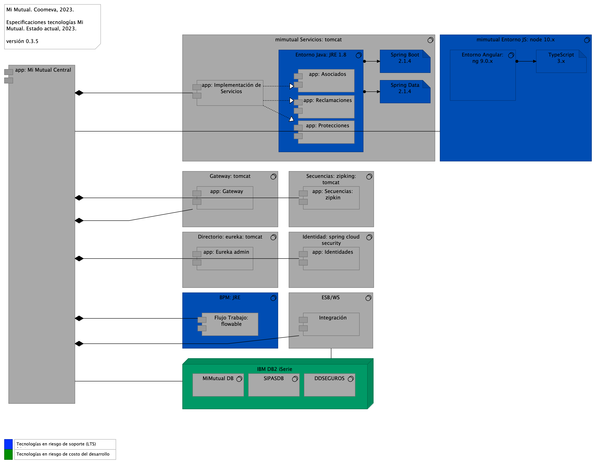
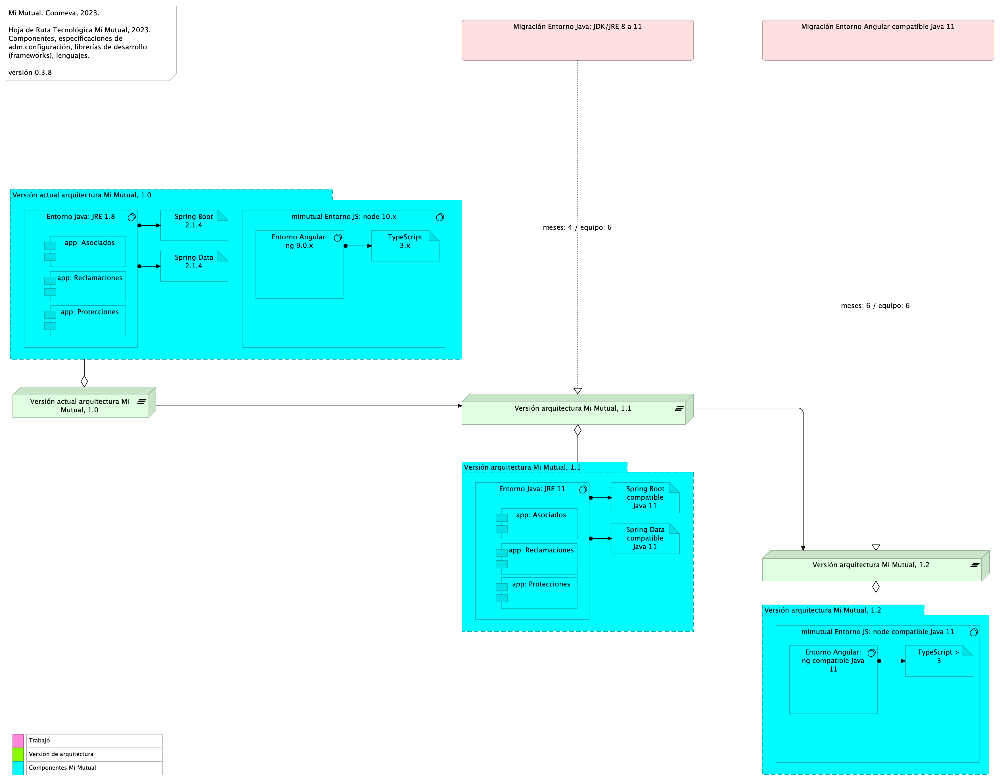

# Doc. 4. Vistas de Arquitectura Cotizador. Manua
* [Análisis de Tecnologías Mi Mutual. Acciones de Migración](#análisis-de-tecnologías-mi-mutual.-acciones-de-migración)
	* [MiMutual. 5.a1. Físico. Tecnologías](#mimutual.-5.a1.-físico.-tecnologías)
	* [Arquitectura. 4. Tecnologías. Hoja Ruta](#arquitectura.-4.-tecnologías.-hoja-ruta)

\newpage

# Análisis de Tecnologías Mi Mutual. Acciones de Migración
## MiMutual. 5.a1. Físico. Tecnologías
{#fig:MiMutual.5.a1.Físico.Tecnologías width=}

Análisis de estado de tecnologías Mi Mutual, 2023. Listado de las tecnologías actuales de Mi Mutual. Coomeva, 2023. Especificaciones de tecnologías e ítems de arquitectura asociados al estado actual de la tecnología.

## Especificaciones de Despliegue Mi Mutual, 2023, Componente Central

* Estándares para el manejo de servicios REST sobre HTTP 1.1
* Tecnologías para el backend: Java 8 con Spring Boot 2.1.4
* Acceso a Datos: Spring Data 2.1.4
* Seguridad de las API: Spring Security + Oauth2.0
* Plataforma de despliegue Backend: Tomcat Spring Boot
* Tecnologías para el frontend Mi Mutual Central: Angular 9
* Tecnologías para el frontend Cotizador Web: Angular 14
* Entorno de ejecución Javascript: nodejs 10.x
* Entorno de ejecución Javascript: nodejs 14.2.0
* Motor de ejecución Javascript: TypeScript, versión 3.x
* Librería de Estilos Bootstrap 4.x
* Servidor web (HTTP 1.1): Apache 2.x
* Servidor BPM, Flowable, versión 6.5.0 con JRE 8
* Spring Cloud, versión Greenwich SR2
* Querydsl, version 4.2.1
* Bases de datos IBM DB2, AS400

 

## Resultados del Análisis

En el diagrama: color azul del diagrama las tecnologías en riesgo de soporte (LTS) fabricante; en color verde, las tecnologías que podrían sustituirse por economía de costos y modernización de entregas.

### Catálogo de Elementos
| Nombre| Tipo| Descripción| Prop.
|:--------|:--------|:--------|:--------|
|**Flujo Trabajo: flowable**|application-component|Contiene todas las funcionalidades relacionadas con el motor de BPM Flowable, como gestión de tareas, instancias de nuevas procesos y asignación de tareas. |*modulo:* mimutual *alcanseSOA:* Fase 1.1 |
|**Integración**|application-component|Contiene todas las funcionalidades relacionadas con integraciones a otros servicios y otras bases de datos.|*modulo:* mimutual *alcanseSOA:* Fase 1.1 |
|**app: Asociados**|application-component|Contiene todas las funcionalidades relacionadas con consulta y creación de asociados y beneficiarios.|*modulo:* mimutual |
|**app: Eureka admin**|application-component|Contiene todas las funcionalidades relacionadas con registrar y localizar microservicios existentes, informar de su localización, su estado y datos relevantes de cada uno de ellos.|*modulo:* mimutual *alcanseSOA:* Fase 1.1 |
|**app: Gateway**|application-component|Contiene todas las funcionalidades relacionadas con un proxy inverso que reenvía las llamadas relevantes a otros servicios.|*modulo:* mimutual *alcanseSOA:* Fase 1.1 |
|**app: Identidades**|application-component|Contiene todas las funcionalidades relacionadas con la gestión de los archivos de propiedades de los microservicios (Esta en construcción y no se ha integrado).|*modulo:* mimutual *alcanseSOA:* Fase 1.1 |
|**app: Implementación de Servicios**|application-component|Los componentes de este tipo se encargan de controlar y almacenar toda la lógica del negocio, validaciones y todo lo referente a procesamiento de datos. |*modulo:* mimutual |
|**app: Mi Mutual Central**|application-component|Antes SIPAS, Mi Mutual es una aplicación web compuesta por distintos módulos de software con arreglo a todas las actividades necesarias que soportan la operación de los productos y servicios que ofrece la Unidad de Solidaridad y Seguros de la Cooperativa.|*modulo:* mimutual |
|**app: Protecciones**|application-component|Contiene todas las funcionalidades relacionadas con la gestión y configuración de productos y protecciones.|*modulo:* mimutual |
|**app: Reclamaciones**|application-component|Contiene todas las funcionalidades relacionadas con la gestión de reclamaciones, liquidaciones y pagos.|*modulo:* mimutual |
|**app: Secuencias: zipkin**|application-component|Contiene todas las funcionalidades relacionadas con la generación de IDs para la trazabilidad de los logs.|*modulo:* mimutual *alcanseSOA:* Fase 1.1 |
|**Spring Boot 2.1.4**|artifact|Librerías backend Spring Boot 2.1.4 para Java 8. |*brecha:* 30 |
|**Spring Data 2.1.4**|artifact|Librerías backend Spring Boot 2.1.4 para Java 8. |*brecha:* 30 |
|**TypeScript 3.x**|artifact|Librerías backend Spring Boot 2.1.4 para Java 8. |*brecha:* 30 *modulo:* mimutual |
|**IBM DB2 iSerie**|node||*alcanseSOA:* Fase 1.1 *modulo:* mimutual *brecha:* 60 |
|**BPM: JRE**|system-software|Entorno de ejecución BPM.  * java.version: 1.8 * flowable.version: 6.5.0 * spring-cloud.version: Greenwich.SR2 * querydsl.version: 4.2.1   |*alcanseSOA:* Fase 1.1 *modulo:* mimutual *brecha:* 30 |
|**DDSEGUROS**|system-software||*alcanseSOA:* Fase 1.1 *modulo:* mimutual |
|**Directorio: eureka: tomcat**|system-software||*alcanseSOA:* Fase 1.1 *modulo:* mimutual |
|**ESB/WS**|system-software|* java.version: 1.8 * spring-cloud.version: Greenwich.SR2   |*alcanseSOA:* Fase 1.1 *modulo:* mimutual |
|**Entorno Angular: ng 9.0.x**|system-software||*modulo:* mimutual *brecha:* 30 |
|**Entorno Java: JRE 1.8**|system-software||*brecha:* 30 *:*  |
|**Gateway: tomcat**|system-software||*alcanseSOA:* Fase 1.1 *modulo:* mimutual |
|**Identidad: spring cloud security**|system-software||*alcanseSOA:* Fase 1.1 *modulo:* mimutual |
|**MiMutual DB**|system-software||*alcanseSOA:* Fase 1.1 *modulo:* mimutual |
|**SIPASDB**|system-software||*alcanseSOA:* Fase 1.1 *modulo:* mimutual |
|**Secuencias: zipking: tomcat**|system-software||*alcanseSOA:* Fase 1.1 *modulo:* mimutual |
|**mimutual Entorno JS: node 10.x**|system-software||*modulo:* mimutual *brecha:* 30 |
|**mimutual Servicios: tomcat**|system-software||*modulo:* mimutual |

 

## Arquitectura. 4. Tecnologías. Hoja Ruta
{#fig:Arquitectura.4.Tecnologías.HojaRuta width=}

## Introducción 
Los ítems de arquitectura impactados por el análisis de estado de tecnologías Mi Mutual, 2023 deben ser migrados (actualizados) mediante trabajos de estabilización de arquitectura con el fin de evitar principalmente los riesgos de soporte y actualización del fabricante. 

En el siguiente tema presentamos una hoja de ruta propuesta y la estimación del plazo de ejecución de la migración del componente central Mi Mutual, Java 8. 

## Hoja de Ruta de Arquitectura Requerida por la Actualización 
La hoja de ruta resultante plantea dos espacios de trabajo, cada uno con su alcance específico, respecto de la actualización tecnológica de Mi Mutual basado en los términos de análisis de estado de tecnologías Mi Mutual presentado antes. Los espacios de trabajo requeridos, Migración Entorno Java: JDK/JRE 8 a 11 y Migración Entorno Angular compatible Java 11, como se muestran en la imagen impactan y generan a su vez versiones nuevas de la arquitectura Mi Mutual, versión 1.1 y 1.2, respectivamente. 

La versión 1.1 de la arquitectura, resultado del espacio de trabajo no. 1, Migración Entorno Java: JDK/JRE 8 a 11 toma (aprox.) 5 semanas de trabajo, en razón de los ítems de arquitectura acotados en su alcance denotado por el primer recuadro celeste en la imagen. 

La versión 1.2 de la arquitectura, resultado del trabajo no. 2, Migración Entorno Angular compatible Java 11, toma por su parte 4 semanas en razón de los ítems de arquitectura acotados en su alcance presentado en el segundo recuadro celeste. 

### Catálogo de Elementos
| Nombre| Tipo| Descripción| Prop.
|:--------|:--------|:--------|:--------|
|**app: Asociados**|application-component|Contiene todas las funcionalidades relacionadas con consulta y creación de asociados y beneficiarios.|*modulo:* mimutual |
|**app: Asociados**|application-component|Contiene todas las funcionalidades relacionadas con consulta y creación de asociados y beneficiarios.|*modulo:* mimutual |
|**app: Protecciones**|application-component|Contiene todas las funcionalidades relacionadas con la gestión y configuración de productos y protecciones.|*modulo:* mimutual |
|**app: Protecciones**|application-component|Contiene todas las funcionalidades relacionadas con la gestión y configuración de productos y protecciones.|*modulo:* mimutual |
|**app: Reclamaciones**|application-component|Contiene todas las funcionalidades relacionadas con la gestión de reclamaciones, liquidaciones y pagos.|*modulo:* mimutual |
|**app: Reclamaciones**|application-component|Contiene todas las funcionalidades relacionadas con la gestión de reclamaciones, liquidaciones y pagos.|*modulo:* mimutual |
|**Spring Boot 2.1.4**|artifact|Librerías backend Spring Boot 2.1.4 para Java 8. |*brecha:* 30 |
|**Spring Boot compatible Java 11**|artifact|Librerías backend Spring Boot 2.1.4 para Java 8. |*brecha:* 30 |
|**Spring Data 2.1.4**|artifact|Librerías backend Spring Boot 2.1.4 para Java 8. |*brecha:* 30 |
|**Spring Data compatible Java 11**|artifact|Librerías backend Spring Boot 2.1.4 para Java 8. |*brecha:* 30 |
|**TypeScript 3.x**|artifact|Librerías backend Spring Boot 2.1.4 para Java 8. |*brecha:* 30 *modulo:* mimutual |
|**TypeScript > 3**|artifact|Librerías backend Spring Boot 2.1.4 para Java 8. |*brecha:* 30 *modulo:* mimutual |
|**Versión actual arquitectura Mi Mutual, 1.0**|grouping|||
|**Versión arquitectura Mi Mutual, 1.1**|grouping|||
|**Versión arquitectura Mi Mutual, 1.2**|grouping|||
|**Versión actual arquitectura Mi Mutual, 1.0**|plateau|||
|**Versión arquitectura Mi Mutual, 1.1**|plateau|||
|**Versión arquitectura Mi Mutual, 1.2**|plateau|||
|**Entorno Angular: ng 9.0.x**|system-software||*modulo:* mimutual *brecha:* 30 |
|**Entorno Angular: ng compatible Java 11**|system-software||*modulo:* mimutual *brecha:* 30 |
|**Entorno Java: JRE 1.8**|system-software||*brecha:* 30 *:*  |
|**Entorno Java: JRE 11**|system-software||*brecha:* 30 *:*  |
|**mimutual Entorno JS: node 10.x**|system-software||*modulo:* mimutual *brecha:* 30 |
|**mimutual Entorno JS: node compatible Java 11**|system-software||*modulo:* mimutual *brecha:* 30 |
|**Migración Entorno Angular compatible Java 11**|work-package|### Actividades de la Migración a Angular 14 Nota Importante. La presente estimación es un concepto de alto nivel. La ejecución de los trabajos indicados por esta migración debe hacerse una fase de siete (7) días en las que concretará al detalle los cambios de la migración.  |                                                                                      | Estimación T. (hrs)  | |---------------------------------------------------------------------------------------------------------------------------------------------------------------------------------------------------------|----------------------| | Preparativos para la recompilación progresiva Angular 10...Angular 14                                                                                                                                   | 20                   | | Diseño de pruebas de regresión                                                                                                                                                                          | 200                  | | Creación de cadenas de integración, pruebas y despliegue                                                                                                                                                | 60                   | | Plan de recompilación de la línea principal (main) de código fuente en Angular 14.x: módulos, paquetes, y clases base (dependencias)                                                                    | 200                  | | Plan de recompilación de la línea principal (main) de código fuente en Angular 14.x: módulos, paquetes, y clases comunes (dependencias)                                                                 | 200                  | | Plan de recompilación de la línea principal (main) de código fuente en Angular 14.x: módulos, paquetes, y clases de dominio (dependientes)                                                              | 480                  | | Plan de actualización de librerías de desarrollo (Node 12, TypeScript 4.2), librerías de terceros, herramientas de desarrollo (IDE) y manejadores de proyecto Java (maven) y resolución de dependencias | 200                  | | Plan de sustitución de librerías de desarrollo (opt-in, webpacks), librerías de terceros, herramientas de desarrollo (IDE) y manejadores de proyecto Java (maven) y resolución de dependencias          | 100                  | | Elaboración de escenarios de certificación tecnológica/funcional                                                                                                                                        | 20                   | ### Plazo de Ejecución Estimado La distribución del esfuerzo estimado arriba puede ejecutarse en un plazo de diez (10) meses con un equipo de tres recursos/desarrolladores, o de seis (6) meses con un equipo de seis recursos/desarrolladores.  La siguiente tabla resumen los plazos de ejecución según el tamaño de los equipos. |                           | Equipo 1 (x3) | Equipo 2 (x4) | Equipo 3 (x6) | |---------------------------|---------------|---------------|---------------| | Estimación Total en meses | 10            | 9             | 6             |   **Nota Importante**. La presente estimación es un concepto de alto nivel. La ejecución de los trabajos indicados por esta migración debe hacerse una fase de siete (7) días en las que concretará al detalle los cambios de la migración. ||
|**Migración Entorno Java: JDK/JRE 8 a 11**|work-package|### Actividades de la Migración a JDK/JRE 11 Nota Importante. La presente estimación es un concepto de alto nivel. La ejecución de los trabajos indicados por esta migración debe hacerse una fase de siete (7) días en las que concretará al detalle los cambios de la migración.  |                                                                                                                                                               | Estimación T. (hrs) | |------------------------------------------------------------------------------------------------------------------------------------------------------------------------------------|--| | Preparativos para la recompilación OpenJDK 11.x: modularidad Java 11                                                                                                                       | 20   | | Diseño de pruebas de regresión                                                                                                                                                             | 200  | | Creación de cadenas de integración, pruebas y despliegue                                                                                                                                   | 60   | | Plan de recompilación de la línea principal (main) de código fuente en OpenJDK 11.x: módulos, paquetes, y   clases base (dependencias)                                                     | 200  | | Plan de recompilación de la línea principal (main) de código fuente en OpenJDK 11.x: módulos, paquetes, y   clases comunes (dependencias)                                                  | 200  | | Plan de recompilación de la línea principal (main) de código fuente en OpenJDK 11.x: módulos, paquetes, y   clases de dominio (dependientes)                                               | 200  | | Plan de actualización de librerías de desarrollo (Spring), librerías de terceros, herramientas de   desarrollo (IDE) y manejadores de proyecto Java (maven) y resolución de   dependencias | 200  | | Plan de sustitución de librerías de desarrollo (JavaFX), librerías de terceros, herramientas de   desarrollo (IDE) y manejadores de proyecto Java (maven) y resolución de   dependencias   | 100  | | Elaboración de escenarios de certificación tecnológica/funcional                                                                                                                           | 20   | | Ejecución de planes de compilación / pruebas certificación                                                                                                                                 | 1440 | | Evaluación de resultados / retroalimentación del plan/ nuevo plan de compilación                                                                                                           | 20   | | Finalización de certificación migración tecnológica                                                                                                                                        | 20   | | Integración líneas de código: Mi Mutual certificación y Mi Mutual desarrollo                                                                                                               | 720  | ### Plazo de Ejecución Estimado La distribución del esfuerzo estimado arriba puede ejecutarse en un plazo de ocho (8) meses con un equipo de tres recursos/desarrolladores, o de cuatro (4) meses con un equipo de seis recursos/desarrolladores. La siguiente tabla resumen los plazos de ejecución según el tamaño de los equipos. |                           | Equipo 1 (x3) | Equipo 2 (x4) | Equipo 3 (x6) | |---------------------------|---------------|---------------|---------------| | Estimación Total en meses | 8             | 7             | 4             |   **Nota Importante**. La presente estimación es un concepto de alto nivel. La ejecución de los trabajos indicados por esta migración debe hacerse una fase de siete (7) días en las que concretará al detalle los cambios de la migración. ||

 

``Generated on: Wed Nov 22 2023 21:34:48 GMT-0500 (COT)``