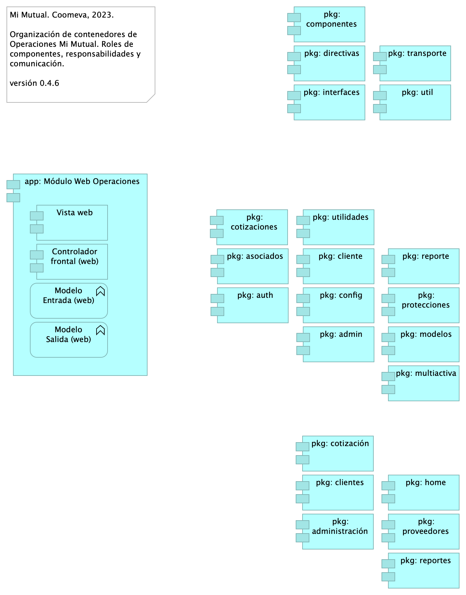

# Doc. 6a. Cadena Producción Operaciones
* [Operaciones. Cadena de Producción. Proceso de Ingeniería](#operaciones.-cadena-de-producción.-proceso-de-ingeniería)
	* [Ingenieria. 3b. Cadena Producción](#ingenieria.-3b.-cadena-producción)
	* [Ingenieria. 3c. Proceso Ingeniería](#ingenieria.-3c.-proceso-ingeniería)
	* [Ingenieria. 3d. Iteración](#ingenieria.-3d.-iteración)
	* [Ingenieria. 1b.3. Procesos Acciones. LT en LP](#ingenieria.-1b.3.-procesos-acciones.-lt-en-lp)
* [Solución Técnica Operaciones Mi Mutual](#solución-técnica-operaciones-mi-mutual)
	* [Operaciones. 1. Contexto](#operaciones.-1.-contexto)
	* [Operaciones. 2. Contenedores](#operaciones.-2.-contenedores)
	* [Operaciones. 3. Componentes Web](#operaciones.-3.-componentes-web)
	* [Operaciones. 3a. Componentes App](#operaciones.-3a.-componentes-app)
	* [Operaciones. 3a. Componentes Datos](#operaciones.-3a.-componentes-datos)

\newpage

# Operaciones. Cadena de Producción. Proceso de Ingeniería
## Ingenieria. 3b. Cadena Producción
{#fig:Ingenieria.3b.CadenaProducción width=}

Organización de actividades de producción, Mi Mutual.

1. Inicia con el plan de liberación. Las versiones del plan de liberación dan el alcance y la prioridad para la ejecución de los procesos de ingeniería. 
1. El proceso de ingeniería programa las líneas de producción necesarias para implementar la versión dirigda por el plan de liberación.
1. Cada línea de producción construirá versiones independientes, que responden al alcance de la propia línea. Como ejemplos del alcance de una línea de producción pueden ser un aplicativo completo, un incremento de versión, una entrega de reparación de defectos. 
1. El proceso de entrega (arquitectura) arranca una vez las líneas de producción hayan desplegado una versión nueva, y garantizará mediante la ejecución de verificaciones (automatizadas) la recolección de hallazgos de QA

### Catálogo de Elementos
| Nombre| Tipo| Descripción| Prop.
|:--------|:--------|:--------|:--------|
|**Repositorio Mi Mutual**|application-component|Antes SIPAS, Mi Mutual es una aplicación web compuesta por distintos módulos de software con arreglo a todas las actividades necesarias que soportan la operación de los productos y servicios que ofrece la Unidad de Solidaridad y Seguros de la Cooperativa. Para el manejo de la persistencia de datos se utilizará Spring Data el cual se apoya en la especificación de JPA y en la implementación de HIBERNATE además de complementar esta capa de persistencia con nuevas funcionalidades que facilitan el acceso a datos. |*modulo:* mimutual |
|**app: Mi Mutual Central**|application-component|Antes SIPAS, Mi Mutual es una aplicación web compuesta por distintos módulos de software con arreglo a todas las actividades necesarias que soportan la operación de los productos y servicios que ofrece la Unidad de Solidaridad y Seguros de la Cooperativa.|*modulo:* mimutual |
|**app: Mi Mutual Central**|application-component|Antes SIPAS, Mi Mutual es una aplicación web compuesta por distintos módulos de software con arreglo a todas las actividades necesarias que soportan la operación de los productos y servicios que ofrece la Unidad de Solidaridad y Seguros de la Cooperativa.|*modulo:* mimutual |
|**app: Mi Mutual Central**|application-component|Antes SIPAS, Mi Mutual es una aplicación web compuesta por distintos módulos de software con arreglo a todas las actividades necesarias que soportan la operación de los productos y servicios que ofrece la Unidad de Solidaridad y Seguros de la Cooperativa.|*modulo:* mimutual |
|**app: Mi Mutual Central**|application-component|Antes SIPAS, Mi Mutual es una aplicación web compuesta por distintos módulos de software con arreglo a todas las actividades necesarias que soportan la operación de los productos y servicios que ofrece la Unidad de Solidaridad y Seguros de la Cooperativa.|*modulo:* mimutual |
|**app: Mi Mutual Central**|application-component|Antes SIPAS, Mi Mutual es una aplicación web compuesta por distintos módulos de software con arreglo a todas las actividades necesarias que soportan la operación de los productos y servicios que ofrece la Unidad de Solidaridad y Seguros de la Cooperativa.|*modulo:* mimutual |
|**app: Mi Mutual Central**|application-component|Antes SIPAS, Mi Mutual es una aplicación web compuesta por distintos módulos de software con arreglo a todas las actividades necesarias que soportan la operación de los productos y servicios que ofrece la Unidad de Solidaridad y Seguros de la Cooperativa.|*modulo:* mimutual |
|**app: Mi Mutual Central**|application-component|Antes SIPAS, Mi Mutual es una aplicación web compuesta por distintos módulos de software con arreglo a todas las actividades necesarias que soportan la operación de los productos y servicios que ofrece la Unidad de Solidaridad y Seguros de la Cooperativa.|*modulo:* mimutual |
|**app: Mi Mutual Central**|application-component|Antes SIPAS, Mi Mutual es una aplicación web compuesta por distintos módulos de software con arreglo a todas las actividades necesarias que soportan la operación de los productos y servicios que ofrece la Unidad de Solidaridad y Seguros de la Cooperativa.|*modulo:* mimutual |
|**app: Mi Mutual Central**|application-component|Antes SIPAS, Mi Mutual es una aplicación web compuesta por distintos módulos de software con arreglo a todas las actividades necesarias que soportan la operación de los productos y servicios que ofrece la Unidad de Solidaridad y Seguros de la Cooperativa.|*modulo:* mimutual |
|**ARQ**|business-actor|||
|**ARQ**|business-actor|||
|**ING DV**|business-actor|||
|**ING SR.**|business-actor|||
|**LT**|business-actor|||
|**LT**|business-actor|||
|**Scrum**|business-actor|||
|**Arquitectura**|business-function|||
|**Ingeniería**|business-function|||
|**Negocio / Producto**|business-function|||
|**Mapa Producto item 1**|business-object|||
|**Mapa Producto item 2**|business-object|||
|**Mapa Producto item 3**|business-object|||
|**Mapa Producto item 4**|business-object|||
|**Mapa Producto item 5**|business-object|||
|**Mapa Producto item 6**|business-object|||
|**Versión Producto**|contract|||
|**Versión Producto**|contract|||
|**ARQ**|value-stream|||
|**GER**|value-stream|||
|**GER**|value-stream|||
|**GER**|value-stream|||
|**ING**|value-stream|||
|**Línea Producción Aplicativo**|value-stream|||
|**Línea Producción Aplicativo**|value-stream|||
|**Línea Producción Aplicativo**|value-stream|||
|**PRODUCTO**|value-stream|||

 

## Ingenieria. 3c. Proceso Ingeniería
{#fig:Ingenieria.3c.ProcesoIngeniería width=}

Organización de actividades de producción, Mi Mutual

1. Las líneas de producción de realizan mediante iteraciones. 
1. A su vez, cada iteración por su parte producirá varias versiones de realimentacieon de desarrollo. 
1. La línea de producción generará versiones candidatas de QA o UAT.

### Catálogo de Elementos
| Nombre| Tipo| Descripción| Prop.
|:--------|:--------|:--------|:--------|
|**app: Mi Mutual Central**|application-component|Antes SIPAS, Mi Mutual es una aplicación web compuesta por distintos módulos de software con arreglo a todas las actividades necesarias que soportan la operación de los productos y servicios que ofrece la Unidad de Solidaridad y Seguros de la Cooperativa.|*modulo:* mimutual |
|**app: Mi Mutual Central**|application-component|Antes SIPAS, Mi Mutual es una aplicación web compuesta por distintos módulos de software con arreglo a todas las actividades necesarias que soportan la operación de los productos y servicios que ofrece la Unidad de Solidaridad y Seguros de la Cooperativa.|*modulo:* mimutual |
|**app: Mi Mutual Central**|application-component|Antes SIPAS, Mi Mutual es una aplicación web compuesta por distintos módulos de software con arreglo a todas las actividades necesarias que soportan la operación de los productos y servicios que ofrece la Unidad de Solidaridad y Seguros de la Cooperativa.|*modulo:* mimutual |
|**app: Mi Mutual Central**|application-component|Antes SIPAS, Mi Mutual es una aplicación web compuesta por distintos módulos de software con arreglo a todas las actividades necesarias que soportan la operación de los productos y servicios que ofrece la Unidad de Solidaridad y Seguros de la Cooperativa.|*modulo:* mimutual |
|**app: Mi Mutual Central**|application-component|Antes SIPAS, Mi Mutual es una aplicación web compuesta por distintos módulos de software con arreglo a todas las actividades necesarias que soportan la operación de los productos y servicios que ofrece la Unidad de Solidaridad y Seguros de la Cooperativa.|*modulo:* mimutual |
|**app: Mi Mutual Central**|application-component|Antes SIPAS, Mi Mutual es una aplicación web compuesta por distintos módulos de software con arreglo a todas las actividades necesarias que soportan la operación de los productos y servicios que ofrece la Unidad de Solidaridad y Seguros de la Cooperativa.|*modulo:* mimutual |
|**app: Mi Mutual Central**|application-component|Antes SIPAS, Mi Mutual es una aplicación web compuesta por distintos módulos de software con arreglo a todas las actividades necesarias que soportan la operación de los productos y servicios que ofrece la Unidad de Solidaridad y Seguros de la Cooperativa.|*modulo:* mimutual |
|**app: Mi Mutual Central**|application-component|Antes SIPAS, Mi Mutual es una aplicación web compuesta por distintos módulos de software con arreglo a todas las actividades necesarias que soportan la operación de los productos y servicios que ofrece la Unidad de Solidaridad y Seguros de la Cooperativa.|*modulo:* mimutual |
|**app: Mi Mutual Central**|application-component|Antes SIPAS, Mi Mutual es una aplicación web compuesta por distintos módulos de software con arreglo a todas las actividades necesarias que soportan la operación de los productos y servicios que ofrece la Unidad de Solidaridad y Seguros de la Cooperativa.|*modulo:* mimutual |
|**app: Mi Mutual Central**|application-component|Antes SIPAS, Mi Mutual es una aplicación web compuesta por distintos módulos de software con arreglo a todas las actividades necesarias que soportan la operación de los productos y servicios que ofrece la Unidad de Solidaridad y Seguros de la Cooperativa.|*modulo:* mimutual |
|**app: Mi Mutual Central**|application-component|Antes SIPAS, Mi Mutual es una aplicación web compuesta por distintos módulos de software con arreglo a todas las actividades necesarias que soportan la operación de los productos y servicios que ofrece la Unidad de Solidaridad y Seguros de la Cooperativa.|*modulo:* mimutual |
|**app: Mi Mutual Central**|application-component|Antes SIPAS, Mi Mutual es una aplicación web compuesta por distintos módulos de software con arreglo a todas las actividades necesarias que soportan la operación de los productos y servicios que ofrece la Unidad de Solidaridad y Seguros de la Cooperativa.|*modulo:* mimutual |
|**ING SR.**|business-actor|||
|**LT**|business-actor|||
|**Arquitectura**|business-function|||
|**ITR**|plateau|||
|**ITR**|plateau|||
|**ITR**|plateau|||
|**ITR**|plateau|||
|**ITR**|plateau|||
|**ITR**|plateau|||
|**ITR**|plateau|||
|**ARQ**|value-stream|||
|**ING**|value-stream|||
|**Línea Producción Aplicativo**|value-stream|||
|**Línea Secundaria (DT)**|value-stream|||

 

## Ingenieria. 3d. Iteración
{#fig:Ingenieria.3d.Iteración width=}

La capacidad dosponible (derecha) es acomodada sobre la capacidad exigida (izquierda). Durante la ejecución de la iteración, esta produce vesiones de despliegue que tienen úinicamente el propósito de generar retroalimentación. Al final de la iteración se produce versión entregble y resultante de la ejecución completa.

### Catálogo de Elementos
| Nombre| Tipo| Descripción| Prop.
|:--------|:--------|:--------|:--------|
|**app: Mi Mutual Central**|application-component|Antes SIPAS, Mi Mutual es una aplicación web compuesta por distintos módulos de software con arreglo a todas las actividades necesarias que soportan la operación de los productos y servicios que ofrece la Unidad de Solidaridad y Seguros de la Cooperativa.|*modulo:* mimutual |
|**app: Mi Mutual Central (despliegue)**|application-component|Antes SIPAS, Mi Mutual es una aplicación web compuesta por distintos módulos de software con arreglo a todas las actividades necesarias que soportan la operación de los productos y servicios que ofrece la Unidad de Solidaridad y Seguros de la Cooperativa.|*modulo:* mimutual |
|**app: Mi Mutual Central (despliegue)**|application-component|Antes SIPAS, Mi Mutual es una aplicación web compuesta por distintos módulos de software con arreglo a todas las actividades necesarias que soportan la operación de los productos y servicios que ofrece la Unidad de Solidaridad y Seguros de la Cooperativa.|*modulo:* mimutual |
|**app: Mi Mutual Central (despliegue)**|application-component|Antes SIPAS, Mi Mutual es una aplicación web compuesta por distintos módulos de software con arreglo a todas las actividades necesarias que soportan la operación de los productos y servicios que ofrece la Unidad de Solidaridad y Seguros de la Cooperativa.|*modulo:* mimutual |
|**ARQ**|business-actor|||
|**ING DV**|business-actor|||
|**ING DV**|business-actor|||
|**ING DV**|business-actor|||
|**ING DV**|business-actor|||
|**ING DV**|business-actor|||
|**ING DV**|business-actor|||
|**ING SR.**|business-actor|||
|**LT**|business-actor|||
|**ITR**|plateau|||
|**Línea Producción Aplicativo**|value-stream|||
|**AN**|work-package|||
|**AN**|work-package|||
|**DEV**|work-package|||
|**DEV**|work-package|||
|**DIS**|work-package|||
|**DIS**|work-package|||
|**Deuda**|work-package|||
|**Integr**|work-package|||
|**Integr**|work-package|||
|**QA**|work-package|||
|**QA**|work-package|||
|**UT (tarea)**|work-package|||
|**UT (tarea)**|work-package|||

 

## Ingenieria. 1b.3. Procesos Acciones. LT en LP
{#fig:Ingenieria.1b.3.ProcesosAcciones.LTenLP width=}

Cómo organizar las líneas de prodcc, principal (que responde al mapa del producto) y contingentes (que responden a ing).

### Diagnóstico Procesos de Ingeniería

### Levantamiento
* La mayoría de HU no tienen un anexo técnico resumen de las validaciones u objetos a modificar o crear
* El cambio del modelo de negocio del cliente genera que las HU no sean funcionales

### Indicadores
* Porcentaje de trazabilidad de los requisitos

### Análisis
Diagnóstico:
* No se realizó en análisis previo de cada HU.

### Indicadores
* Tasa de aprobación de HU por cliente
* Estabilidad del código

### Diseño
* No se realizó en diseño previo de cada HU
* Los modelos físicos son propiedad del cliente

### Indicadores
* Flujo acumulado
* Porcentaje reutilización de código

### Construcción
* No se tiene un versionamiento controlado y automatizado de la base de datos
* No se cuenta con integraciones para despliegues en DevOps que permitan mayor control y automatización. 
* No se cuenta con repositorios del mismo proveedor que faciliten las automatizaciones (CI)
* Sobredependencia del Lider Técnico

### Indicadores
* Tasa de cierre de defectos
* Velocidad de construcción
* Cobertura de código
* Simplicidad de código

### Catálogo de Elementos
| Nombre| Tipo| Descripción| Prop.
|:--------|:--------|:--------|:--------|
|**MET.APRB**|business-object|Cod.	APRB Nombre indicador	Tasa de aprobación de HU por cliente Uso	Estabildad de requerimientos. Contensión del flujo de trabajo inicio de desarrolo Proceso	ANLS Calculo de medición	Cantidad de HU refinadas y aprobadas por cliente / Total de cantidad de HU Fuente	[Repo Sharepoint], [Azure DevOps]) ||
|**MET.Métrica xyz**|business-object|||
|**MET.VEL**|business-object|Cod.	VEL Nombre indicador	Velocidad de construcción Uso	Capacidad interna de desarrollo Proceso	DEV Calculo de medición	Cantidad de puntos de HU ejecutadas / Horas habiles del mes de trabajo Fuente	[Azure DevOps], [Calculo manual] ||
|**ANLS.Analisis**|business-process|### 2. ANSS (análisis). R/Re Scrum, Funcional, Dueño producto cliente (requiere conocimiento del negocio). Resultado: Refinamiento HU, modelo de negocio, es decir, diagrama de HU relacionadas unas con otras y con los conceptos de negocio en el repositorio de ARQ. Actualmente: no hay resultados de este proceso. Ejemplo del modelo de negocio ### Salidas * Modelo de negocio en el repo * Estimación --puede en devops * Análisis de dependencia en el repo ### KPI - Tasa de aprobación de HU por cliente Fuente: (Cantidad de HU refinadas y aprobadas por cliente [Repo Sharepoint] / Total de cantidad de HU [Azure DevOps]) Dato 26/10/2023: (30/44) = 0,68 - Tasa de error en Bug por PR entregados Fuente: (Cantidad de solicitude de cambio en rama (Pull Reqst) de Correcciones (fix) o Regresión (reverts) [Bitbucket] / Cantidad total de PR desplegados [Bitbucket]) Dato 26/10/2023: (8/111)*100 = 7,2% ||
|**DEV.Contrucción**|business-process|### KPI - Velocidad de construcción Fuente: (Cantidad de puntos de HU ejecutadas [Azure DevOps] / Horas habiles del mes de trabajo [Calculo manual]) Dato 26/10/2023: 83 / 153 = 0,54 HU/horas  - Tasa de cierre de defectos Fuente: (Cantidad de Bug solucionados [Azure DevOps] / Total de Bugs a corte sin nuevos [Azure DevOps]) Dato 26/10/2023: 81 / 920 = 0,088 - Indice de dependecia de Lider Técnico Fuente: (Cantidad de actividades retrazadas semanales segun las HU planeadas / Total de HU planeadas para ejecución) Dato 26/10/2023: Pendiente proxima semana ||
|**DIS.Diseño**|business-process|### KPI - Nivel de HU sin detalle técnico Fuente: (Cantidad de HU refinadas y aprobadas sin diseño de implementacion [Repo Sharepoint] / Total de cantidad de HU [Azure DevOps]) Dato 26/10/2023: 0/44=0 ||
|**Ing Sr.**|grouping|||
|**Ing Sr.**|grouping|||
|**Ing Sr.**|grouping|||
|**LT**|grouping|||
|**Plan Producción: ING**|grouping|||
|**Plan Producción: ING**|grouping|||
|**Plan Producción: ING**|grouping|||
|**IT**|plateau|||
|**IT**|plateau|||
|**IT**|plateau|||
|**IT (itera)**|plateau|||
|**ITR**|plateau|||
|**Línea Producción Aplicativo**|value-stream|||
|**Línea Secundaria (DT)**|value-stream|||
|**Línea Soporte (DEF)**|value-stream|||
|**AN**|work-package|||
|**DEF**|work-package|||
|**DEF**|work-package|||
|**DEF**|work-package|||
|**DEF**|work-package|||
|**DEF**|work-package|||
|**DEF (defecto)**|work-package|||
|**DEV**|work-package|||
|**DIS**|work-package|||
|**DT**|work-package|||
|**DT**|work-package|||
|**DT**|work-package|||
|**DT**|work-package|||
|**DT**|work-package|||
|**DT (deuda)**|work-package|||
|**Integr**|work-package|||
|**QA**|work-package|||
|**UT (tarea)**|work-package|||

 

\newpage

# Solución Técnica Operaciones Mi Mutual
## Operaciones. 1. Contexto
{#fig:Operaciones.1.Contexto width=}

El Conjunto de funciones al que llamamos Operaciones es la composición de aplicativos de software independientes e interrelacionados, organizados en correspondencia del lenguaje de negocio de Operaciones. Esta organización parte del insumo del mapa del producto de Operaciones.

El contexto de módulo de Operaciones (conjuinto de aplicativos independientes) está separado físicamente de otros módulos Mi Mutual y dell sistema de fondo Mi Mutual Central.

Nota: el sistema de fondo Mi Mutual Central es la composición de las funciones de negocio de la Unidad de Solidaridad de Coomeva. Las funciones de negocio referidas, como Gestión Beneficiarios, Certificados, Gestión Beneficiarios, aparecen dentro del componente principal en la imagen.

### Catálogo de Elementos
| Nombre| Tipo| Descripción| Prop.
|:--------|:--------|:--------|:--------|
|**Operaciones Mi Mutual Application Collaboration**|application-collaboration|Módulo Operaciones Mi Mutual. Conjunto de aplicativos independientes del dominio de Operaciones, Coomeva. ||
|**app: Administración Operaciones**|application-component|Aplicativo autónomo de Operaciones.||
|**app: Cancelaciones**|application-component|Aplicativo autónomo de Operaciones.||
|**app: Cargue Masivo**|application-component|Aplicativo autónomo de Operaciones.||
|**app: Cotización y Ventas**|application-component|||
|**app: Crediperseverados**|application-component|Aplicativo autónomo de Operaciones.||
|**app: Disminuciones**|application-component|Aplicativo autónomo de Operaciones.||
|**app: Estudio de Cuenta**|application-component|Aplicativo autónomo de Operaciones.||
|**app: Mi Mutual Central**|application-component|Antes SIPAS, Mi Mutual es una aplicación web compuesta por distintos módulos de software con arreglo a todas las actividades necesarias que soportan la operación de los productos y servicios que ofrece la Unidad de Solidaridad y Seguros de la Cooperativa.|*modulo:* mimutual |
|**app: Pagos Operativos**|application-component|Aplicativo autónomo de Operaciones.||
|**app: Reactivaciones**|application-component|Aplicativo autónomo de Operaciones.||
|**app: Receso**|application-component|Aplicativo autónomo de Operaciones.||
|**app: Reclamaciones**|application-component|Contiene todas las funcionalidades relacionadas con la gestión de reclamaciones, liquidaciones y pagos.|*modulo:* mimutual |
|**app: Reingreso**|application-component|Aplicativo autónomo de Operaciones.||
|**app: Rescate**|application-component|Aplicativo autónomo de Operaciones.||
|**app: Reserva Matemática**|application-component|Aplicativo autónomo de Operaciones.||
|**app: Retiro**|application-component|Aplicativo autónomo de Operaciones.||
|**app: Reversiones**|application-component|Aplicativo autónomo de Operaciones.||
|**app: Vinculación**|application-component|||
|**Administración facturación y recaudo**|application-function|Administración de la facturación y recaudo diario de los productos ||
|**Autorizaciones**|application-function|Autorizaciones: Administración de peticiones de autorización y sus correspondientes aprobaciones mediante el servicio del flujo de procesos||
|**Certificados**|application-function|Certificados: Permite la generación de los certificados de valores de protección y contribuciones pagadas, de retención en la fuente, de pagos de perseverancia y de cobertura de auxilio funerario. ||
|**Configuración factores cálculos, contribuciones**|application-function|1. Configuración o parametrización de factores para realizar los cálculos de las contribuciones de los asociados a la Cooperativa para cada uno de los productos adquiridos. ||
|**Gestión Beneficiarios**|application-function|Gestión de Beneficiarios: Permite administrar la información relacionada con los beneficiarios del Asociado, permitiendo ejecutar operaciones de consulta, inserción y modificación. ||
|**Gestión Reclamaciones**|application-function|Gestión de Reclamaciones (Indemnización): Permite realizar la gestión, seguimiento y pago o negación de las diferentes reclamaciones de acuerdo a las coberturas y los productos que se encuentren dentro del portafolio del Asociado. ||
|**Gestión Usuarios**|application-function|Gestión de Usuarios: Administración de la información relacionada con los usuarios del sistema. Este componente se comunica con el servicio unificado de autenticación y autorización que devuelve los permisos que un usuario posee sobre las opciones que proporciona el sistema. ||
|**Gestión fondo mutual y auxilio funerario**|application-function|Gestión de productos del fondo mutual y auxilio funerario que involucran a sus coberturas ||
|**Interoperabilidad entre sistemas Coomeva**|application-function|Integración con otros sistemas para facilitar los procesos de vinculación, retiro, reactivación o fallecimiento de asociados. ||
|**Seguridad**|application-function|Software base. ||
|**Simuladores**|application-function|Simuladores: Funcionalidades que permiten generar las simulaciones de los diferentes planes o modificaciones (incrementos y disminuciones) a los productos del Asociado. ||
|**Application Interaction**|application-interaction|||
|**Credimutual**|application-interaction|||
|**Autorizaciones**|application-service|Autorizaciones: Administración de peticiones de autorización y sus correspondientes aprobaciones usando el servicio del flujo de procesos. ||
|**Certificados**|application-service|Certificados: Permite la generación de los certificados de valores de protección y contribuciones pagadas, de retención en la fuente, de pagos de perseverancia y de cobertura de auxilio funerario. ||
|**Configuración**|application-service|Configuración o parametrización de factores para realizar los cálculos de las contribuciones de los asociados a la Cooperativa para cada uno de los productos adquiridos. ||
|**Facturación y Recaudo**|application-service|Administración de la facturación y recaudo diario de los productos. ||
|**Gestión de Beneficiarios**|application-service|Gestión de Beneficiarios: Permite administrar la información relacionada con los beneficiarios del Asociado, permitiendo ejecutar operaciones de consulta, inserción y modificación. ||
|**Gestión de Reclamos**|application-service|Gestión de Reclamaciones (Indemnización): Permite realizar la gestión, seguimiento y pago o negación de las diferentes reclamaciones de acuerdo a las coberturas y los productos que se encuentren dentro del portafolio del Asociado||
|**Gestión de Usuarios**|application-service|Gestión de Usuarios: Administración de la información relacionada con los usuarios del sistema. Este componente se comunica con el servicio unificado de autenticación y autorización que devuelve los permisos que un usuario posee sobre las opciones que proporciona el sistema. ||
|**Simuladores**|application-service|Simuladores: Funcionalidades que permiten generar las simulaciones de los diferentes planes o modificaciones (incrementos y disminuciones) a los productos del Asociado. ||
|**Unidad de Solidaridad y Seguros**|business-function|Unidad de Solidaridad y Seguros de la Cooperativa||
|**Analistas**|business-role|Analistas y auxiliares de servicio regional y nacional, agentes del centro de contacto, auditores médicos, analistas de operaciones (aseguramiento y facturación) y jefes.||
|**Asesores**|business-role|Asesores integrales||
|**Auxiliares servicio**|business-role|Analistas y auxiliares de servicio regional y nacional, agentes del centro de contacto, auditores médicos, analistas de operaciones (aseguramiento y facturación) y jefes.||
|**Fidelización**|business-role|Ejecutivos de Fidelización||
|**Profundización**|business-role|Ejecutivos de Profundización||
|**Servicios Operativos Mi Mutual**|grouping|||

 

## Operaciones. 2. Contenedores
{#fig:Operaciones.2.Contenedores width=}

Los contenedores de Operaciones Mi Mutual están separados en unidades desplegables autónomas. Por ejemplo, el contenedor web, app: Módulo Web Operaciones en el diagrama, es independiente de los otros dos contenedores, app: Operaciones (centro) y de Almacenamiento y Repositorio Operaciones (derecha).

La organización interna de cada contenedor de Operaciones Mi Mutual apoya la separación de aspectos, y así mismo, la separación del desarrollo basado en aspectos.

Esta decisión de organización de los componentes de Mi Mutual, incluyendo al misional del mismo nomnbre, permite estructurar la aplicación de una manera ordenada y, en línea con las restricciones de arquitectura exigidas al sistema, facilita la efectividad de las extensiones y el mantenimiento.

### Catálogo de Elementos
| Nombre| Tipo| Descripción| Prop.
|:--------|:--------|:--------|:--------|
|**Operaciones Mi Mutual Application Collaboration**|application-collaboration|Módulo Operaciones Mi Mutual. Conjunto de aplicativos independientes del dominio de Operaciones, Coomeva. ||
|**Controlador frontal (web)**|application-component|-	Verificados los SSL, se recomienda adquirir SSL seguros, con entidades certificadoras.  Si se desea continuar con SSL de Let's Encrypt, se recomienda automatizar el proceso de actualización dado que al dejar estos en modo actualización manual es probable el olvido de esta actualización (Estos certificados se deben actualizar trimestralmente y no cuentan con las características de seguridad necesarias.  |*plataforma:* js |
|**Dominio Particular de Operaciones**|application-component|||
|**Procesos negocio**|application-component|Contiene todas las funcionalidades relacionadas con los flujos de JBPM, actualmente se hace solo para acceso a datos de la base de datos de JBPM.|*modulo:* mimutual |
|**Vista web**|application-component||*plataforma:* html |
|**app: Administración Operaciones**|application-component|Aplicativo autónomo de Operaciones.||
|**app: Cancelaciones**|application-component|Aplicativo autónomo de Operaciones.||
|**app: Cargue Masivo**|application-component|Aplicativo autónomo de Operaciones.||
|**app: Crediperseverados**|application-component|Aplicativo autónomo de Operaciones.||
|**app: Disminuciones**|application-component|Aplicativo autónomo de Operaciones.||
|**app: Estudio de Cuenta**|application-component|Aplicativo autónomo de Operaciones.||
|**app: Eureka admin**|application-component|Contiene todas las funcionalidades relacionadas con registrar y localizar microservicios existentes, informar de su localización, su estado y datos relevantes de cada uno de ellos. |*modulo:* mimutual *alcanseSOA:* Fase 1.1 |
|**app: Módulo Web Operaciones**|application-component|Contenedor web de Operaciones Mi Mutual. pkg: MiMutualWeb |*modulo:* cotizador |
|**app: Operaciones**|application-component|Sistema de Operaciones como conjunto de aplicativos independientes. ||
|**app: Pagos Operativos**|application-component|Aplicativo autónomo de Operaciones.||
|**app: Reactivaciones**|application-component|Aplicativo autónomo de Operaciones.||
|**app: Receso**|application-component|Aplicativo autónomo de Operaciones.||
|**app: Reingreso**|application-component|Aplicativo autónomo de Operaciones.||
|**app: Rescate**|application-component|Aplicativo autónomo de Operaciones.||
|**app: Reserva Matemática**|application-component|Aplicativo autónomo de Operaciones.||
|**app: Retiro**|application-component|Aplicativo autónomo de Operaciones.||
|**app: Reversiones**|application-component|Aplicativo autónomo de Operaciones.||
|**Implementación Entidades**|application-function|||
|**Implementación Funcionalidad Operaciones**|application-function|Funcionalidad pura (caso de uso, historia de usuario, o escenario de HU) del aplicativo de Operaciones Mi Mutual. ||
|**Implementación Lógica Operaciones**|application-function|||
|**Implementación de Servicios Operaciones**|application-function|Implementación de las tareas y servicios requeridos por la funcionalidad pura (caso de uso, historia de usuario, o escenario de HU) del aplicativo de Operaciones Mi Mutual. ||
|**Modelo Entrada**|application-function|Esquema de datos entrantes al dominio del aplicaitvo de Operaciones Mi Mutual. ||
|**Modelo Entrada (web)**|application-function|||
|**Modelo Salida (drivers)**|application-function|Esquema de datos externos al dominio del aplicaitvo, o , resultantes de la ejecución de la funcionalidad del aplicativo de Operaciones Mi Mutual. ||
|**Modelo Salida (web)**|application-function|||
|**Credimutual**|application-interaction|||
|**API Operaciones**|application-interface||*modulo:* mimutual |
|**Almacenamiento y Repositorio**|application-service|Servicios de base utilizados por Mi Mutual. Especificaciones de tecnologías Mi Mutual, 2023. * Bases de datos IBM DB2, AS400   ||
|**Almacenamiento y Repositorio Operaciones**|application-service|Servicios de base utilizados por Mi Mutual. Especificaciones de tecnologías Mi Mutual, 2023. * Bases de datos IBM DB2, AS400   ||
|**BPMS**|application-service|Servicio de base. Motor de BPM Flowable. Gestión de tareas, instancias de nuevas procesos, bandeja y asignación de tareas. ||
|**DDSEGUROS**|application-service|IBM DB2||
|**ESB/WS**|application-service|Servicio de base. Integración de aplicaciones y datos Mi Mutual. ||
|**MiMutual DB**|application-service|IBM DB2||
|**RULES**|application-service|Servicio de base. Motor de reglas de negocio. ||
|**SIPAS DB mdb**|application-service|IBM DB2||
|**SIPASDB**|application-service|IBM DB2||
|**SISPRO**|application-service|Servicio de base. Expone funcionalidades relacionadas con la autenticación y autorización al sistema Mi mutual. ||
|**Servicios Backend Mi Mutual Central**|application-service|Servicios de base utilizados por Mi Mutual. Especificaciones de tecnologías Mi Mutual, 2023. * Estándares para el manejo de servicios REST sobre HTTP 1.1 * Tecnologías para el backend: Java 8   ||
|**dat: Cancelaciones**|application-service|IBM DB2||
|**dat: Dismminuciones**|application-service|IBM DB2||
|**dat: Reingreso**|application-service|IBM DB2||
|**dat: Rescate**|application-service|IBM DB2||

 

## Operaciones. 3. Componentes Web
{#fig:Operaciones.3.ComponentesWeb width=}

Los contenedores de Operaciones Mi Mutual están separados en unidades desplegables autónomas. Por ejemplo, el contenedor web, app: Módulo Web Operaciones en el diagrama, es independiente de los otros dos contenedores, app: Operaciones (centro) y de Almacenamiento y Repositorio Operaciones (derecha).

La organización interna de cada contenedor de Operaciones Mi Mutual apoya la separación de aspectos, y así mismo, la separación del desarrollo basado en aspectos.

Esta decisión de organización de los componentes de Mi Mutual, incluyendo al misional del mismo nomnbre, permite estructurar la aplicación de una manera ordenada y, en línea con las restricciones de arquitectura exigidas al sistema, facilita la efectividad de las extensiones y el mantenimiento.

### Catálogo de Elementos
| Nombre| Tipo| Descripción| Prop.
|:--------|:--------|:--------|:--------|
|**Controlador frontal (web)**|application-component|-	Verificados los SSL, se recomienda adquirir SSL seguros, con entidades certificadoras.  Si se desea continuar con SSL de Let's Encrypt, se recomienda automatizar el proceso de actualización dado que al dejar estos en modo actualización manual es probable el olvido de esta actualización (Estos certificados se deben actualizar trimestralmente y no cuentan con las características de seguridad necesarias.  |*plataforma:* js |
|**Vista web**|application-component||*plataforma:* html |
|**app: Módulo Web Operaciones**|application-component|Contenedor web de Operaciones Mi Mutual. pkg: MiMutualWeb |*modulo:* cotizador |
|**pkg: admin**|application-component|controller: Almacenan todas las clases que constituyen los servicios rest de la aplicación.|*modulo:* cotizador |
|**pkg: administración**|application-component|admin controller: Almacenan todas las clases que constituyen los servicios REST de la administrción de la aplicación.|*modulo:* cotizador |
|**pkg: asociados**|application-component|controller: Almacenan todas las clases que constituyen los servicios rest de la aplicación.|*modulo:* cotizador |
|**pkg: auth**|application-component|controller: Almacenan todas las clases que constituyen los servicios rest de la aplicación.|*modulo:* cotizador |
|**pkg: cliente**|application-component|controladores web de cliente. Reúne las clases que constituyen el modelo de entrada/salida de la interfaz gráfica de Clientes. Distinto al paquete admin controlador Clientes (pkg: web.clientes). |*modulo:* cotizador |
|**pkg: clientes**|application-component|admin controller: Almacenan todas las clases que constituyen los servicios REST de la administrción de la aplicación. Disitnto al paquete web de Cliente (pkg: admin.cliente).|*modulo:* cotizador |
|**pkg: componentes**|application-component|controller: contiene las clases que constituyen los llamados a librerías compartidas de la aplicación.|*modulo:* cotizador |
|**pkg: config**|application-component|controller: Almacenan todas las clases que constituyen los servicios rest de la aplicación.|*modulo:* cotizador |
|**pkg: cotizaciones**|application-component|controller: Almacenan todas las clases que constituyen los servicios rest de la aplicación.|*modulo:* cotizador |
|**pkg: cotización**|application-component|admin controller: Almacenan todas las clases que constituyen los servicios REST de la administrción de la aplicación.|*modulo:* cotizador |
|**pkg: directivas**|application-component|controller: contiene las clases que constituyen los llamados a librerías compartidas de la aplicación.|*modulo:* cotizador |
|**pkg: home**|application-component|admin controller: Almacenan todas las clases que constituyen los servicios REST de la administrción de la aplicación.|*modulo:* cotizador |
|**pkg: interfaces**|application-component|controller: contiene las clases que constituyen los llamados a librerías compartidas de la aplicación.|*modulo:* cotizador |
|**pkg: modelos**|application-component|controller: Almacenan todas las clases que constituyen los servicios rest de la aplicación.|*modulo:* cotizador |
|**pkg: multiactiva**|application-component|controller: Almacenan todas las clases que constituyen los servicios rest de la aplicación.|*modulo:* cotizador |
|**pkg: protecciones**|application-component|controller: Almacenan todas las clases que constituyen los servicios rest de la aplicación.|*modulo:* cotizador |
|**pkg: proveedores**|application-component|admin controller: Almacenan todas las clases que constituyen los servicios REST de la administrción de la aplicación.|*modulo:* cotizador |
|**pkg: reporte**|application-component|controller: Almacenan todas las clases que constituyen los servicios rest de la aplicación.|*modulo:* cotizador |
|**pkg: reportes**|application-component|admin controller: Almacenan todas las clases que constituyen los servicios REST de la administrción de la aplicación.|*modulo:* cotizador |
|**pkg: transporte**|application-component|controller: contiene las clases que constituyen los llamados a librerías compartidas de la aplicación.|*modulo:* cotizador |
|**pkg: util**|application-component|controller: contiene las clases que constituyen los llamados a librerías compartidas de la aplicación.|*modulo:* cotizador |
|**pkg: utilidades**|application-component|controller: Almacenan todas las clases que constituyen los servicios rest de la aplicación.|*modulo:* cotizador |
|**Modelo Entrada (web)**|application-function|||
|**Modelo Salida (web)**|application-function|||

 

## Operaciones. 3a. Componentes App
{#fig:Operaciones.3a.ComponentesApp width=}

Los contenedores de Operaciones Mi Mutual están separados en unidades desplegables autónomas. Por ejemplo, el contenedor web, app: Módulo Web Operaciones en el diagrama, es independiente de los otros dos contenedores, app: Operaciones (centro) y de Almacenamiento y Repositorio Operaciones (derecha).

La organización interna de cada contenedor de Operaciones Mi Mutual apoya la separación de aspectos, y así mismo, la separación del desarrollo basado en aspectos.

Esta decisión de organización de los componentes de Mi Mutual, incluyendo al misional del mismo nomnbre, permite estructurar la aplicación de una manera ordenada y, en línea con las restricciones de arquitectura exigidas al sistema, facilita la efectividad de las extensiones y el mantenimiento.

### Catálogo de Elementos
| Nombre| Tipo| Descripción| Prop.
|:--------|:--------|:--------|:--------|
|**Dominio Particular de Operaciones**|application-component|||
|**app: Operaciones**|application-component|Sistema de Operaciones como conjunto de aplicativos independientes. ||
|**pkg: admin**|application-component|controller: Almacenan todas las clases que constituyen los servicios rest de la aplicación.|*modulo:* cotizador |
|**pkg: administración**|application-component|admin controller: Almacenan todas las clases que constituyen los servicios REST de la administrción de la aplicación.|*modulo:* cotizador |
|**pkg: asociados**|application-component|controller: Almacenan todas las clases que constituyen los servicios rest de la aplicación.|*modulo:* cotizador |
|**pkg: auth**|application-component|controller: Almacenan todas las clases que constituyen los servicios rest de la aplicación.|*modulo:* cotizador |
|**pkg: cliente**|application-component|controladores web de cliente. Reúne las clases que constituyen el modelo de entrada/salida de la interfaz gráfica de Clientes. Distinto al paquete admin controlador Clientes (pkg: web.clientes). |*modulo:* cotizador |
|**pkg: clientes**|application-component|admin controller: Almacenan todas las clases que constituyen los servicios REST de la administrción de la aplicación. Disitnto al paquete web de Cliente (pkg: admin.cliente).|*modulo:* cotizador |
|**pkg: componentes**|application-component|controller: contiene las clases que constituyen los llamados a librerías compartidas de la aplicación.|*modulo:* cotizador |
|**pkg: config**|application-component|controller: Almacenan todas las clases que constituyen los servicios rest de la aplicación.|*modulo:* cotizador |
|**pkg: cotizaciones**|application-component|controller: Almacenan todas las clases que constituyen los servicios rest de la aplicación.|*modulo:* cotizador |
|**pkg: cotización**|application-component|admin controller: Almacenan todas las clases que constituyen los servicios REST de la administrción de la aplicación.|*modulo:* cotizador |
|**pkg: directivas**|application-component|controller: contiene las clases que constituyen los llamados a librerías compartidas de la aplicación.|*modulo:* cotizador |
|**pkg: home**|application-component|admin controller: Almacenan todas las clases que constituyen los servicios REST de la administrción de la aplicación.|*modulo:* cotizador |
|**pkg: interfaces**|application-component|controller: contiene las clases que constituyen los llamados a librerías compartidas de la aplicación.|*modulo:* cotizador |
|**pkg: modelos**|application-component|controller: Almacenan todas las clases que constituyen los servicios rest de la aplicación.|*modulo:* cotizador |
|**pkg: multiactiva**|application-component|controller: Almacenan todas las clases que constituyen los servicios rest de la aplicación.|*modulo:* cotizador |
|**pkg: protecciones**|application-component|controller: Almacenan todas las clases que constituyen los servicios rest de la aplicación.|*modulo:* cotizador |
|**pkg: proveedores**|application-component|admin controller: Almacenan todas las clases que constituyen los servicios REST de la administrción de la aplicación.|*modulo:* cotizador |
|**pkg: reporte**|application-component|controller: Almacenan todas las clases que constituyen los servicios rest de la aplicación.|*modulo:* cotizador |
|**pkg: reportes**|application-component|admin controller: Almacenan todas las clases que constituyen los servicios REST de la administrción de la aplicación.|*modulo:* cotizador |
|**pkg: transporte**|application-component|controller: contiene las clases que constituyen los llamados a librerías compartidas de la aplicación.|*modulo:* cotizador |
|**pkg: util**|application-component|controller: contiene las clases que constituyen los llamados a librerías compartidas de la aplicación.|*modulo:* cotizador |
|**pkg: utilidades**|application-component|controller: Almacenan todas las clases que constituyen los servicios rest de la aplicación.|*modulo:* cotizador |
|**Implementación Entidades**|application-function|||
|**Implementación Funcionalidad Operaciones**|application-function|Funcionalidad pura (caso de uso, historia de usuario, o escenario de HU) del aplicativo de Operaciones Mi Mutual. ||
|**Implementación Lógica Operaciones**|application-function|||
|**Implementación de Servicios Operaciones**|application-function|Implementación de las tareas y servicios requeridos por la funcionalidad pura (caso de uso, historia de usuario, o escenario de HU) del aplicativo de Operaciones Mi Mutual. ||
|**Modelo Entrada**|application-function|Esquema de datos entrantes al dominio del aplicaitvo de Operaciones Mi Mutual. ||
|**Modelo Salida (drivers)**|application-function|Esquema de datos externos al dominio del aplicaitvo, o , resultantes de la ejecución de la funcionalidad del aplicativo de Operaciones Mi Mutual. ||
|**API Operaciones**|application-interface||*modulo:* mimutual |

 

## Operaciones. 3a. Componentes Datos
{#fig:Operaciones.3a.ComponentesDatos width=}

Los contenedores de Operaciones Mi Mutual están separados en unidades desplegables autónomas. Por ejemplo, el contenedor web, app: Módulo Web Operaciones en el diagrama, es independiente de los otros dos contenedores, app: Operaciones (centro) y de Almacenamiento y Repositorio Operaciones (derecha).

La organización interna de cada contenedor de Operaciones Mi Mutual apoya la separación de aspectos, y así mismo, la separación del desarrollo basado en aspectos.

Esta decisión de organización de los componentes de Mi Mutual, incluyendo al misional del mismo nomnbre, permite estructurar la aplicación de una manera ordenada y, en línea con las restricciones de arquitectura exigidas al sistema, facilita la efectividad de las extensiones y el mantenimiento.

### Catálogo de Elementos
| Nombre| Tipo| Descripción| Prop.
|:--------|:--------|:--------|:--------|
|**pkg: admin**|application-component|controller: Almacenan todas las clases que constituyen los servicios rest de la aplicación.|*modulo:* cotizador |
|**pkg: administración**|application-component|admin controller: Almacenan todas las clases que constituyen los servicios REST de la administrción de la aplicación.|*modulo:* cotizador |
|**pkg: asociados**|application-component|controller: Almacenan todas las clases que constituyen los servicios rest de la aplicación.|*modulo:* cotizador |
|**pkg: auth**|application-component|controller: Almacenan todas las clases que constituyen los servicios rest de la aplicación.|*modulo:* cotizador |
|**pkg: cliente**|application-component|controladores web de cliente. Reúne las clases que constituyen el modelo de entrada/salida de la interfaz gráfica de Clientes. Distinto al paquete admin controlador Clientes (pkg: web.clientes). |*modulo:* cotizador |
|**pkg: clientes**|application-component|admin controller: Almacenan todas las clases que constituyen los servicios REST de la administrción de la aplicación. Disitnto al paquete web de Cliente (pkg: admin.cliente).|*modulo:* cotizador |
|**pkg: componentes**|application-component|controller: contiene las clases que constituyen los llamados a librerías compartidas de la aplicación.|*modulo:* cotizador |
|**pkg: config**|application-component|controller: Almacenan todas las clases que constituyen los servicios rest de la aplicación.|*modulo:* cotizador |
|**pkg: cotizaciones**|application-component|controller: Almacenan todas las clases que constituyen los servicios rest de la aplicación.|*modulo:* cotizador |
|**pkg: cotización**|application-component|admin controller: Almacenan todas las clases que constituyen los servicios REST de la administrción de la aplicación.|*modulo:* cotizador |
|**pkg: directivas**|application-component|controller: contiene las clases que constituyen los llamados a librerías compartidas de la aplicación.|*modulo:* cotizador |
|**pkg: home**|application-component|admin controller: Almacenan todas las clases que constituyen los servicios REST de la administrción de la aplicación.|*modulo:* cotizador |
|**pkg: interfaces**|application-component|controller: contiene las clases que constituyen los llamados a librerías compartidas de la aplicación.|*modulo:* cotizador |
|**pkg: modelos**|application-component|controller: Almacenan todas las clases que constituyen los servicios rest de la aplicación.|*modulo:* cotizador |
|**pkg: multiactiva**|application-component|controller: Almacenan todas las clases que constituyen los servicios rest de la aplicación.|*modulo:* cotizador |
|**pkg: protecciones**|application-component|controller: Almacenan todas las clases que constituyen los servicios rest de la aplicación.|*modulo:* cotizador |
|**pkg: proveedores**|application-component|admin controller: Almacenan todas las clases que constituyen los servicios REST de la administrción de la aplicación.|*modulo:* cotizador |
|**pkg: reporte**|application-component|controller: Almacenan todas las clases que constituyen los servicios rest de la aplicación.|*modulo:* cotizador |
|**pkg: reportes**|application-component|admin controller: Almacenan todas las clases que constituyen los servicios REST de la administrción de la aplicación.|*modulo:* cotizador |
|**pkg: transporte**|application-component|controller: contiene las clases que constituyen los llamados a librerías compartidas de la aplicación.|*modulo:* cotizador |
|**pkg: util**|application-component|controller: contiene las clases que constituyen los llamados a librerías compartidas de la aplicación.|*modulo:* cotizador |
|**pkg: utilidades**|application-component|controller: Almacenan todas las clases que constituyen los servicios rest de la aplicación.|*modulo:* cotizador |
|**Almacenamiento y Repositorio Operaciones**|application-service|Servicios de base utilizados por Mi Mutual. Especificaciones de tecnologías Mi Mutual, 2023. * Bases de datos IBM DB2, AS400   ||
|**dat: Cancelaciones**|application-service|IBM DB2||
|**dat: Dismminuciones**|application-service|IBM DB2||
|**dat: Reingreso**|application-service|IBM DB2||
|**dat: Rescate**|application-service|IBM DB2||

 

``Generated on: Fri Jan 12 2024 14:54:09 GMT-0500 (COT)``