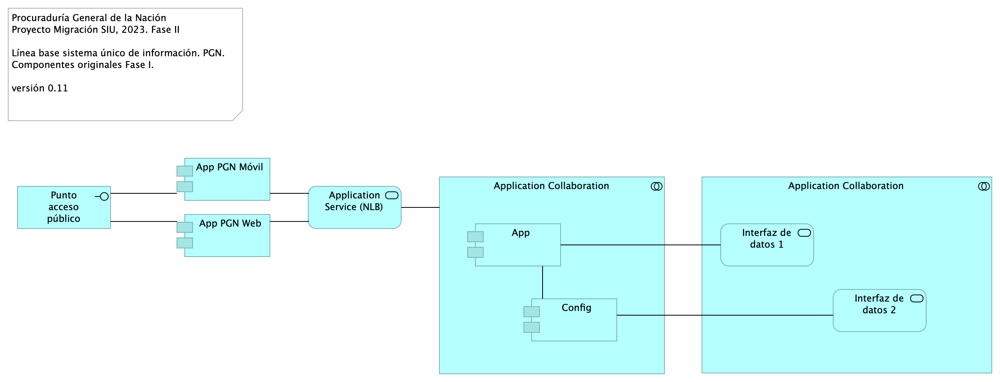

## Lineabase.0.SIU applicación
{#fig:Lineabase.0.SIUapplicación width=}

Procuraduría General de la Nación, proyecto Migración SIU, 2023, Fase II. Línea base del sistema único de información (SUI en adelante) de la PGN. Presentación de componentes de software  originales implementados en la Fase I del presente proyecto.

## Representación Arquitectónica
Con una arquitectura orientada a servicios SUI recopila:

1. Runtime: Es el servicio que interactúa con el usuario final (GUI) elaborado en Angular 11
1. API Tx: Servicio api rest base node encargado de realizar las transacciones básicas CRUD
1. API Config / Seguridad. Servicio Web API .Net Framework encargado de gestionar características con la autenticación y configuración

 

### Catálogo de Elementos
| Name| Type| Description| Properties
|:--------|:--------|:--------|:--------|
|**Application Collaboration**|application-collaboration|||
|**Application Collaboration**|application-collaboration|||
|**App**|application-component||*plataforma:* node Js |
|**App PGN Móvil**|application-component||*plantilla:* element-md-new |
|**App PGN Web**|application-component||*plataforma:* angular 11 |
|**Config**|application-component||*plataforma:* cs |
|**Punto acceso público**|application-interface|URL tipo C HTTP||
|**Application Service (NLB)**|application-service||*plataforma:* angular 11 |
|**Interfaz de datos 1**|application-service|||
|**Interfaz de datos 2**|application-service|||
