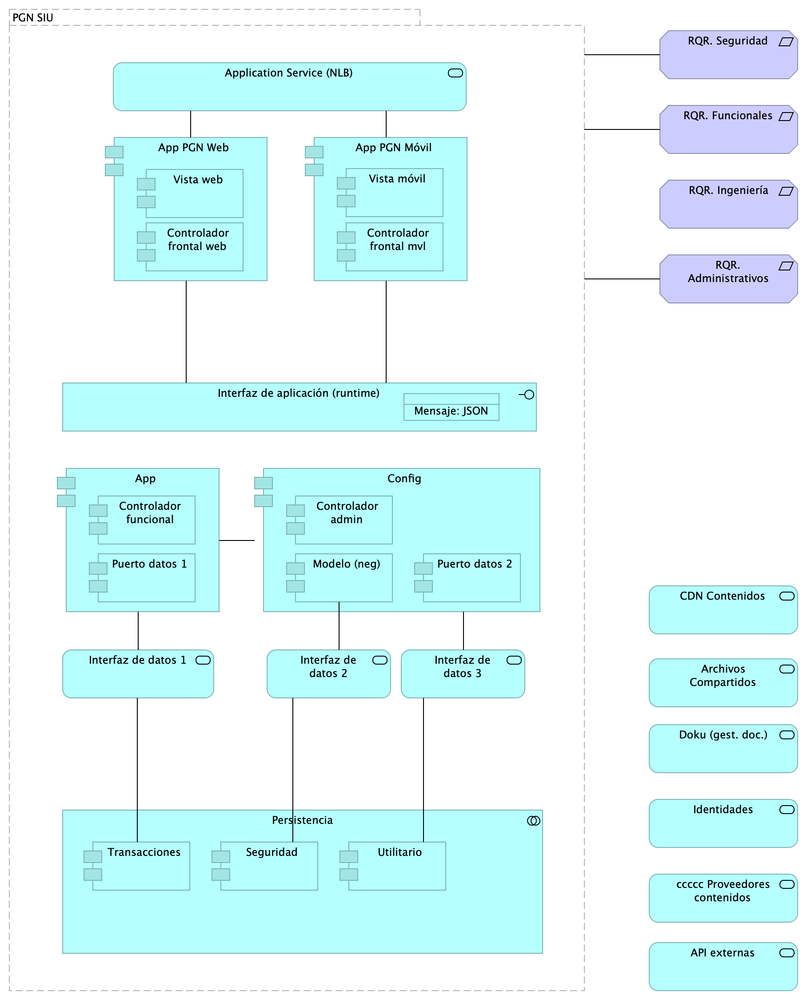

## Lineabase.1.SIU componente
{#fig:Lineabase.1.SIUcomponente width=5.89in}

Distribución de los servicios y paquetes que integran la aplicación de SUI. 

Cuatro paquetes con tecnologías respectivas

1. Angular 11 (Web)
1. API Transaccional (Node Js)
1. API Config (C#)
1. Persistencia (SQL)

Asuntos de la Migración:

* Estrategia CMS central
* Motor de búsqueda
* Estatego como BI
* Conciliación y Doku
* Gestión de sesiones / caducidad

### Catálogo de Elementos
| Name| Type| Description| Properties
|:--------|:--------|:--------|:--------|
|**Persistencia**|application-collaboration|||
|**App**|application-component||*plataforma:* node Js |
|**App PGN Móvil**|application-component||*plantilla:* element-md-new |
|**App PGN Web**|application-component||*plataforma:* angular 11 |
|**Config**|application-component||*plataforma:* cs |
|**Controlador admin**|application-component||*plataforma:* cs |
|**Controlador frontal mvl**|application-component||*plataforma:* js |
|**Controlador frontal web**|application-component||*plataforma:* js |
|**Controlador funcional**|application-component||*plataforma:* js |
|**Modelo (neg)**|application-component||*plataforma:* cs |
|**Puerto datos 1**|application-component||*plataforma:* js |
|**Puerto datos 2**|application-component||*plataforma:* cs |
|**Seguridad**|application-component||*plataforma:* sql |
|**Transacciones**|application-component||*plataforma:* sql |
|**Utilitario**|application-component||*plataforma:* no-sql |
|**Vista móvil**|application-component||*plataforma:* js |
|**Vista web**|application-component||*plataforma:* html |
|**Interfaz de aplicación (runtime)**|application-interface||*plataforma:* angular 11 |
|**API externas**|application-service|||
|**Application Service (NLB)**|application-service||*plataforma:* angular 11 |
|**Archivos Compartidos**|application-service|||
|**CDN Contenidos**|application-service|||
|**Doku (gest. doc.)**|application-service|||
|**Identidades**|application-service|||
|**Interfaz de datos 1**|application-service|||
|**Interfaz de datos 2**|application-service|||
|**Interfaz de datos 3**|application-service|||
|**ccccc Proveedores contenidos**|application-service|||
|**Mensaje: JSON**|data-object|||
|**PGN SIU**|grouping|El objetivo principal de la arquitectura del SUI de la migración es la centralización de los conceptos misionales: concentrar los conceptos misionales en componentes aislados; dejar por fuera de estos componentes misionales todo lo distintos a la misionalidad de la PGN. Los objetivos secundarios de esta arquitectura SUI de la migración son flexibilidad y extensibilidad. Dichos objetivos son independientes. Es decir, estos pueden ser maximizados sin conclifcto entre ellos. ||
|**RQR. Administrativos**|requirement|||
|**RQR. Funcionales**|requirement|||
|**RQR. Ingeniería**|requirement|||
|**RQR. Seguridad**|requirement|Requerimientos de seguridad, SUI, Migración, en aspectos de comunicación, autenticación, autorización y (manejo de) sesiones. ||
