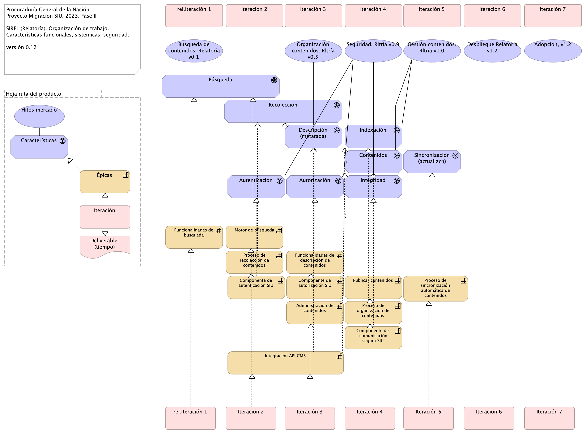

## Organización. 1n.1. Mapa producto PGN.1.Relatoría
{#fig:Organización.1n.1.MapaproductoPGN.1.Relatoría width=}

Organización y distribución de las características técnicas y funcionales del módulo de Relatoría. 

Características principales:
* Utilización de metadatos
* Búsqueda de contenido (intradocumental y por metadatos)
* Procesos de recolección y sincronización de contenidos

De arriba a abajo: 
1. Fila 1, planificación de espacios de trabajo (iteraciones, para este caso) restringido al alcance del proyecto Migración PGN 2023.
1. Debajo, lo hitos importantes organizados en el tiempo.
1. Fila 3. Evolución de las características en los aspectos funcionales, técnico, hardware y software del módulo Relatoría de PGN. 
1. FInalmente, fila final del diagrama, la entrega en el tiempo de las capacidades del módulo de relatoría (épicas, para el caso de Scrum). La prioridad de liberación de estas la determina el equipo funcional de este módulo de la PGN.

 

### Catálogo de Elementos
| Name| Type| Description| Properties
|:--------|:--------|:--------|:--------|
|**Administración de contenidos**|capability||*modulo:* relatoria |
|**Componente de  comunicación segura SIU**|capability||*modulo:* conciliacion |
|**Componente de autenticación SIU**|capability||*modulo:* conciliacion |
|**Componente de autorización SIU**|capability||*modulo:* conciliacion |
|**Funcionalidades de búsqueda**|capability||*modulo:* relatoria |
|**Funcionalidades de descripción de contenidos**|capability||*modulo:* relatoria |
|**Integración API CMS**|capability||*modulo:* relatoria |
|**Motor de búsqueda**|capability||*modulo:* relatoria |
|**Proceso de organización de contenidos**|capability||*modulo:* relatoria |
|**Proceso de recolección de contenidos**|capability||*modulo:* relatoria |
|**Proceso de sincronización automática de contenidos**|capability||*modulo:* relatoria |
|**Publicar contenidos**|capability||*modulo:* relatoria |
|**Épicas**|capability||*modulo:*  |
|**Deliverable: (tiempo)**|deliverable||*modulo:*  |
|**Autenticación**|goal||*modulo:* relatoria *caracteristica:* seguridad |
|**Autorización**|goal||*modulo:* relatoria *caracteristica:* seguridad |
|**Búsqueda**|goal||*modulo:* relatoria *caracteristica:* técnica, integración |
|**Características**|goal||*modulo:*  |
|**Contenidos**|goal||*modulo:* relatoria *caracteristica:* técnica, integración |
|**Descripción (metatada)**|goal||*modulo:* relatoria *caracteristica:* técnica, integración |
|**Indexación**|goal||*modulo:* relatoria *caracteristica:* técnica, integración |
|**Integridad**|goal||*modulo:* relatoria *caracteristica:* seguridad |
|**Recolección**|goal||*modulo:* relatoria *caracteristica:* técnica, integración |
|**Sincronización (actualizcn)**|goal||*modulo:* relatoria *caracteristica:* técnica, integración |
|**Hoja ruta del producto**|grouping||*modulo:* relatoria |
|**Adopción, v1.2**|value||*modulo:* relatoria |
|**Búsqueda de contenidos. Relatoría v0.1**|value||*modulo:* relatoria |
|**Despliegue Relatoría v1.2**|value||*modulo:* relatoria |
|**Gestión contenidos. Rltría v1.0**|value||*modulo:* relatoria |
|**Hitos mercado**|value||*modulo:*  |
|**Organización contenidos. Rltría v0.5**|value||*modulo:* relatoria |
|**Seguridad. Rltría v0.9**|value||*modulo:* relatoria |
|**Iteración**|work-package||*modulo:*  |
|**Iteración 2**|work-package||*modulo:* relatoria |
|**Iteración 2**|work-package||*modulo:* relatoria |
|**Iteración 3**|work-package||*modulo:* relatoria |
|**Iteración 3**|work-package||*modulo:* relatoria |
|**Iteración 4**|work-package||*modulo:* relatoria |
|**Iteración 4**|work-package||*modulo:* relatoria |
|**Iteración 5**|work-package||*modulo:* relatoria |
|**Iteración 5**|work-package||*modulo:* relatoria |
|**Iteración 6**|work-package||*modulo:* relatoria |
|**Iteración 6**|work-package||*modulo:* relatoria |
|**Iteración 7**|work-package||*modulo:* relatoria |
|**Iteración 7**|work-package||*modulo:* relatoria |
|**rel.Iteración 1**|work-package||*modulo:* relatoria |
|**rel.Iteración 1**|work-package||*modulo:* relatoria |
