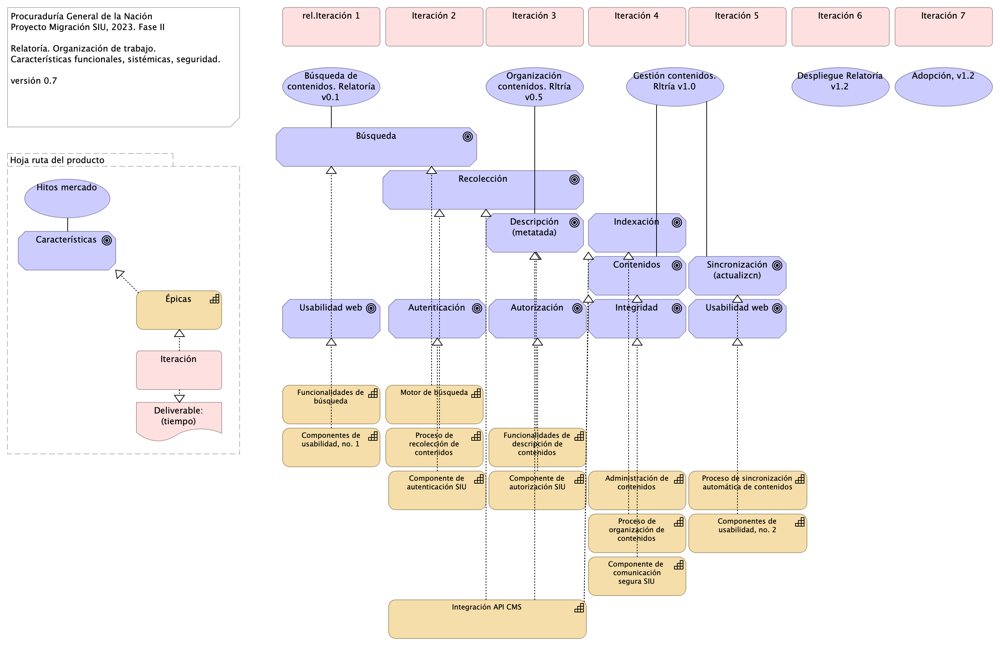

## Organización. 1n.1.b. Mapa producto PGN. Relatoría
{#fig:Organización.1n.1.b.MapaproductoPGN.Relatoría width=}

### Catálogo de Elementos
| Name| Type| Description| Properties
|:--------|:--------|:--------|:--------|
|**Administración de contenidos**|capability||*modulo:* relatoria |
|**Componente de  comunicación segura SIU**|capability||*modulo:* conciliacion |
|**Componente de autenticación SIU**|capability||*modulo:* conciliacion |
|**Componente de autorización SIU**|capability||*modulo:* conciliacion |
|**Componentes de usabilidad, no. 1**|capability||*modulo:* relatoria |
|**Componentes de usabilidad, no. 2**|capability||*modulo:* relatoria |
|**Funcionalidades de búsqueda**|capability||*modulo:* relatoria |
|**Funcionalidades de descripción de contenidos**|capability||*modulo:* relatoria |
|**Integración API CMS**|capability||*modulo:* relatoria |
|**Motor de búsqueda**|capability||*modulo:* relatoria |
|**Proceso de organización de contenidos**|capability||*modulo:* relatoria |
|**Proceso de recolección de contenidos**|capability||*modulo:* relatoria |
|**Proceso de sincronización automática de contenidos**|capability||*modulo:* relatoria |
|**Épicas**|capability||*modulo:*  |
|**Deliverable: (tiempo)**|deliverable||*modulo:*  |
|**Autenticación**|goal||*modulo:* relatoria *caracteristica:* seguridad |
|**Autorización**|goal||*modulo:* relatoria *caracteristica:* seguridad |
|**Búsqueda**|goal||*modulo:* relatoria *caracteristica:* técnica, integración |
|**Características**|goal||*modulo:*  |
|**Contenidos**|goal|Se tendran que adecuar los contenidos audivisuales de los sitios web, con subtitulos o CLosed Caption y la apropiacion de lenguajes de señas. |*modulo:* relatoria *caracteristica:* técnica, integración |
|**Descripción (metatada)**|goal||*modulo:* relatoria *caracteristica:* técnica, integración |
|**Indexación**|goal||*modulo:* relatoria *caracteristica:* técnica, integración |
|**Integridad**|goal||*modulo:* relatoria *caracteristica:* seguridad |
|**Recolección**|goal||*modulo:* relatoria *caracteristica:* técnica, integración |
|**Sincronización (actualizcn)**|goal||*modulo:* relatoria *caracteristica:* técnica, integración |
|**Usabilidad web**|goal||*modulo:* relatoria *caracteristica:* seguridad |
|**Usabilidad web**|goal||*modulo:* relatoria *caracteristica:* seguridad |
|**Hoja ruta del producto**|grouping||*modulo:* relatoria |
|**Adopción, v1.2**|value||*modulo:* relatoria |
|**Búsqueda de contenidos. Relatoría v0.1**|value||*modulo:* relatoria |
|**Despliegue Relatoría v1.2**|value||*modulo:* relatoria |
|**Gestión contenidos. Rltría v1.0**|value||*modulo:* relatoria |
|**Hitos mercado**|value||*modulo:*  |
|**Organización contenidos. Rltría v0.5**|value||*modulo:* relatoria |
|**Iteración**|work-package||*modulo:*  |
|**Iteración 2**|work-package||*modulo:* relatoria |
|**Iteración 3**|work-package||*modulo:* relatoria |
|**Iteración 4**|work-package||*modulo:* relatoria |
|**Iteración 5**|work-package||*modulo:* relatoria |
|**Iteración 6**|work-package||*modulo:* relatoria |
|**Iteración 7**|work-package||*modulo:* relatoria |
|**rel.Iteración 1**|work-package||*modulo:* relatoria |
