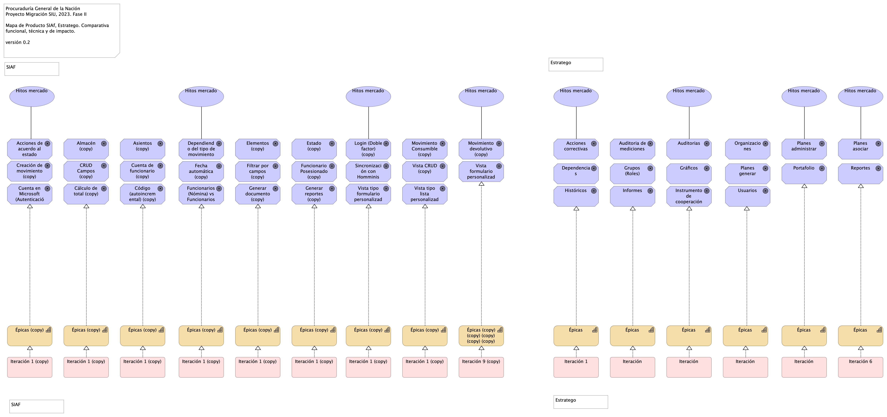

## Organización. 4n.1a. Mapa producto PGN. Comparativa
{#fig:Organización.4n.1a.MapaproductoPGN.Comparativa width=}

Mapa de productos. Comparativa funcional y técnica de módulos PGN, SIAF (izq.) y Estratego (derecha).

### Volumen Funcional
El análisis funcional de ambos módulos realizado durante el levantamiento (iteración 0) del presente proyecto arroja que SIAF tiene un 40% más de volumen que Estratego. Esto es, 16 funcionalidades de Estratego, mientras que SIAF suma 26. Ver imagen comparativa.

### Viabilidad de Alcance
Tomando en cuenta el criterio de calidad de la migración, objeto del presente contrato, 078-2023, de migrar módulos completos dentro de lo posible, y contrastando este criterio con el plazo del proyecto actual, que es de 4 meses, de los cuales ya se han ejecuta aproximadamente el 20% del mismo, es más viable la estrategia de migración de estratego sobre la de SIAF de la PGN por requerir menos iteraciones de desarrollo: seis (6) iteraciones, versus, nueve (9) de SIAF.

### Impacto / Beneficio a PGN
Los hitos de mercado del presente análisis producto, imagen arriba, dan cuenta  del beneficio e impacto de ambos proyectos de migración. Haciendo la comparación de los hitos de mercado de estos productos resalta que Estratego prima sobre SIAF en tanto que el peso cualitativo de las funciones estratégicas del primero son de mayor relevancia que las funciones operativos de inventario de SIAF. Basado en esto, Estratego reporta mayor beneficio y menos impacto en esfuerzo (por la razón anterior) que SIAF.

En conclusion, por los criterios de viabilidad y tamaño funcional y por el impacto estratégico, Estratego resulta en la migración a seleccionar sobre la del modulo SIAF. Esta estrategia satisface además la restricción de migrar moóulos completos sobre migración parcial.

### Catálogo de Elementos
| Name| Type| Description| Properties
|:--------|:--------|:--------|:--------|
|**Épicas**|capability||*modulo:* estratego |
|**Épicas**|capability||*modulo:* estratego |
|**Épicas**|capability||*modulo:* estratego |
|**Épicas**|capability||*modulo:* estratego |
|**Épicas**|capability||*modulo:* estratego |
|**Épicas**|capability||*modulo:* estratego |
|**Épicas (copy)**|capability||*modulo:* siaf |
|**Épicas (copy)**|capability||*modulo:* siaf |
|**Épicas (copy)**|capability||*modulo:* siaf |
|**Épicas (copy)**|capability||*modulo:* siaf |
|**Épicas (copy)**|capability||*modulo:* siaf |
|**Épicas (copy)**|capability||*modulo:* siaf |
|**Épicas (copy)**|capability||*modulo:* siaf |
|**Épicas (copy)**|capability||*modulo:* siaf |
|**Épicas (copy) (copy) (copy) (copy) (copy)**|capability||*modulo:* siaf |
|**Acciones correctivas**|goal|Administrar los riesgos asociados a cada uno de los indicadores o planes.|*modulo:* estratego |
|**Acciones de acuerdo al estado (copy)**|goal|Realización de acciones específicas según el estado de los movimientos devolutivos.|*modulo:* siaf |
|**Almacén (copy)**|goal|Administración de almacenes.|*modulo:* siaf |
|**Asientos (copy)**|goal|Registro de asientos.|*modulo:* siaf |
|**Auditoria de mediciones**|goal|Gestionar las actividades de los usuarios, como el registro de indicadores, el tipo, etc.|*modulo:* estratego |
|**Auditorias**|goal|Gestionar el control de logs de las actividades realizadas por el usuario en sesión.|*modulo:* estratego |
|**CRUD Campos (copy)**|goal|Operaciones CRUD (Crear, Leer, Actualizar, Eliminar) en campos de los asientos.|*modulo:* siaf |
|**Creación de movimiento (copy)**|goal|Generación de movimientos de acuerdo con los asientos abiertos.|*modulo:* siaf |
|**Cuenta de funcionario (copy)**|goal|Gestión de cuentas de funcionarios.|*modulo:* siaf |
|**Cuenta en Microsoft (Autenticación) (copy)**|goal|Autenticación mediante cuentas de Microsoft.|*modulo:* siaf |
|**Cálculo de total (copy)**|goal|Cálculo automático del total basado en la información de elementos.|*modulo:* siaf |
|**Código (autoincremental) (copy)**|goal|Generación automática de códigos que se reinician cada año.|*modulo:* siaf |
|**Dependencias**|goal|Reportar al sistema, actividades, proyectos, indicadores.|*modulo:* estratego |
|**Dependiendo del tipo de movimiento (copy)**|goal|Gestión de movimientos según su tipo, incluyendo elementos como conceptos, beneficiarios y funcionarios (maestros).|*modulo:* siaf |
|**Elementos (copy)**|goal|Registro de elementos relacionados con los movimientos.|*modulo:* siaf |
|**Estado (copy)**|goal|Seguimiento del estado de los asientos.|*modulo:* siaf |
|**Fecha automática (copy)**|goal|Asignación automática de la fecha en los asientos.|*modulo:* siaf |
|**Filtrar por campos (copy)**|goal|Capacidad para filtrar los movimientos devolutivos según campos específicos.|*modulo:* siaf |
|**Funcionario Posesionado (copy)**|goal|Registro de información sobre funcionarios en posesión.|*modulo:* siaf |
|**Funcionarios (Nómina) vs Funcionarios (Siaf) (copy)**|goal|Comparación y actualización de información de funcionarios almacenada en Siaf con la información de nómina.|*modulo:* siaf |
|**Generar documento (copy)**|goal|Creación de documentos relacionados con los movimientos.|*modulo:* siaf |
|**Generar reportes (copy)**|goal|Creación de informes y reportes para proporcionar la información solicitada.|*modulo:* siaf |
|**Grupos (Roles)**|goal|Administrar los roles y permisos dentro del sistema|*modulo:* estratego |
|**Gráficos**|goal|Generar y presentar gráficos|*modulo:* estratego |
|**Históricos**|goal|Almacenar y consultar históricos dentro del sistema|*modulo:* estratego |
|**Informes**|goal|Generar documentos con los informes correspondientes.|*modulo:* estratego |
|**Instrumento de cooperación**|goal|Administrar los proyectos de los cooperantes.|*modulo:* estratego |
|**Login (Doble factor) (copy)**|goal|Autenticación de usuario mediante doble factor de seguridad|*modulo:* siaf |
|**Movimiento Consumible (copy)**|goal|Registro de movimientos relacionados con elementos consumibles.|*modulo:* siaf |
|**Movimiento devolutivo (copy)**|goal|Registro de movimientos devolutivos.|*modulo:* siaf |
|**Organizaciones**|goal|Estructura principal.|*modulo:* estratego |
|**Planes administrar**|goal|Administrar el plan estratégico institucional.|*modulo:* estratego |
|**Planes asociar**|goal|Asociar recursos, presupuesto.|*modulo:* estratego |
|**Planes generar**|goal|Generar planes estratégicos institucionales y asociar los planes de acción preventivos.|*modulo:* estratego |
|**Portafolio**|goal|Gestionar el portafolio de todos los proyectos de la entidad.|*modulo:* estratego |
|**Reportes**|goal|Generar reportes y exportarlos en diferentes tipos de archivo.|*modulo:* estratego |
|**Sincronización con Homminis (copy)**|goal|Sincronización de datos con el sistema Homminis.|*modulo:* siaf |
|**Usuarios**|goal|Administrar los usuarios del sistema|*modulo:* estratego |
|**Vista CRUD (copy)**|goal|Interfaz para crear, leer, actualizar y eliminar registros en el almacén.|*modulo:* siaf |
|**Vista formulario personalizada (copy)**|goal|Personalización de formularios para la creación de asientos dependiendo del almacén.|*modulo:* siaf |
|**Vista tipo formulario personalizada (copy)**|goal|Personalización de formularios para ingresar datos relacionados con los asientos.|*modulo:* siaf |
|**Vista tipo lista personalizada (copy)**|goal|Visualización personalizada en forma de lista con filtros por campos específicos.|*modulo:* siaf |
|**Hitos mercado**|value||*modulo:* estratego |
|**Hitos mercado**|value||*modulo:* estratego |
|**Hitos mercado**|value||*modulo:* estratego |
|**Hitos mercado**|value||*modulo:* estratego |
|**Hitos mercado**|value||*modulo:* siaf |
|**Hitos mercado**|value||*modulo:* siaf |
|**Hitos mercado**|value||*modulo:* siaf |
|**Hitos mercado**|value||*modulo:* siaf |
|**Iteración**|work-package||*modulo:* estratego |
|**Iteración**|work-package||*modulo:* estratego |
|**Iteración**|work-package||*modulo:* estratego |
|**Iteración**|work-package||*modulo:* estratego |
|**Iteración 1**|work-package||*modulo:* estratego |
|**Iteración 1 (copy)**|work-package||*modulo:* siaf |
|**Iteración 1 (copy)**|work-package||*modulo:* siaf |
|**Iteración 1 (copy)**|work-package||*modulo:* siaf |
|**Iteración 1 (copy)**|work-package||*modulo:* siaf |
|**Iteración 1 (copy)**|work-package||*modulo:* siaf |
|**Iteración 1 (copy)**|work-package||*modulo:* siaf |
|**Iteración 1 (copy)**|work-package||*modulo:* siaf |
|**Iteración 1 (copy)**|work-package||*modulo:* siaf |
|**Iteración 6**|work-package||*modulo:* estratego |
|**Iteración 9 (copy)**|work-package||*modulo:* siaf |
