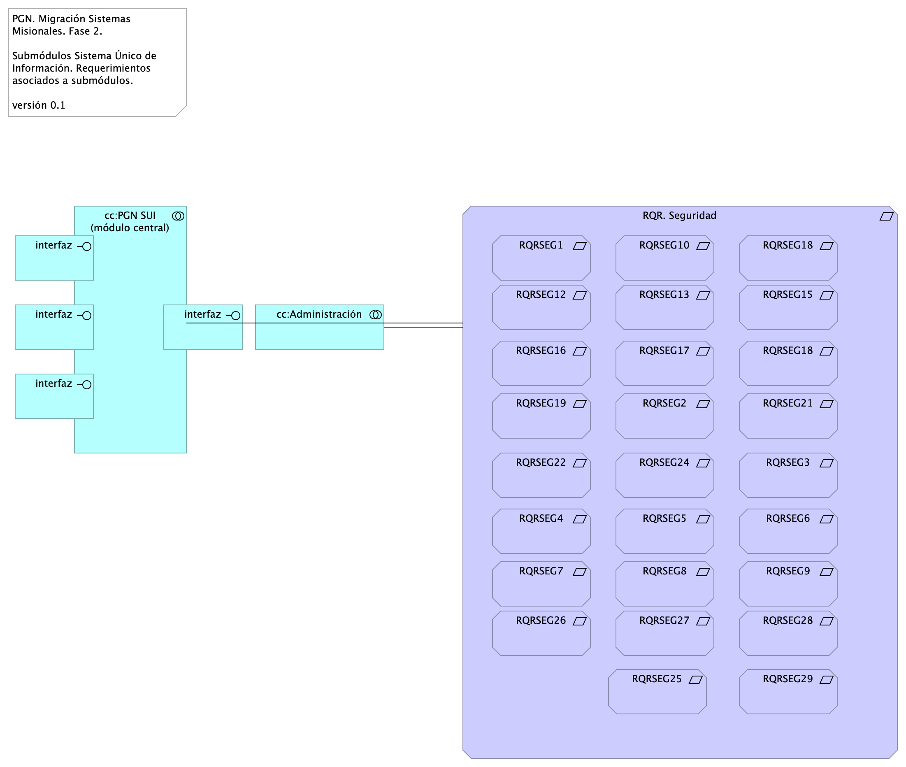

## Seguridad. 1. Requerimientos
{#fig:Seguridad.1.Requerimientos width=}

### Catálogo de Elementos
| Name| Type| Description| Properties
|:--------|:--------|:--------|:--------|
|**cc:Administración**|application-collaboration|||
|**cc:PGN SUI (misional)**|application-collaboration|||
|**interfaz**|application-interface|||
|**interfaz**|application-interface|||
|**interfaz**|application-interface|||
|**interfaz**|application-interface|||
|**RQR. Seguridad**|requirement|Requerimientos de seguridad, SUI, Migración, en aspectos de comunicación, autenticación, autorización y (manejo de) sesiones. ||
|**RQRSEG1**|requirement|1. Las soluciones deben dar cumplimiento a las políticas institucionales del sistema de gestión de seguridad de la información establecidas por la entidad que busca garantizar la confidencialidad, integridad y disponibilidad de la información que se genera, procesa, almacena y/o transmite en los sistemas de Información de la Entidad.||
|**RQRSEG10**|requirement|1. Debe incluir un mecanismo de cifrado de los datos que se transportan entre los diferentes componentes tecnológicos y los datos sensibles de la base de datos que representen un alto nivel de confidencialidad.||
|**RQRSEG12**|requirement|1. Debe contemplar el cumplimiento de la normatividad vigente en cuanto a protección de datos personales y debe permitir el manejo de excepciones.||
|**RQRSEG13**|requirement|1. Para los casos que aplique se debe permitir el manejo de certificados y/o firmas digitales en los documentos que así se definan para efectos de aprobación y digitalización.||
|**RQRSEG15**|requirement|1. Debe funcionar sobre protocolo SSL (certificados internos de la entidad cuando los sistemas de información sean internas y certificados validos públicamente cuando los sistemas de información estén expuestas a internet).||
|**RQRSEG16**|requirement|1. Debe entregar un procedimiento para el respaldo de la información de acuerdo con las necesidades de la entidad.||
|**RQRSEG17**|requirement|1. Debe incluir uso de criptografía para transacciones y/o campos sensibles según lo indiquen las normas vigentes y las necesidades específicas del negocio de acuerdo como lo determine la entidad.||
|**RQRSEG18**|requirement| "1. Debe contemplar un modelo de datos que garantice base de datos única para evitar que se pueda presentar duplicidad de información. "||
|**RQRSEG18**|requirement|1. Debe contemplar un modelo de datos que garantice base de datos única para evitar que se pueda presentar duplicidad de información.,id-d1a6b80e7a6c4538b922f333f4d7ec7a,requirement RQRSEG11,"1. A nivel de la base de datos debe poder definirse reglas de validación de integridad de datos (unicidad, referencial y negocio).||
|**RQRSEG19**|requirement|1. En la información confidencial solo puede ser consultada por los perfiles autorizados e igualmente restringir documentos de consulta según los privilegios o permisos asociados.||
|**RQRSEG2**|requirement|1. Las soluciones de automatización de procesos a implementar deben permitir la Gestión de Seguridad de Usuarios, grupos de usuarios y asignación de Roles y perfiles de usuarios, permitiendo asociar las acciones disponibles en la solución con respecto a roles de usuario, permitiendo parametrizar las funcionalidades que cada actor puede usar en la solución.||
|**RQRSEG21**|requirement|1. Debe cerrar las transacciones luego de máximo 10 minutos de inactividad. """||
|**RQRSEG22**|requirement|1. Debe incluir controles de bloqueo de cuenta después de un máximo de 5 intentos erróneos a fin de evitar ataques de fuerza bruta.||
|**RQRSEG24**|requirement|1. Debe cumplir con todos los lineamientos de desarrollo seguro establecidos en The OWASP Foundation recomendados en la “Guía de desarrollo OWASP” y “OWAS Cheat Sheet||
|**RQRSEG25**|requirement| "1. Debe incluir un mecanismo de cifrado de los datos que se transportan entre los diferentes componentes tecnológicos y los datos sensibles de la base de datos que representen un alto nivel de confidencialidad."||
|**RQRSEG26**|requirement| "1. Para los casos que aplique se debe permitir el manejo de certificados o firmas digitales en los documentos que así se definan para efectos de aprobación y digitalización. "||
|**RQRSEG27**|requirement| "1. Debe contemplar las prácticas de desarrollo seguro de aplicaciones y/o implementación segura de productos, para su naturaleza Web based. "||
|**RQRSEG28**|requirement| "1. A nivel de la base de datos debe poder definirse reglas de validación de integridad de datos (unicidad, referencial y negocio). "||
|**RQRSEG29**|requirement| "1. Debe evidenciar el resultado positivo frente apruebas de ethical hacking, análisis de vulnerabilidades, carga, estrés y desempeño antes de la puesta en operación de acuerdo con los lineamientos de la entidad. "||
|**RQRSEG3**|requirement|1. Un usuario puede estar asociado a uno o más roles, de tal manera que los menús de navegación de la solución se muestran o despliegan dependiendo de las acciones asociadas a cada rol de usuario, permitiendo así que cuando el usuario es autenticado correctamente, la solución verifica los roles que tiene activos para otorgarle únicamente las acciones autorizadas.||
|**RQRSEG4**|requirement|1. El diseño de la solución debe definir los criterios necesarios para asegurar la trazabilidad y auditoría sobre las acciones de creación, actualización, modificación o borrado de los componentes de información, de tal manera que la solución debe permitirle al administrador de la solución parametrizar las tablas y eventos que pueden auditarse.||
|**RQRSEG5**|requirement|1. Las soluciones deben tener en cuenta mecanismos que aseguren el registro histórico para poder mantener la trazabilidad de las acciones realizadas por los usuarios, contemplando el registro de auditoría que contiene información de fecha y hora, identificación del registro, tabla afectada, descripción del evento, tipo de evento, usuario que realiza la acción, identificación de sesión y dirección IP del usuario que efectuó la transacción.||
|**RQRSEG6**|requirement|1. La solución debe proveer una consulta que permita a un usuario con los privilegios asignados, consultar los registros de auditoría, aplicando criterios de filtro (usuario, maquina, rango de fechas y tipo de operación).||
|**RQRSEG7**|requirement|1. Las soluciones deben integrarse con LDAP – (Lightweight Directory Access Protocol) para los procesos de inicio de sesión y autenticación. La solución debe soportar la integración Nativa con Active Directory de Microsoft. Para usuarios externos el mecanismo de autorización, autenticación y acceso será controlado a través del modelo de seguridad de la solución (no habrá autenticación para usuarios externos).||
|**RQRSEG8**|requirement|1. Las soluciones deben cumplir con los lineamientos de seguridad relacionados a su utilización a través de redes públicas y privadas, garantizando la confidencialidad e integridad de la información y acceso a ella.||
|**RQRSEG9**|requirement|1. Debe evidenciar que, a través de pruebas de vulnerabilidad, garantiza la seguridad de la información. Estas pruebas deben suministrar evidencia de que se usaron umbrales de seguridad para establecer niveles mínimos aceptables de calidad de la seguridad y de la privacidad.||
